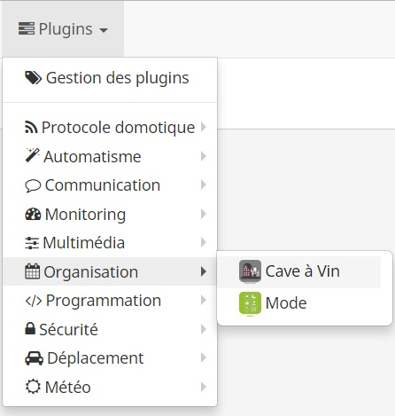
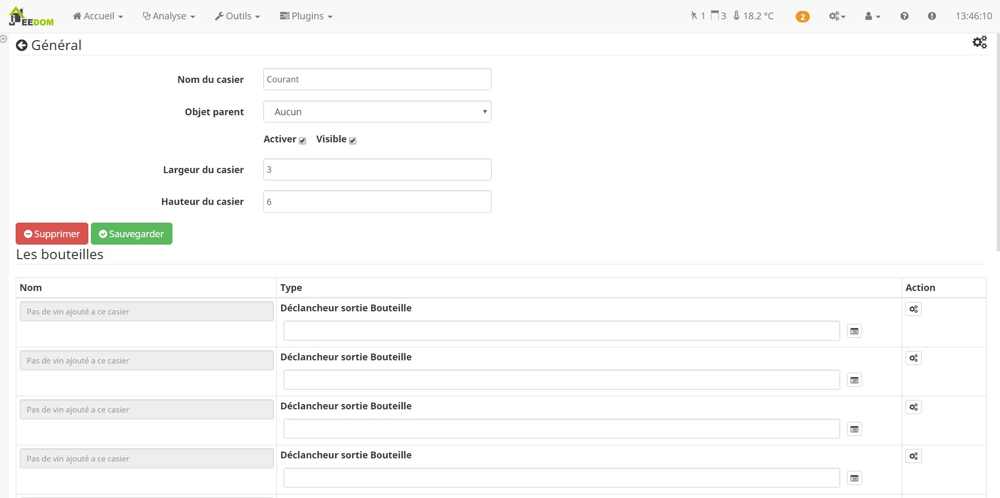
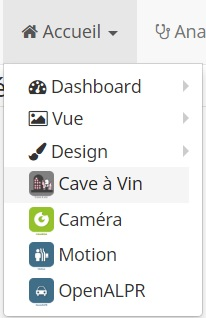
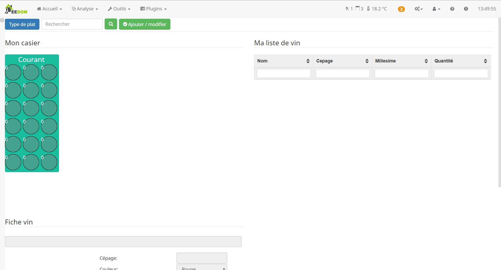
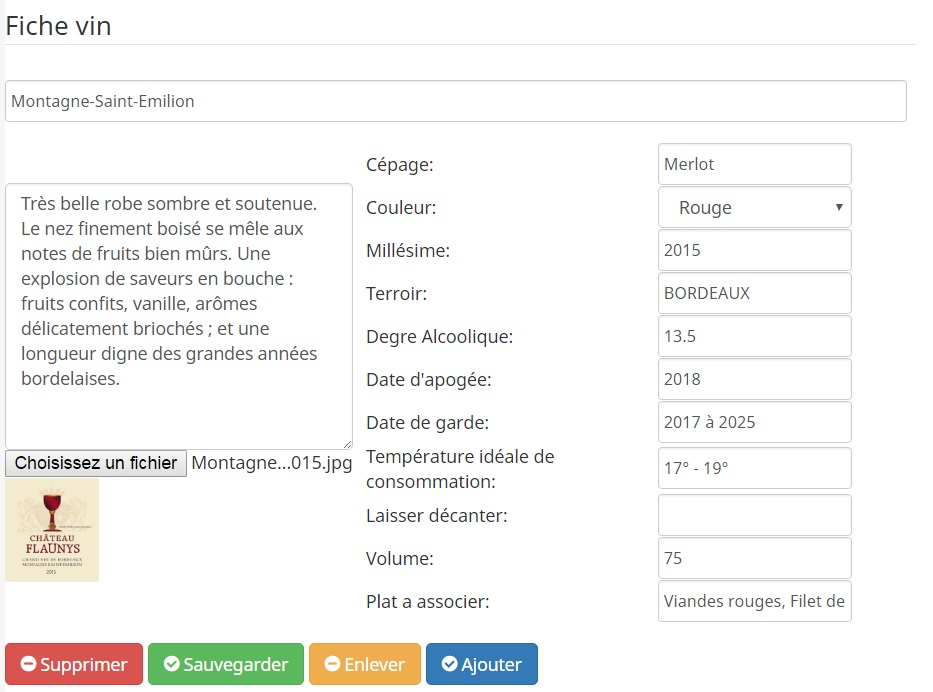
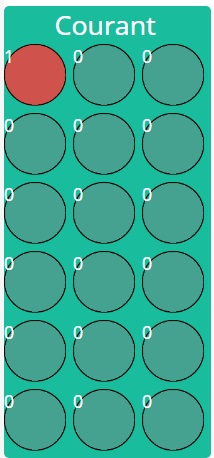

Description
===

Et si on domotisait notre cave à vin!
Ce plugin Jeedom nous permet de créer virtuellement notre cave, si on veut on peut domotiser la présence de la bouteille.

Configuration
===

Création d'un casier à bouteille
---

Rendez vous sur la page de configuration Plugins > Organisation > Cave à vin.

Créer un nouveau casier, sans oublier de paramétrer le casier

* Largeur du casier : Nombre de logement de bouteille disponible dans la largeur du casier
* Hauteur du casier : Nombre de logement de bouteille disponible dans la hauteur du casier

Puis sauvgarder, le plugin va donc créer de lui même une commmande par logement disponible.
Pour chaqune de ces commandes, vous pouvez lui associer une commande jeedom qui mettra à jour automatiquement la présence d'une bouteille

Création d'une fiche vin
---

Rendez vous sur le panel du plugin Général > Cave à vin (avec jeedom V3, il faut penser à l'activer dans la configuration du plugin).

Sur le panel vous apercevez 3 zones:

* Le widget représentant votre casier
* Une table permettant de chercher un vin
* La fiche de vin séléctionné

Pour créer une nouvelle fiche de vin cliquez sur "Ajouter / modifier" (si une fiche de vin est selectionné alors on éditera celle-ci).

La fiche de vin passera alors en édition et vous pourrez la compléter.

Nommer votre fiche de vin par le nom du vin puis compléter les informations de la fiche:

* Cépage
* Couleur
* Millésime
* Terroir
* Degré Alcoolique
* Date d'apogée
* Date de garde
* Température idéale de consommation
* Laisser décanter
* Plat à associer

Toutes ces informations, hormis la couleur, sont informatives et c'est à votre convenance de les compléter ou non.
Vous avez également la possibilité d'associer une image de la bouteille ou de l'etiquette afin de la repérer facilement
Vous pouvez également inclure vos remarques.

N'oubliez pas de sauvegarder votre fiche.

Association d'une bouteille à son logement dans le casier
---

L'association est simple et se fait également depuis le panel.

Cliquez sur un logement (vide ou non, on peut remplacer une bouteille par une autre si on veut)
Lorsque le logement est séléctionné, il est souligné en bleu.
Choisissez dans la liste de vos vins celui que vous voulez associer à ce logement.
Cliquez sur "Ajouter" en bas de la liste de vin.

Vous allez voir que le widget va se mettre à jours en remplissant le casier de la couleur du vin et en indiquant le nombre de bouteilles identiques

