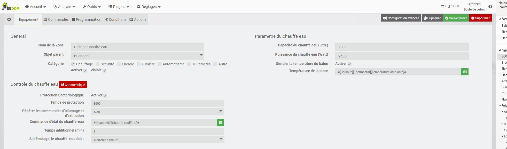
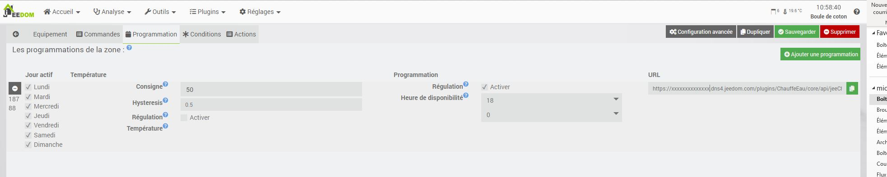
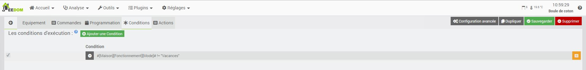
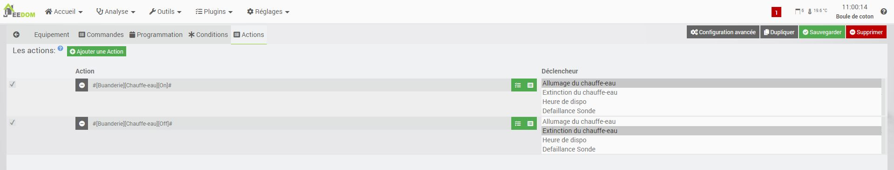
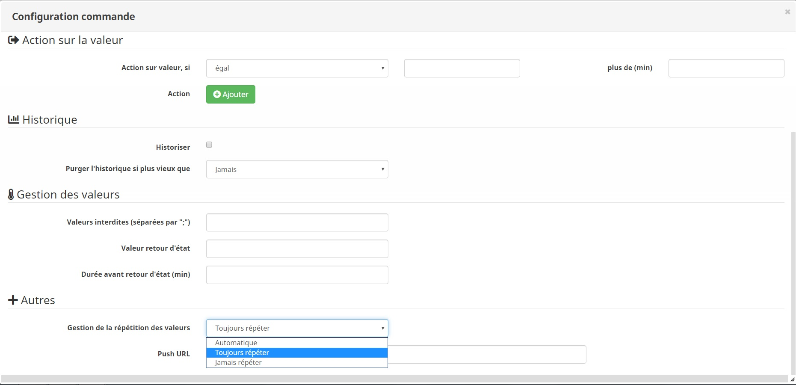

# Description

Ce plugin permet de gérer votre chauffe-eau.
Il va estimer le temps nécessaire pour une chauffe complète de votre ballon.
Si votre installation est équipée d'une sonde de température, le plugin arrêtera la chauffe dès qu'il atteindra sa température désirée.
Après l'heure programmée, le plugin arrêtera la chauffe et attendra le prochain créneau, reduit du temps de chauffage calculé.

Le plugin embarque une régulation configurable par hystérésis.

## Principe du mode hystérésis

Par exemple, si on règle l’hystérésis à 1°C et que la valeur de consigne vaut 19°C, alors le chauffage s’active lorsque la température passe en dessous de 18°C et s’arrête dès qu’il atteint 20°C.

# Paramétrage du plugin

Sur ce blog, vous aurez l'exemple d'une installation complète de la gestion de chauffe eau avec jeedom
https://Documentations/facile.fr/index.php/2019/01/03/piloter-votre-ballon-deau-chaude/

## Paramètrage général

* Nom  : le nom a déjà été paramétré, mais vous avez la possibilité de le changer.
* Objet parent : ce paramètre permet d'ajouter l'équipement dans un objet Jeedom.
* Catégorie : déclare l'équipement dans une catégorie.
* Visible : permet de rendre l'équipement visible dans le Dashboard.
* Activer : permet d'activer l'équipement.

## Paramètrage du chauffe-eau

* Capacité du chauffe-eau (Litre) : indiquez le volume de votre chauffe-eau
* Puissance du chauffe-eau (Watt) : indiquez la puissance de votre chauffe-eau, cette puissance sera ré-évaluée en cours d'utilisation
* Température Souhaitée (°C) : indiquez la température à atteindre, ou saisissez une formule
* Simuler la température du ballon : Si actif alors le plugin simulera une perte de température de votre ballon
* Sélectionner une commande de la température actuelle de l'eau : Choisissez un objet Jeedom représentant la valeur
* Température de la pièce : Température de la pièce du ballon (valeur mini de la simulation de température)

## Contrôle du chauffe-eau

* Protection Bactériologique : ce mode permet au plugin de lancer automatiquement un nettoyage bactériologique
* Temps de protection : Défini le temps que le ballon reste en zone critique (25°C > 47°C)
* Répéter les commandes d'allumage et d'extinction : Permet de configurer une récurrence d’émission des ordres de commande et de s'assurer que le chauffe eau est toujours dans l’état attendu
* Commande d’état du chauffe-eau : sélectionnez la commande d’état de votre chauffe-eau afin de permettre au plugin de se mettre a jours > La commande de retour d’état doit être d'un sous-type binaire (0 => Eteint, 1 => Allumé)
* Temps additionnel (min) : Ce temps défini en minutes permet d'ajouter au temps calculé un temps de sécurité au démarrage
* Si délestage, le chauffe-eau doit : Choix du comportement que doit avoir le plugin en cas de délestage durant la chauffe

Si vous utilisez une sonde de température réelle, le plugin enregistre les caractéristiques de perte.
Il est possible de visualiser cette caractéristique en cliquant sur le bouton "Caractéristique"

# Programmation

Nous avons la possibilité de créer plusieurs programmations de notre chauffe eau, en fonction des jours de la semaine, de l'heure de disponibilité de l'eau chaude ou d'un seuil de température.

Pour chaque programmation, nous pouvons déterminer une consigne, l'hystérésis, et le type de régulation active avec ses paramètres.

## Programmation déclenchée par Température

Si la régulation par Température est actif alors le plugin cherchera l'heure d'atteinte de la valeur de seuil et se déclenchera uniquement en dessous de cette valeur.

## Programmation Horaire

Lorsque vous sélectionnez une programmation horaire, le chauffage de l'eau sera autorisé uniquement dans la plage horaire :
Heure Programmée - Temps de chauffe > Chauffe > Heure Programmée.

## Programmation dynamique

Pour chaque programmation une url de reconfiguration est disponible pour le lier avec d'autres équipements.
L'url de reprogrammation se présente sous la forme
URL_Jeedom/plugins/ChauffeEau/core/api/jeeChauffeEau.php?apikey=APIKEY&id=ID&prog=IDcmd&day=%DAY&heure=%H&minute=%M&seuil=%S
Les champs "URL_Jeedom, APIKEY, ID, IDcmd sont automatiquement complétés pour chaque URL.
Il sera impératif de personnaliser cette url en remplaçant les paramètres par les informations a compléter :

- %DAY : Les jours de déclenchement (0 = Dimanche, 1 = Lundi, ...)
- %H : L'heure de déclenchement du réveil
- %M : La minute de déclenchement du réveil
- %S : Le seuil a atteindre pour déclencher

Si les paramètres heure=%H et minute=%M sont présent dans l'url alors le plugin activera la programmation horaire
Si le paramètre seuil=%S est présent dans l'url alors le plugin activera la programmation hystérésis

# Condition

Afin de pouvoir filtrer les déclenchements du ChauffeEau nous avons la possibilité de lui ajouter des conditions d’exécution.
Par exemple je suis en vacance, je ne veux donc pas que le chauffe-eau se déclenche.

Cliquer sur "Ajouter une condition" et configurer votre condition
Chaque condition de la liste formera un ET

# Actions

Les actions sont exécutées dans l'ordre d'apparition en fonction de leur déclencheurs.
Il existe 3 déclenchements
* Allumage du chauffe-eau : Toutes les actions que l'on souhaite lorsque le plugin ordonnera un allumage
* Extinction du chauffe-eau : Toutes les actions que l'on souhaite lorsque le plugin ordonnera une extinction
* Heure de dispo : Toutes les actions que l'on souhaite déclencher lorsque le plugin mettra fin a son cycle
* Défaillance Sonde : Si vous utilisez une sonde de température, le plugin va la surveiller et exécuter ce type d'action pour corriger ou notifier.

# Mode de fonctionnement

Le plugin a 4 modes de fonctionnement, Marche forcée, Automatique , Off ou Délestage.
Nous pouvons connaitre et contrôler chacun de ses mode par une commande.

La commande "Marche forcée" permet de forcer l'allumage du chauffe-eau.
La commande "Désactiver" permet de forcer l'extinction du chauffe-eau.
La commande "Automatique" permet de laisser le plugin gérer le chauffe-eau.
La commande "Délestage" permet de forcer l'extinction du chauffe-eau mais en ayant la possibilité de prolonger la chauffe.

> En fonction de l'état du chauffe-eau vu par le plugin et l'état réel, le plugin changera automatiquement le mode.
Par exemple, vous forcé l'allumage du chauffe-eau en manuel, le retour d'état réel passe a on alors que le plugin attend un off, il comprend alors que nous souhaitons faire une marche forcée et passe par ce mode pour ne pas interférer avec votre ordre manuel

# FAQ

## Je veux que le plugin ne se déclenche qu'en heures creuses

> Pour cette problématique, propre a la France, il est facile d'ajouter une condition qui n'autorisera le déclenchement que durant la période qui défini les heures creuse, ou toute autre  spécificité tarifaire existante.

## Le plugin change automatiquement de mode de fonctionnement

> Le changement automatique de gestion se fait sur incohérence de l’état réel et l’état de pilotage du plugin.
Ce mode automatique est important pour qu'une manipulation manuelle ou scenario soit prioritaire.
Dans une premier temps, il faut s'assurer qu'aucune action extérieure au plugin ne soit faite.
Dans un second temps il faut vérifier la synchronisation des états.
L’état réel doit être identique a l’état de pilotage. Si ce n'est pas le cas il faut vérifier la  *répétition de votre commande d'état*.
Pour le corriger, rendez-vous sur la page de configuration du plugin de contrôle de votre module et double-cliquez sur la commande de retour d'état.
Jeedom va vous ouvrir la page de paramètres avancés
Allez dans l'onglet **Configuration** >> **Autres** et passez le paramètre **Gestion de la répétition des valeurs** sur **Toujours répéter**

