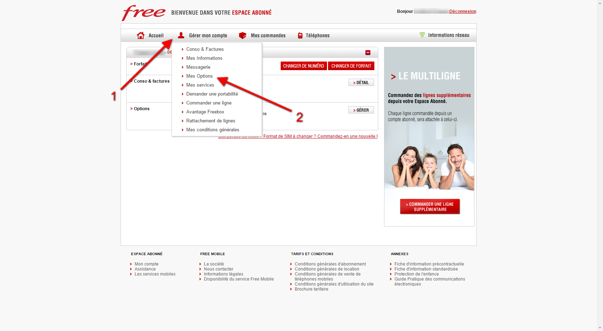
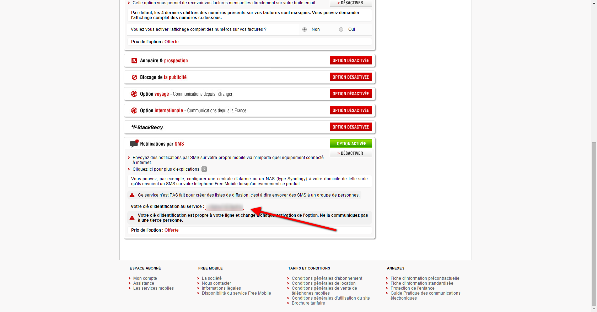
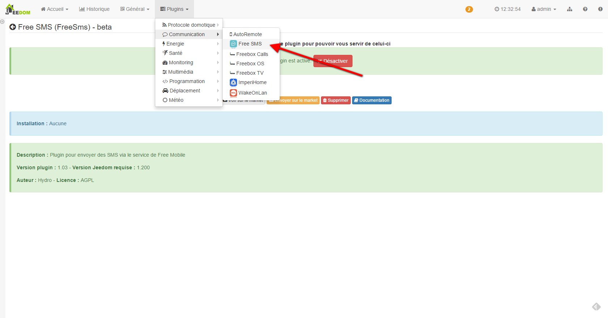
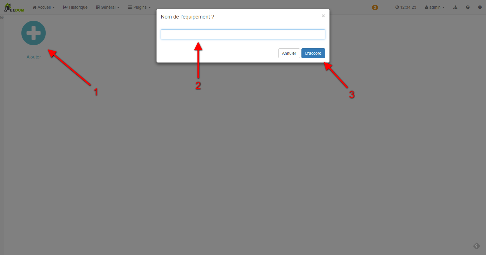
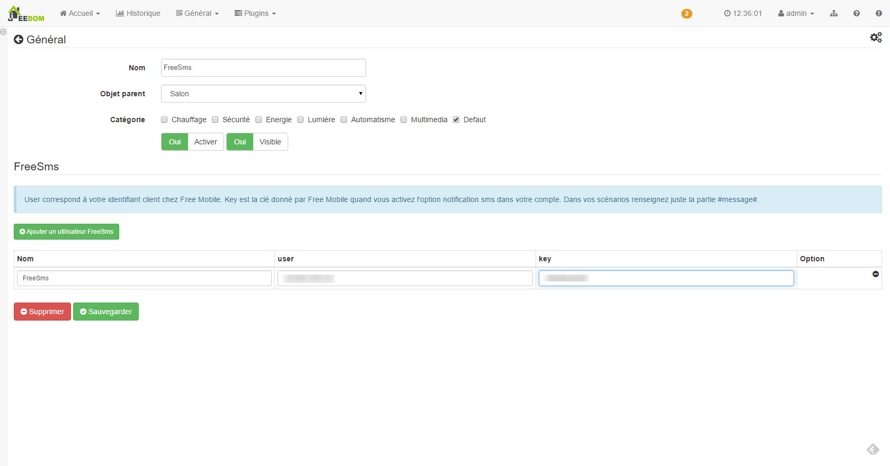

Description
===========

Ce plugin vous permet d'envoyer des sms à votre portable Free via le service de notification proposé par Free.

Configuration
=============

Activation du service
------------------------

Sur le site de Free mobile (https://mobile.free.fr), rendez-vous dans votre espace abonné.

Ensuite dans "Gérer mon compte", choississez "Mes Options"

Tout en bas de cette page, vous avez l'option "Notifications par SMS" que vous pouvez activer.
Une fois activée, vous verrez votre clé d'identification s'affichée.

Configuration du plugin FreeSms
-------------------------------

Il n'y a aucune configuration particulière à effectuer.

Configuration des équipements
--------------------------------

La configuration des numéro est accessible à partir du menu plugin : 

La page principale du plugin vous permets d'ajouter un équipement en indiquant un nom :

Une fois l'équipement sélectionné vous arrivez sur la page de configuration :

Vous retrouvez ici toute la configuration de votre équipement : 

* *Nom* : nom de votre équipement
* *Objet parent* : indique l'objet parent auquel appartient l'équipement
* *Activer* : permet de rendre votre équipement actif
* *Visible* : permet de le rendre visible sur le dashboard

En dessous vous retrouvez un bouton pour ajouter un utilisateur. Chaque utilisateur correspond à un numéro Free.
Vous devez indiquer :

* *Nom* : nom à attribuer
* *user* : correspond à votre identifiant chez Free Mobile
* *key* : correspond à la clé d'identification affichée dans votre espace abonné
* *Tester* : permet de tester la commande