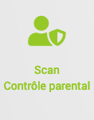
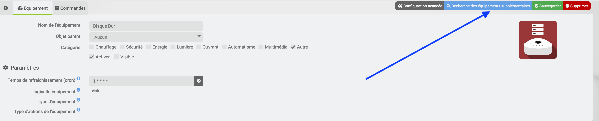
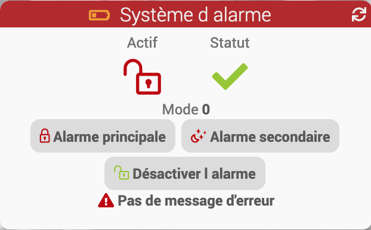
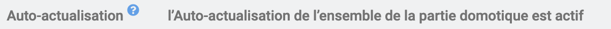
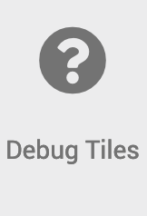
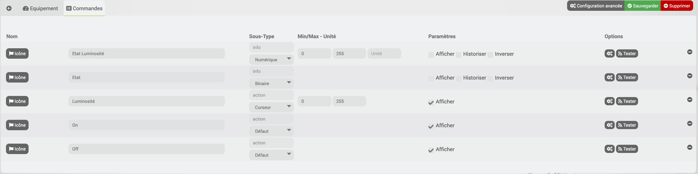
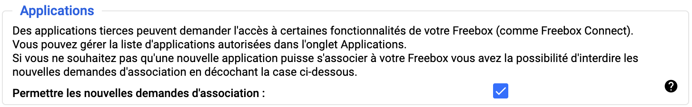
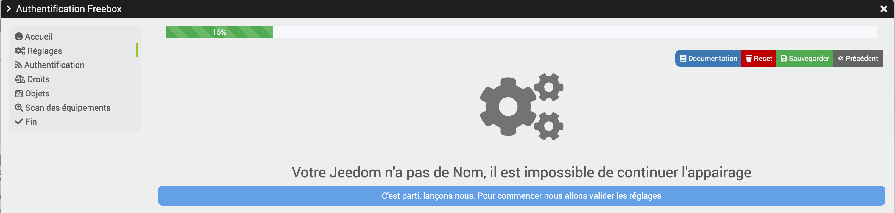
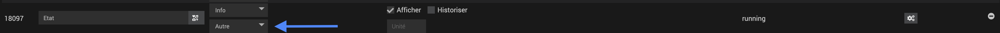

# Description

Ce plugin permet de récupérer les informations de votre FreeboxOS (Serveur Freebox Révolution ou 4K ou DELTA ou POP) et d’interagir avec via des widgets ou des scénarios reprenant les commandes créées.

> Toutes les infos ne sont pas encore disponibles pour la Freebox POP
>
> **Il est nécessaire d'avoir la Freebox Serveur en version 4.7 pour que le plugin fonctionne**

Les informations disponibles de votre Freebox Serveur sur Jeedom sont :

- **Les informations système :**
  - Couper le wifi
  - Redémarrer votre Freebox
  - Les débits internet
  - L'état de votre connexion
  - Gestion du filtrage des appels
- **Téléphone :** sur les dernieres 24h
  - Le nombre d'appels en absence
  - Le nombre d'appels passés
  - Le nombre d'appels reçus
- **Disque Dur :**
  - La place disponible dans vos disques connectés à la Freebox Serveur.
- **Appareils connectés sur le LAN et le Wifi Invité:**
  - L’état de chaque équipement DHCP
  - Possibilité d'utiliser la commande **_Wake on LAN_** uniquement par scénario
- **Domotique (uniquement pour la DELTA) :**
  - Récupère les infos de la maison connectée

# Installation et Configuration

Une fois le plugin installé et actif, aucune configuration n'est nécessaire.

# Appairage (Authentification)

Il faut se rendre dans la page principale du plugin et cliquer

<p></p>

Il faut ensuite suivre les différents écrans pour valider l'appairage

<p></p>

## Réglages

Dans la fenêtre ci-dessous, il est possible de modifier

- **IP Freebox** : Adresse de connexion de la Freebox _(par défaut : mafreebox.freebox.fr)_
- **Nom de l'équipement connecté** : Le nom de la Jeedom (ce champ est verrouillé)
- **Ajouter automatiquement les équipements détectés dans :** : Indiquer la pièce par défaut
- Il est possible de cliquer sur le bouton **Reset configuration** pour avoir les paramètres par défaut
- Ne pas oublier de cliquer sur **Sauvegarder**

> Il est impératif que votre Jeedom soit nommé pour continuer l'appairage du plugin avec votre Freebox

<p></p>

## Authentification

Dans la fenêtre ci-dessous, il va être réalisée l'authentification sur la Freebox

- Cliquer sur le bouton **Lancement de l'Authentification**
- Suivre à la fois les identifications sur cet écran ainsi que sur la Freebox

<p></p>

## Vérification des droits

Dans la fenêtre ci-dessous, Le système va contrôler les droits qui sont attribués à l'application

- Voir la section des Droits d'accès (dans cette documentation) pour modifier les droits sur la Freebox
- Une fois les droits réglés, cliquer sur le bouton **Vérification des droits**.
  > Si les droits sont OK, le bouton **suivant** deviendra visible
  > Les droits obligatoires sont en gras

<p></p>

## Lier les pièces Freebox avec les Objets Jeedom

> Cette fenêtre n'apparait uniquement que si la Freebox est une DELTA
>
> Il est possible d'activer ou désactiver le cron "Actualisation Globale des Tiles"
>
> <b>Ne pas oublier</b> de cliquer sur sauvegarder pour prendre en compte les changements

<p></p>

## Scan

Dans la fenêtre ci-dessous, Il est possible de lancer le scan des différents équipements.

<p></p>

## Authentification terminée

L'authentification est réussie.

<p></p>

# Droits d'accès

Certains droits d'accès supplémentaires sont nécessaires pour l'utilisation du plugin, ils doivent être **obligatoirement attribués et modifiés** directement depuis l'OS de la Freebox

- Se connecter à l'interface de la Freebox (http://mafreebox.freebox.fr)
- Ouvrir les paramètres de la Freebox

<p></p>

- Ouvrir la gestion des accès de la Freebox _(ce réglage se trouve dans le mode avancé)_

<p></p>

- Cliquer sur l'onglet **Applications**
- Dans la liste, choisir l'Application déclarée lors de l'installation du Plugin _(par défaut : Plugin Freebox OS)_

<p></p>

- **Autoriser tous les droits d'accès**

<p></p>

# Les équipements standards

Cliquer sur le bouton **_Scan équipements standards_**, le plugin va créer les différents équipements standards de la Freebox.

<p></p>

Les équipements et les commandes suivants vont être créés :

- **Air Média**
  - Choix du Player actuel 
  - AirMedia Start / Stop
- **Appareils connectés** et **Appareils connectés Wifi Invité**
  - Ensemble des appareils connectés à la Freebox
  - Possibilité d'utiliser la commande **_Wake on LAN_** (uniquement par scénario)
- **Disque Dur**
  - Occupation du disque
  - Température
  - Type de raid (uniquement pour les freebox compatible)
- **Freebox Débits**
  - Freebox rate down, rate up, bandwidth up, bandwidth down
  - Freebox media
  - Freebox state
  - Type de connexion
  - État de la connexion
  - IP
  - Réponse au ping
- **Player**
  - Mac
  - Type
  - Modèle
  - Version
  - API disponible
  - Disponible sur le réseau
  - Etat (allumé ou éteint)
    > La commande est créée uniquement si le player renvoie son état et possède un ID.
    > **Il faut absolument que le player soit sous tension et pas en veille prolongée (Révolution) lors de la recherche**
    > Les Player mini4K/POP sont disponibles mais ils ne remontent pas l'état
- **Partage Windows - Mac**
  - Activer / Désactiver le Partage de fichiers Mac, Windows, FTP
  - Activer / Désactiver le Partage Imprimante (disponible uniquement si SMBv2 n'est pas actif)
- **Système**
  - Update
  - Reboot
  - Freebox firmware version
  - Mac
  - IP v4/v6
  - Vitesse ventilateur
  - Températures _(temp sw, temp cpub, temp cpum)_
  - Allumée depuis
  - board name
  - serial
  - 4G si la carte est présente dans la Freebox
- **Téléphone** sur les dernieres 24h
  - Nombre Appels Manqués / Reçus / Passés
  - Liste Appels Manqués / Reçus / Passés
- **Téléchargements**
  - Nombre de tâches
  - Nombre de tâches actives, en extraction, en réparation, en vérification, en attente, en erreur, stoppées, terminées, de flux RSS, de flux RSS non lus
  - Téléchargement en cours
  - Vitesse réception, émission
  - Start, Stop
  - Mode de téléchargement
  - Etat du planning
  - Etat connexion
- **VM** (uniquement pour les freebox compatible)
  - Statut
  - Action possible : Stop, Redémarrer, Start
  - info : Nb de CPU, Adresse Mac, Mémoire, Port USB, Ecran Virtuel, Type de Disque
- **Wifi**
  - Statut du wifi
  - Wifi On Off
  - Gestion du filtrage des appels
  - État du planning
  - Session WPS ON/OFF
  - Liste mac noire
  - Liste mac blanche
  - État carte wifi

# Le contrôle parental

Cliquer sur le bouton **_Scan Contrôle parental_**, le plugin va créer les différents équipements système de la Freebox.

> Ces contrôles ont été implantés avec la version 4.2 de la Freebox.

<p></p>

- Les équipements et les commandes suivants vont être créés :
  
  > - Etat
  > - Bloquer
  > - Autoriser
  > - Bloquer 30min/1h/2h


# Spécificité de Home Adapters (Uniquement Freebox Delta), Appareils connectés, Disque Dur et système

Ces quatre équipements sont vides par défaut lors de leur création sauf pour le système qui intègre les infos communes à toutes les Freebox.

Ouvrir chaque équipement et cliquer sur le bouton "Rechercher"

> Le plugin recherchera et créera les différentes commandes associées

<p></p>

> Un Cron Journalier permet automatiquement de chercher les nouveaux équipements


# Gestion réseau

Cet équipement permet de :

> - Attribuer une adresse IP fixe
> - Gérer le filtrage des addresses MAC
> - Fonction Wake on LAN
> - Modifier le type de périphérique

## Attribuer une adresse IP

<p></p>

Il faut avoir les valeurs les champs suivants renseignés

- Sélectionner l'appareil connecté
- Sélection modification Appareil avec une valeur suivante

  > - **Ajouter IP fixe**
  > - **Supprimer IP fixe**
  > - **Modifier IP l'équipement**

- Choix IP : Indiquer l'adresse IP de l'appareil
- Sélection Nom Appareil : Indiquer le nom de l'appareil
- Commentaires : permet de saisir un commentaire (Option)


## Changer le type de périphérique

<p></p>

Il faut avoir les valeurs les champs suivants renseignés

- Sélectionner l'appareil connecté
- Sélection modification Appareil avec une valeur suivante

  > - **Modifier le type de périphérique**

- Sélection Type de périphérique : Sélectionner le type de périphérique
- Commentaires : permet de saisir un commentaire
- Modifier l'appareil : Permet d'envoyer la modification sur la freebox

## Gérer le filtrage des adresses MAC (WIFI)

<p></p>

Il est possible de faire cela avec les commandes depuis les équipements appareils connectés ou wifi
Il faut avoir les valeurs les champs suivants renseignés

- Sélectionner l'appareil connecté
- Sélection modification Appareil avec une valeur suivante

  > - **Ajouter Liste noire Wifi**
  > - **Ajouter Liste blanche Wifi**
  > - **Supprimer Liste noire Wifi**
  > - **Supprimer Liste blanche Wifi**
  > - **Modifier Liste noire Wifi**
  > - **Modifier Liste blanche Wifi**

- Commentaires : permet de saisir un commentaire ou un mot de passe
- Modifier l'appareil : Permet d'envoyer la modification sur la Freebox

> **A savoir** : l'appareil n'est pas automatiquement supprimer d'une liste si un changement de type de filtrage est fait.

## Fonction Wake on LAN

<p></p>

- Sélectionner l'appareil connecté
- Sélection modification Appareil avec une valeur suivante

  > - **Wake on LAN**

- Commentaires : permet de saisir un mot de passe
- Modifier l'appareil : Permet d'envoyer la modification sur la Freebox

Cette gestion se fait par la modale depuis le widget des appareils connectés ou depuis un scénario.

# Freebox Delta

> La Freebox Delta permet d'avoir un pack de sécurité ainsi que la connexion avec certains équipements.

Cliquer sur le bouton **_Scan Tiles_**,les équipements et les commandes des différents équipements connectés vont être créés

<p></p>

## Statut Alarme

> Le plugin remonte l'état de l'alarme par la commande "Etat de l alarme"


Les valeurs possibles sont :

> **idle** = Alarme désactivée
> **alarm_1_arming** = L'alarme principale est activée, c'est un compte à rebours lorsque seuls les capteurs ne se trouvant pas dans la zone peuvent déclencher l'alerte
> **alarm_2_arming** = L'alarme partielle est activée, c'est un compte à rebours lorsque seuls les capteurs ne se trouvant pas dans la zone peuvent déclencher l'alerte
> **alarm_1_armed** = Alarme totale activée
> **alarm_2_armed** = Alarme partielle activée
> **alarm1_alert_timer** = L'alarme principale a été déclenchée par un capteur dans le fuseau horaire et la sirène sonnera après un compte à rebours
> **alarm2_alert_timer** = L'alarme de nuit a été déclenchée par un capteur dans le fuseau horaire et la sirène sonnera après un compte à rebours
> **alert** = La sirène sonne

> le système d'alarme est compatible avec Homebridge et l'application mobile : aucune configuration n'est à faire.
> Pour permettre l'intégration, des commandes d'infos ont été ajoutées pour permettre d'interagir avec le plugin Alarme.
>
> - **Actif** = Info Binaire (1 = Alarme Activée)
> - **Statut** = Info Binaire (1 = Sirène active)

<p></p>

## Statut de la télécommande

> Le plugin remonte l'historique de la télécommande, il affichera la dernière action faite par la télécommande.

- Les valeurs possibles sont :
  > **null** ou **0** = Aucun état
  > **1** = Alarme principale
  > **2** = Désactivation
  > **3** = Alarme secondaire

## Les caméras

> les caméras sont créées automatiquement si le plugin caméra est installé

# Temps de rafraichissement (cron) des équipements

- Il est possible de modifier le cron de rafraichissement de chaque équipement, par défaut :

  > Home Adapter, FREEBOX - Télécommande (Alarme), Contrôle parental et Mes équipements sauf disque Dur = **Cron sera réglé à 5 minutes**
  >
  > Disque Dur = **Cron sera réglé à 1 heure**

- Ce cron permet de rafraichir les différentes commandes de type infos, l'équipement est actualisé automatiquement en cas d'action d'une commande.
  > Les commandes d'action ne sont pas concernées par ce cron.
  >
  > Plus le temps est court, plus il y aura de la charge sur la CPU de la Freebox.

- Depuis la version du plugin 20210507, pour la **partie domotique**
  > Un Cron d'actualisation global est activé par défaut
  >
  > <p></p>
  >
  > si cette option est désactivé, le **Cron sera réglé à 1 minute**

# Les tiles

*Chaque équipement n'est pas forcement intégré dans le système vue l'évolution de la Freebox*S

- Afin de pouvoir intégrer les nouveaux systèmes, il faut :

  > Mettre le plugin en mode débug
  > Redémarrer le Démon
  > Faire **_Debug Tiles_**

<p></p>

Ouvrir un sujet (si aucun sujet ne traite pas déjà cette demande) sur le community et fournir les infos suivantes

- Faire une copie d'écran de l'équipement

<p></p>

- Faire une copie d'écran des commandes de l'équipement

<p></p>

- Fournir les logs sous forme de texte et non une copie d'écran
  > [Voir le paragraphe **11** Formatez correctement](https://community.jeedom.com/t/comment-nous-aider-a-vous-aider-ou-comment-poser-une-bonne-question/34932)

```
    [2020-08-24 07:37:41][DEBUG] : ┌───────── Commande trouvée pour l'équipement FREEBOX : FREEBOX - Eclairage Canapé -- Pièce : Salon (Node ID 9)
[2020-08-24 07:37:41][DEBUG] : │ Label : Enclenché -- Name : switch_state
[2020-08-24 07:37:41][DEBUG] : │ Type (eq) : light -- Action (eq): intensity_picker
[2020-08-24 07:37:41][DEBUG] : │ Index : 0 -- Value Type : bool -- Access : rw
[2020-08-24 07:37:41][DEBUG] : │ Valeur actuelle :
[2020-08-24 07:37:41][DEBUG] : │ Range : ----- -- Range color : -
[2020-08-24 07:37:41][DEBUG] : │ Name: Etat -- Type : info -- LogicalID : 0 -- Template Widget / Ligne : core::light/0-- Type de générique : LIGHT_STATE -- Inverser : 0 -- Icône :  -- Min/Max : default/default
[2020-08-24 07:37:41][DEBUG] : │ No Repeat pour l'info avec le nom : Etat
[2020-08-24 07:37:41][DEBUG] : │ Name: On -- Type : action -- LogicalID : PB_On -- Template Widget / Ligne : core::light/1-- Type de générique : LIGHT_ON -- Inverser : 0 -- Icône :  -- Min/Max : default/default
[2020-08-24 07:37:41][DEBUG] : │ Name: Off -- Type : action -- LogicalID : PB_Off -- Template Widget / Ligne : core::light/0-- Type de générique : LIGHT_OFF -- Inverser : 0 -- Icône :  -- Min/Max : default/default
[2020-08-24 07:37:41][DEBUG] : └─────────
[2020-08-24 07:37:41][DEBUG] : ┌───────── Commande trouvée pour l'équipement FREEBOX : FREEBOX - Eclairage Canapé -- Pièce : Salon (Node ID 9)
[2020-08-24 07:37:41][DEBUG] : │ Label : Luminosité -- Name : luminosity
[2020-08-24 07:37:41][DEBUG] : │ Type (eq) : light -- Action (eq): intensity_picker
[2020-08-24 07:37:41][DEBUG] : │ Index : 2 -- Value Type : int -- Access : rw
[2020-08-24 07:37:41][DEBUG] : │ Valeur actuelle : 254
[2020-08-24 07:37:41][DEBUG] : │ Range : ----- -- Range color : -
[2020-08-24 07:37:41][DEBUG] : │ Name: Etat Luminosité -- Type : info -- LogicalID : 2 -- Template Widget / Ligne : /0-- Type de générique : LIGHT_COLOR -- Inverser : 0 -- Icône :  -- Min/Max : 0/255
[2020-08-24 07:37:41][DEBUG] : │ No Repeat pour l'info avec le nom : Etat Luminosité
[2020-08-24 07:37:41][DEBUG] : │ Name: Luminosité -- Type : action -- LogicalID : 2 -- Template Widget / Ligne : default/0-- Type de générique : LIGHT_SET_COLOR -- Inverser : 0 -- Icône :  -- Min/Max : 0/255
[2020-08-24 07:37:41][DEBUG] : └─────────
```

# Troubleshotting

- **Je n'ai pas le message d'autorisation qui apparait sur la Freebox**

  > Vérifier dans les réglages de l'OS de la Freebox que le paramètre **Permettre les nouvelles demandes d'associations** est coché _(Paramètres de la Freebox -> Gestion des accès -> Onglet paramètres)_
  >
  > <p></p>

- **Je n'ai pas le niveau de batterie sur le capteur de présence de la Freebox et/ou sur la télécommande**

  > ces infos ne sont pas remontées à la Freebox donc impossible de les avoir dans Jeedom.
  >
  > Elles ne sont donc pas disponibles sur la page santé (il est indiqué secteur ou N/A)

- **Je ne peux pas commander la sirène de l'alarme de la Freebox**

  > Il n'est pas possible de commander directement cette sirène
  > [Voir Bugtracker Freebox FS#30650](https://dev.freebox.fr/bugs/task/30650)

- **J'ai le message "Version d’API inconnue"**

  > **Il est nécessaire d'avoir la Freebox en version 4.7 minimum pour que le plugin fonctionne**

  > - Une détection automatique de la version API de la freebox est lancée une fois par semaine.
  > - Il est possible de le lancer directement depuis l'écran d'Appairage
  > - Il est actuellement obligatoire de faire le reset de la clef API a chaque mise à jour
  >
  > <p></p>
  >
  > <p></p>

- **J'ai le message "unknown host, use ip address or mafreebox.freebox.fr" et le Demon NOK**

  - Suite à la mise à jour de la Freebox 4.2.3
  > Free a changé l'adresse de la Freebox **_mafreebox.free.fr_**, celle-ci ne fonctionne plus il faut remplacer par **_mafreebox.freebox.fr_**
  >
  > Voir le paragraphe **Installation et Configuration**

- **J'ai le widget des appareils connectés qui n'est plus disponible**

  > Le widget a été renommé lors d'une mise à jour'
  >
  > Il faut faire une **recherche des équipements supplémentaires** pour avoir le nouveau widget

- **J'ai les messages suivants qui apparaissent "Missing device_name" ou "Votre Jeedom n'a pas de Nom, il est impossible de continuer" lors de l'appairage**

  > **Votre Jeedom n'a pas de Nom**
  >
  > Il est impératif que votre Jeedom soit nommé pour continuer l'appairage du plugin avec votre Freebox
  >
  > Se rendre dans Réglages -> Système -> Configuration -> onglet Général et mettre un nom
  >
  > Recommencer ensuite l'authentification en n'oubliant pas de faire un reset de la configuration
  >
  > <p></p>
  >
  > <p></p>


- **Erreur CronDaily avec des noms d'appareils avec des icônes**

  > - Il ne faut pas que les noms d'appareils comportent des icônes.

- **Les nouveaux "Appareils connectés" et "Appareils connectés Wifi Invité" n'apparaissent pas lors de l'actualisation de l'équipement**

  > - Les nouveaux équipements ne sont pas ajoutés lors de l'actualisation mais uniquement avec le Cron Journalier

- **Je n'ai pas de message dans les logs en mode debug**

  > - Pour la partie Tile vu que le rafraichissement se fait plusieurs fois par minute, pour éviter de remplir les logs. Aucun message n'apparait dans les logs
  >
  > Pour avoir des logs, sur un équipement il faut cliquer sur le bouton "Rafraichir" de l'équipement

- **J'ai le message METHODE OBSOLETE => MERCI DE REGARDER LA DOCUMENTATION**

  > Les commandes ont changées dans la partie network, il est donc necessaire de changer la methode pour utiliser les commandes ci-dessous. *Voir le paragraphe "Gestion réseau"*
  >
  > Les commandes suivantes seront supprimer lors de la prochaine mise à jour :
  >
  > - **"Ajout - Supprimer filtrage Mac"** pour l'équipement *WIFI*
  > - **"Ajouter supprimer IP Fixe"** pour les équipements *Appareils connectés* et *Appareils connectés Wifi Invité*
  > - **"Wake on LAN"** pour les équipements *Appareils connectés* et *Appareils connectés Wifi Invité*

- **A quoi corresponde les différents moteurs de tâches**

  > - **RefreshToken** : Permet de raffraichir l'accès a la freebox
  >
  > - **FreeboxPUT** : Permet de faire les actions sur la freebox
  >
  > - **FreeboxAPI** :
    > Permet de tester de vérifier la dernière version de l'API de la freebox
    > un contrôle est fait une fois par semaine
  >
  > - **FreeboxGET** : Permet de récupèrer les données de type info de la partie domotique

  - **L'état du player ne remonte pas**

  > Il faut vérifier que le type pour la commande "Etat" est le sous type **Autre**
  > <p></p>
  
  - **Le statut du player n'est pas disponible**

  > Il faut absolument lancer un scan des équipements standards avec le player sous tension

  - **Les commandes "Appareil connecté choisi" et "Sélection appareil connecté"" dans l'équipement Gestion réseau**

  > Ces commandes seront créés automatiquement par l'équipement *Appareils connectés* et/ou *Appareils connectés Wifi Invité*