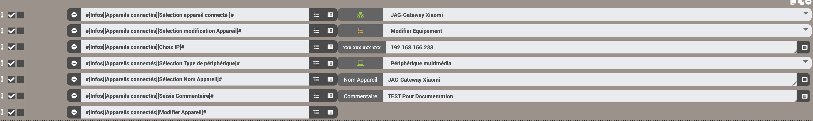

# Description

Ce plugin permet de récupérer les informations de votre FreeboxOS (Serveur Freebox Révolution ou 4K ou DELTA ou POP).

> Toutes les infos ne sont pas encore disponibles pour la Freebox POP
>
> **Il est nécessaire d'avoir la Freebox Serveur en version 4.3 pour que le plugin fonctionne**

Les informations disponibles de votre Freebox Serveur sur Jeedom sont :

# Attribuer une adresse IP fixe / Gérer le filtrage des addresses MAC / Fonction Wake on LAN

Il est possible de faire cela avec les commandes depuis les équipements appareils connectés

- Sélectionner l'appareil connecté : Choisir par mis la liste le nom de l'équipement
- Sélection modification Appareil : Sélectionner la modification voulue

  > - **Ajouter IP fixe**
  > - **Supprimer IP fixe**
  > - **Modifier l'équipement**
  > - **Modifier le type de périphérique**
  > - **Modifier l'équipement**
  > - **Ajouter Liste noire Wifi**
  > - **Ajouter Liste blanche Wifi**
  > - **Supprimer Liste noire Wifi**
  > - **Supprimer Liste blanche Wifi**
  > - **Modifier Liste noire Wifi**
  > - **Modifier Liste blanche Wifi**
  > - **Wake on LAN**

- Choix IP : Indiquer l'adresse IP de l'appareil
- Sélection Nom Appareil : Indiquer le nom de l'appareil
- Commentaires : permet de saisir soit un commentaire ou un mot de passe
- Sélection Type de périphérique : Sélectionner le type de périphérique
- Modifier l'appareil : Permet d'envoyer la modification sur la freebox

## Attribuer une adresse IP

Il faut avoir les valeurs les champs suivants renseignés

- Sélectionner l'appareil connecté
- Sélection modification Appareil avec une valeur suivante

  > - **Ajouter IP fixe**
  > - **Supprimer IP fixe**
  > - **Modifier l'équipement**
  > - **Modifier le type de périphérique**
  > - **Modifier l'équipement**

- Choix IP : Indiquer l'adresse IP de l'appareil
- Sélection Nom Appareil : Indiquer le nom de l'appareil
- Commentaires : permet de saisir un commentaire
- Sélection Type de périphérique : Sélectionner le type de périphérique
- Modifier l'appareil : Permet d'envoyer la modification sur la freebox

## Gérer le filtrage des adresses MAC

Il est possible de faire cela avec les commandes depuis les équipements appareils connectés ou wifi
Il faut avoir les valeurs les champs suivants renseignés

- Sélectionner l'appareil connecté
- Sélection modification Appareil avec une valeur suivante

  > - **Ajouter Liste noire Wifi**
  > - **Ajouter Liste blanche Wifi**
  > - **Supprimer Liste noire Wifi**
  > - **Supprimer Liste blanche Wifi**
  > - **Modifier Liste noire Wifi**
  > - **Modifier Liste blanche Wifi**

- Commentaires : permet de saisir un commentaire ou un mot de passe
- Modifier l'appareil : Permet d'envoyer la modification sur la freebox

> **A savoir** : l'appareil n'est pas automatiquement supprimer d'une liste si un changement de type de filtrage est fait.

## Fonction Wake on LAN

- Sélectionner l'appareil connecté
- Sélection modification Appareil avec une valeur suivante

  > - **Wake on LAN**

  - Modifier l'appareil : Permet d'envoyer la modification sur la freebox
  - Commentaires : permet de saisir un mot de passe

Cette gestion se fait par la modale depuis le widget des appareils connectés ou depuis un scénario.
