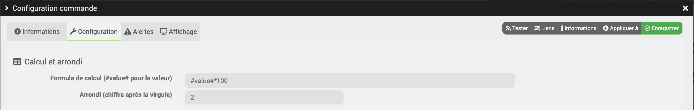

# Info

## Important

> **_Pour rappel_**, s'il n'y a pas d'information sur la mise à jour, c'est que celle-ci concerne uniquement de la mise à jour de documentation, de traduction ou de corrections de bugs mineurs.
>
> **Attention : Il est nécessaire d'avoir la Freebox serveur en version 4.8.13 pour que le plugin fonctionne.**

## Fil d'actualité

> [Voir le fil d'actualité du plugin sur Community](https://community.jeedom.com/t/info-plugin-Freebox-mise-a-jour-des-composants-de-la-delta-tiles-systeme/30673)

# Changelog

# 2024

## 25/09/2024

- Traduction
- Ajout Firmware dans le lien communauty
- Clean code
- Correction PHP 8
- Traduction
- Core mini 4.2
- Correction bug remise a zéro téléphonie

## 23/08/2024

- Correction bug authentification

## 21/08/2024

> **ATTENTION : IL FAUT RELANCER UNE RECHERCHE DES EQUIPEMENTS STANDARDS ET PARENTAL**

- **Ensemble des équipements standards**

- Reprise de l'ensemble des mises à jour
- Amélioration info vers Community pour le Core 4.4
- Correction Warning PHP8

- **Contrôle parental**

- Ajout commande pour "appareil associé"
- Ajout commande pour "Vacances associées au profil"

> **ATTENTION : Il faudra supprimer la commande ETAT et renommer ETAT(1) en ETAT**

- **Afficheur**

- Ajout commandes pour forcer l'orientation
- Ajout commandes pour cacher la clef Wifi

- **Systeme**

- Ajout commande info sur la mise à jour du firmware de la Freebox Serveur avec les valeurs suivantes
      - Le processus de mise à jour est en cours d\'initialisation
      - Le micrologiciel est en cours de mise à jour
      - Le micrologiciel est à jour
      - Une erreur s'est produite pendant la mise à jour
- Ajout info de la langue d'affichage

- **Wifi**
- Ajout Info du type de mode Eco pour le wifi
- Ajout du mode de veille pour la planification du Wifi

## 18/07/2024

- Amélioration log 
- Correction warning PHP8

## 11/04/2024

- Correction bug lors de la migration de la box DELTA à ULTRA

## 10/04/2024

- **Général**

- Nettoyage lors de l'installation des commandes obsolètes lors de la migration de box (révolution->ULTRA, DELTA->ULTRA).
- Amélioration LOG pour 4.4

- **Management**

- Amélioration Log

- **Wifi**

- Amélioration widget Wifi pour prendre en compte le mode économie d'énergie (Box ULTRA).

- **VM/CONTROLE PARENTAL/Disque**

- Non actualisation de l'équipement (de type VM / Contrôle parental) s'il n'est pas trouvé sur la Freebox et désactivation de l'équipement.

- **Disques**

  - Non actualisation de l’équipement si pas de disque et désactivation de l’équipement.

- **Tiles**

  - Si la box n'est plus compatible avec cette fonction :
      - Désactivation de l'équipement
      - Suppression CRON GLOBAL titles


## 15/02/2024

- Correction Bug en cas de suppression du plugin

## 13/02/2024

- Migration de l'API mini en v10.

- **Début compatibilité Freebox Ultra**
  
  - Pour la partie domotique non-actualisation des équipements si migration de la Freebox Delta vers Ultra


## 05/02/2024

- Suppression lien Community suite changement Core 4.4
- Amélioration barre de recherche

## 15/01/2024

- Correction inversion binaire

## 14/01/2024

- Amélioration pour Core V4.4

## 06/01/2024

- Amélioration de la création de l'équipement **Gestion réseau**
- Deuxième correctif sur le capteur de détection de mouvement

## 05/01/2024

- Amélioration mise à jour Player
- Ajout Player Mini4K/POP  **Attention : Pas de retour d'état pour ce Player**
- Non mise à jour des équipements lors de la création (rend la création plus rapide)
- Typo log
- Correction affichage pour les capteurs de détection de mouvement

## 03/01/2024

- Amélioration mise à jour Player

## 01/01/2024

- Amélioration récupération information Player pour la révolution

# 2023

## 17/12/2023

- Amélioration info vers Community pour le Core 4.4
- Amélioration des équipements pour le Core 4.4
- Reprise création commande download
- Reprise création commande système
- Correction variable non défini
- Suppression des commandes obsolètes

- **Tiles**
  
  - Amélioration gestion de la valeur de la télécommande de l'alarme
  - Bouton Télécommande de l'alarme, la valeur du bouton est toujours répétée
  - Amélioration log Tiles
  - Correction Bug mise à jour des commandes de type info pour la partie TITLES
  - Amélioration gestion de l'inversion des commandes binaires pour la partie TITLES(utilisation de la commande d'inversion du Core)

    > **ATTENTION : IL FAUT RELANCER UNE RECHERCHE DES TITLES**

- **Appareils connectés**
  
  - Correction bug IP4 pour les équipements désactivés
  - Ajout de l'IP4 si l'appareil a une adresse fixe

- **Débit**

  - Ajout info de débit (Reçu et Émis)


## 04/03/2023

- Correction variable indéfinie
- Correction typo usage pour le Market

## 10/02/2023

- **Général**

    > - l'API passe désormais par une variable par défaut pour l'ensemble des box
    > - Modification non variable cache pour utiliser le format Core "pluginid::custom_key"

- **Tiles**

    > - Correction Bug enregistrement équipement si Cron global Actif

- **Freebox Player**

    > - Correction Bug statut équipement
    > - Ajout info dans log pour différencier les Players
    > - Suppression refresh après ajout des équipements

- **Freeplug**

    > - Correction du type d'équipement

- **Santé**

    > - Ajout warning si DEMON est NOK
    > - Ajout warning si équipement est désactivé

- **Téléphone**

    > - Changement des fonctions "Vider le journal d'appels" et "Tout marquer comme lu"

- **Freebox Débits**

    > - Migration vers la nouvelle API pour l'agrégation 4G/xDSL.

# 2022

## 27/11/2022

- **Général**

  > - Possibilité de faire un reset de la version API en v9 sans avoir fait le test

## 24/11/2022

- **Général**

  > - l'API passe désormais en v9 par défaut pour l'ensemble des box (c'est compatible avec la Freebox révolution)
  > - Ajout dans le message "API NON COMPATIBLE : Version d'API inconnu" du chemin de la requête

## 02/11/2022

- **Appareils connectés**

  > - Correction Bug sur la modale de redirection des ports

## 29/10/2022

- **Contrôle parental**

  > - Correction Bug "API NON COMPATIBLE : Version d’API inconnue" lors d'une action

## 27/10/2022

- **Wi-Fi**

  > - Correction Bug état des cartes Wi-Fi
  
## 26/10/2022

- **Version Mini Core Jeedom**

  > - Dernière version compatible Core 4.0

- **Général**

  > - Arrêt des Crons actifs lors du refreshToken
  > - Création d'un Cron semaine pour rechercher la version de l'API valide
  > - Utilisation de la dernière version de l'API valide pour l’ensemble des équipements
  > - Ajout d'un bouton dans la modale “Appairage” pour rechercher la version de l'API
  > - Ajout fonctionnalité Core V4.3

- **Airmedia**

  > **Pour l'ensemble des nouveautés ci-dessous, il faut lancer le scan "Scan équipements standard"**

    > Réécriture complète de cette partie
    > Les anciennes commandes seront supprimées car non compatibles

- **Appairage** (21.09.2022, 22/09/2022)
  
  > - Ajout Bouton pour ignorer la vérification des droits
  > - Ajout Bouton pour faire un reset de l'API de la Freebox

- **Appareils connectés** (28/08/2022)

  > - Correction de l'ordre des appareils (en premier les connectés suivi des non connectés)
  > - Réécriture de la commande de refresh et de création des commandes en vue de l'ajout de futures améliorations
  > - Les commandes suivantes seront supprimer lors de la prochaine mise à jour car elles sont désormais intégrées dans la gestion réseau :

    > "Ajouter supprimer IP Fixe"
    > "Wake on LAN"

- **Gestion réseau**

  > **Pour l'ensemble des nouveautés ci-dessous, il faut lancer le scan "Scan équipements standard"**

  - Nouvel équipement
  - Il réunit plusieurs commandes partagées dans plusieurs équipements

  > - Gérer le filtrage mac pour le Wi-Fi
  > - Ajouter - supprimer une IP Fixe” pour les équipements

- **Contrôle Parental** (17.08.2022)
  
  > - Correction du bug sur la recherche des nouveaux contrôles

- **Network**

  > - Correction de la lecture des ports
  > - Correction Ajout mac adresse en liste noire ou blanche

- **Tiles**

  > - Ajout texte d'information pour l'actualisation globale des titles dans le cas de volet SOMFY
  > - Correction du refresh équipement si le Cron global n’est pas actif

- **Wi-Fi**

  > La commande "Ajout - Supprimer filtrage Mac" sera supprimer lors de la prochaine mise à jour car elle est désormais intégrée dans la gestion réseau

## 30/04/2022

> - Modification de la liste des Appels
> - Ajout info sur les disques dur
> - Suppression Cron jour
> - Possibilité de désactiver la mise à jour des commandes Network (Il est déconseillé de le faire, cela peut poser des problèmes en cas de commande en double)
> - Suppression Cron jour

  > - un Cron spécifique est paramétrable dans les équipements de type "Disque", "Appareils connectés", "Homeadapter"
  > - si le champs "Ajout des nouvelles commandes" est laissé vide, les nouvelles commandes ne seront pas ajoutées

## 17/03/2022

> - Modification création commande Homeadapter
> - Correction bug Groupe Freeplug
> - Ajout commande ON/OFF => home adapter mais attente réponse Free
> - Modification recherche Network avec mise à jour des noms des équipements
> - Mise à jour création commande network
> - Correction nom des VM lors de la création

# 2021 

## 06/12/2021

> - Renommage dossier image afin de répondre aux nouvelles exigences du Core
> - Correction problème d'effacement de variable dans le cache
> - Amélioration création équipement caméra
> - Correction bug sur les commandes ON et OFF de la partie titles
> - Ajout Freeplug,

  > - Info Rôle du Freeplug
  > - Action Reset
  >   **Pour l'ensemble des nouveautés ci-dessous, il faut lancer un Scan équipements standards**
  >   Pour avoir les freeplugs, il faut absolument qu'ils soient associés

## 04/08/2021

- Correction bug sur le refresh de l'alarme

## 29/07/2021

- Correction bug sur les commandes des VM
- Correction Airmedia
- Amélioration pour Core 4.2

## 27/06/2021

- **Freebox Débits**

  > - Correction problème refresh des données fibre optique sur les Freebox révolution

- **Téléchargements**

  > - Correction problème sur les commandes de mode du téléchargement
    > **Les anciennes commandes seront supprimées lors de la mise jour, il faudra lancer le Scan équipements standards pour avoir la nouvelle commande**

## 28/05/2021

- Correction problème Cron arrêté et non redémarré lors d'un refresh du Token
- Modification de la valeur de la commande "Erreur" de l'alarme si sa valeur est nulle
- Amélioration recherche des appareils connectés

## 23/05/2021

- Correction fonctionnement inversion Slider
- Correction commande ON et OFF pour l'ensemble des commandes du Wi-Fi
- Correction Template Network version Mobile
- Amélioration commande Wi-Fi WPS

## 10/05/2021

- Correction Action contrôle parental
- Amélioration action tiles (type bool)

## 08/05/2021

- Correction Reset Appairage

## 07/05/2021

- Amélioration création des équipements (gestion des doublons)
- Amélioration liste des équipements
- Correction Bugs création des équipements systèmes sur la Freebox révolution
- Mode Bridge : Non création des équipements suivants

  > - Air Média
  > - Appareils connectés
  > - Appareils connectés Wi-Fi Invité
  > - Téléchargements
  > - Wi-Fi

- **Amélioration Cron/DEMON**

  - Amélioration Démon
  - Ajout Cron pour les actions pour palier à la lenteur de la Freebox (merci @Nebz et @Foulek57)
  - Amélioration Cron refresh Token

- **Amélioration suite Firmware Freebox 4.3**

- **Contrôle parental**

  > - Mise à jour du contrôle des droits lors de l'appairage

- **Système**

 > - Ajout Info Langue de la Freebox

- **Appareils connectés**

  > - Prise en compte des nouveaux types de périphériques (Véhicule connectées)

- **VM**

  > - Ajout équipement (État, Start, Stop, Redémarrer et d'autres infos)

- **Partage Windows/Mac**

  > - Possibilité d'activer SMBv2
      > si SMBv2 actif, les commandes de partage d'imprimante seront supprimées lors de la prochaine mise à jour de l'équipement.
      >
      > Attention si vous activez cette fonction, les sauvegardes Jeedom peuvent ne plus fonctionner si vous sauvegarder sur la Freebox

- **Tiles**

  > - Ajout Cron refresh global pour la partie domotique (merci @Nebz et @Foulek57)
  > - Correction Bug création des caméras
    > **Attention Il est possible que les caméras soient créees en double dans le plugin Camera**
  > - Correction Bug création des Prises
  > - Ajout Icône pour les équipements (merci @Skillix)
  > - Amélioration gestion des différents types de volet

  > - Ajout Toggle pour certains types de volet
  > - Correction bug sur inversion des commandes numériques
  > [Voir le fil d'actualité du plugin sur Community](https://community.jeedom.com/t/info-plugin-Freebox-mise-a-jour-des-composants-de-la-delta-tiles-systeme/30673/54?u=jag)

> **Pour l'ensemble des nouveautés ci-dessus, il faut lancer l'ensemble des scans**

## 16/02/2021

- Ajout menu Debug pour les box prenant en charge les Tiles (Freebox Delta)

## 14/02/2021

- Affichage tableau Core v4.2 (beta)
- Correction recherche contrôle Parental

- **Equipement standard**

  > - Ajout équipement "Afficheur LCD" uniquement pour les Freebox révolutions
    > **Pour l'ensemble des nouveautés ci-dessous, il faut lancer un Scan équipements standards**

- **Tiles**

  - **Homeadapteur**

    - Amélioration de l'update des commandes
    - Correction Bug sur la création des commandes

  - **Page santée**
    - Amélioration affichage
    - Correction Bug des niveaux des batteries pour les télécommandes de l'alarme

## 23/01/2021

- **Tiles**

  > **Pour l'ensemble des nouveautés ci-dessous, il faut lancer un Scan Tiles**

  - **Alarme**

    - Correction Bug non-actualisation des états pour Homebridge

## 22/01/2021

- Amélioration de la recherche pour les commandes supplémentaires des équipements
- Amélioration de l'affichage pour les mobiles de la partie authentification

- **Appareils connectés**

  - Ajout de la commande pour attribuer une **_adresse IP Fixe_** depuis un scénario
    > Il faut faire une **recherche des équipements supplémentaires** pour avoir les nouvelles commandes

- **Tiles**

  > **Pour l'ensemble des nouveautés ci-dessous, il faut lancer un Scan Tiles**

  - **Caméra**

    - Ajout de cet équipement dans le plugin avec la possibilité de :
      - Activer / Désactiver :

        > - La détection de mouvement
        > - Activer avec l'Alarme
        > - Qualité HD
        > - Retourner verticalement
        > - Horodatage
        > - Détection du Bruit
        > - Flux rtsp

      - Régler :

        > - Sensibilité
        > - Seuil
        > - Sensibilité du micro
        > - Volume du micro

    - La caméra est automatiquement ajoutée dans le plugin caméra si celui-ci est présent

      > - Correction bug sur la création de la caméra dans le plugin CAMERA

  - **Télécommande**

    - Ajout du type de batterie dans l'équipement
    - Ajout de la fonction : Activé l'équipement

  - **Détecteur de mouvement / d'ouverture**

    - Ajout des fonctions :
      - Activer / Désactiver pour :

        > - Zone temporisée
        > - Alarme principale
        > - Alarme secondaire

    - Inversion de l'état des détecteurs de mouvement pour être compatible avec Homebridge
    - Ajout du type de batterie dans l'équipement

  - **Alarme**

    - Ajout des fonctions :
      - Régler :

        > - Puissance des bips
        > - Puissance de la sirène
        > - Délai avant armement
        > - Délai avec sirène
        > - Durée de la sirène

    - Amélioration de la fonction Alarme non fonctionnelle avec Homebridge

      > - **Il faut sauvegarder l'équipement du système d'Alarme pour avoir les améliorations**
      > - **Sans cette sauvegarde, le système Homebridge ne fonctionnera plus**

    - Ajout du type de batterie dans l'équipement

# 2020

## 13/12/2020

- Correction Bug sur la recherche des équipements Débits

## 09/12/2020

- Correction Bug sur Alarme non fonctionnelle avec Homebridge
  > Il faut relancer une recherche des Tiles pour résoudre ce problème

## 08/12/2020

- **Appareils connectés**

  - Ajout de la commande pour lancer une **_recherche des nouveaux appareils_** depuis un scénario
  - Ajout de la commande pour lancer **_Wake on LAN_**, cette fonctionnalité est disponible depuis un scénario (pour répondre à une demande @mguyard)

    > Il faut faire une **recherche des équipements supplémentaires** pour avoir les nouvelles commandes

- **Wi-Fi**

  - Correction retour d'état du Wi-Fi
  - Ajout statut des différentes carte Wi-Fi

- **Général**

  - Correction bouton recherche sur les équipements systèmes

## 29/11/2020

- **Wi-Fi**

  - Ajout de la prise en charge de la gestion du filtrage des Mac
  - Possibilité d'ajouter ou supprimer des adresses MAC dans la gestion du filtrage des MAC depuis un scénario
  - Ajout du filtrage des adresses mac : listes blanches / Listes noires (ce filtrage se fait par scénario)

  > Il faut faire une **recherche des équipements supplémentaires** pour avoir les nouvelles commandes

- **Appareils connectés**

  - Ajout de la commande pour lancer une **_recherche des nouveaux appareils_** depuis un scénario
  - Ajout de la commande pour lancer **_Wake on LAN_**, cette fonctionnalité est disponible depuis un scénario (pour répondre à une demande @mguyard)

    > Il faut faire une **recherche des équipements supplémentaires** pour avoir les nouvelles commandes

- **Général**

  - Optimisation de la création des équipements
  - Amélioration général de l'affichage suivant le Template Jeedom
  - Ajout des info bulle sur les commandes

## 06/11/2020

- Amélioration de la liste des objets parents
- Ajout de la page santé pour les équipements
  > Attention, la batterie n'est pas prise en charge pour certains équipements (Télécommande, Détecteur de mouvement)

## 28/10/2020

- Correction du refresh de l'état 4G
- Amélioration des Tiles

## 15/10/2020

> **Merci**  
> Merci aux bêta-testeurs : ipapy, Tom's, Olive, Jcamus86, Noodom pour leurs aides et leurs retours

- **Disque Dur**

  - Réécriture de cette partie afin de prendre en charge les disques avec partition

- **Wi-Fi**

  - Ajout commande Wi-Fi WPS
    > Il faut faire une **recherche des équipements supplémentaires** pour avoir les nouvelles commandes

- **Tiles**

  - Correction Bug sur la création des commandes

- **Optimisation**

  - Prise en compte des versions des équipements pour la mise à jour du plugin
  - Amélioration log close session

## 14/10/2020

> **Merci**  
> Merci aux bêta-testeurs : ipapy, Tom's, Olive, Jcamus86, Freetronic pour leurs aides et leurs retours
>
> Merci à Mips de son aide pour l'optimisation du code afin d'éviter des messages d'erreurs

- **Disque Dur**

  - Prise en compte des améliorations de @mid.sebastien

  > **Attention Il est nécessaire de modifier la configuration de chaque équipement**

  <p></p>

- **Optimisation**

  - Freebox Débit : Optimisation du nombre de requêtes
  - Amélioration refresh Token pour palier au nouveau Firmware de la Freebox
  - Corrections de variables non définies pour la partie Tiles
  - Corrections des valeurs nulles
  - Cron
    - Non-exécution des Crons si l'équipement est désactivé
    - Ajout de log supplémentaire en cas de problème sur un Cron

## 01/10/2020

> **Merci**  
> Merci aux bêta-testeurs : ipapy, Tom's, Olive, Jcamus86 pour leurs aides et leurs retours
>
> Merci à Mips de son aide pour l'optimisation du code afin d'éviter des messages d'erreur

- **Système**

  - Ajout des infos suivantes
    - Nom Freebox
    - Mode Feeebox
    - Ip
  - Optimisation de la récupération des données (moins de requêtes)

- **Appareils connectés**

  - Ces équipements ne sont disponibles que si la Freebox n'est pas mode bridge
    > Pour ceux qui sont en mode bridge, il faudra manuellement supprimer les deux équipements des appareils connectés (Wi-Fi invité et Lan)
  - Optimisation du refresh et de la création des commandes
  - Cron Daily : les nouveaux appareils détectés sont invisibles

- **Cron**

  - Le Cron ne s’exécutera pas si le démon est _nok_
  - Optimisation du Cron

- **CronDaily**

  - Le Cron ne s’exécutera pas si le démon est _nok_
  - Le Cron ne fera pas la recherche des appareils connectés si la Freebox est en mode bridge
    > Ne pas oublier de faire un scan des équipements standards

- **Appairage**

  - Ajout d'un lien sur chaque fenêtre vers la documentation du plugin
  - Ajout d'un lien vers l'interface de la Freebox si les droits ne sont pas OK

- **Optimisation PHP**

  - Résolution des bugs dans les logs en mode info
  - Résolution des divisions par zéro

## 12/09/2020

- Possibilité d'inverser les valeurs numériques (Action et Info)
- Suppression forçage widget Disque et réseau
- Suppression des débits 4G (Les données ne sont pas remontées sur l'API)
- Résolution du problème d'authentification suite à la nouvelle version du firmware 4.2.5 des Freebox Serveur

- **Freebox débits**

  - Optimisation de la récupération des données

- **Player**

  > Il faudra supprimer les équipements après la mise à jour.

  > **Etat (allumé ou éteint)** :
  >
  > - La commande est créée uniquement si le Player renvoie son état.
  > - Il faut absolument que le Player soit sous tension et pas en veille prolongée. (Révolution)
  > - Le Player mini4K n'est pas compatible, le Player POP n'est pas enCore compatible

## 30/08/2020

- Corrections Bug Type de générique sur les commandes Wi-Fi Planning
- Correction Bug recherche Appareils connectés Wi-Fi Invité
- Corrections action sur les Commandes Tiles
- Corrections slider couleur inactif
  > il faudra supprimer la commande slider couleur et faire une recherche des tiles pour avoir cette correction

## 29/08/2020

- **Freebox Débits**

  - Reprise des commandes suites aux différences entre les box et des protocoles
    > Les commandes seront mises à jour lors du scan des équipements standards
  - Ajout des informations ADSL

- **Système**

  - Ajout du nom du bouton sur le dashboard pour la commande reboot

- **Appairage**

  - Ajout d'information si l’association de nouvelles applications est désactivée
  - Modification de la barre de progression lors de l'appairage
  - Ajout de log
  - Ajout d'un message en cas d'absence de nom à votre Jeedom

- **Téléchargements**

  - Ajout de l'info état de la connexion
  - Ajout de l'info état du planning
  - Ajout de l'info état mode de téléchargement
  - Ajout des commandes pour modifier le type de mode (4 modes)

- **Player**

  - Certains Player ne renvoient pas leur nom. Mise en place d'une parade pour pouvoir créer l'équipement
    > Les commandes seront mises à jour lors du scan des équipements standards
  - Ajout d’un message dans les logs, si l’ID du Player est vide

  ```
  Player : Freebox-Mini-52ec41c5c8d0bbee -- L'Id est vide donc pas de création de l'équipement (mettre sous tension le Player pour résoudre ce problème)
  ```

- **Tiles**

  - Possibilité d'inverser la commande pour les actions de type curseur
    > Il faut avoir la valeur mini et maxi de renseigner pour que cela fonctionne

## 26/08/2020

- Correction bug routé crantée infinie lors de la mise à jour
- Correction Bug débit, les débit 4G ne sont plus ajoutés si la carte n'est pas présente
- Correction ordre des commandes de débit

## 25/08/2020

> **Important**  
> **Il est nécessaire de refaire l'appairage de la Freebox avec le nouveau menu**
>
> **NE PAS FAIRE LA Mise à jour SI VOUS N'ETES PAS CHEZ VOUS**

> **Merci**  
> Merci aux bêta-testeurs : ipapy, Tom's,Olive, jcamus86 pour leurs aides et leurs retours
>
> Merci Titi_Titi de m'aider à améliorer le plugin

- Amélioration des messages d'erreurs (en cas d'erreur, un message est indiqué dans le centre des messages)
- Suppression des widgets n'étant plus utilisés
- Corrections des bugs sur la commande rafraichir sur certains équipements
- Les fonctionnalités non disponibles pour la box sont masquées (Ex : Scan des Tiles)
- Les regroupements d'équipements vides sont masqués
- **Cron Journalier**
  - Ajout Cron journalier pour rechercher les nouveaux appareils connectés
  - Ajout Cron journalier pour rechercher les nouveaux disques
  - Ajout Cron journalier pour rechercher les nouveaux Home Adapters
- **Appairage**
  - Mise en place d'une fenêtre de type modale pour faciliter l'appairage (l'association) avec la Freebox
    > Le menu se trouve maintenant dans l'interface du plugin
    > La documentation du plugin a été mise à jour en conséquence [Voir Documentation](https://mika-nt28.github.io/Documentations/Freebox_OS/fr_FR/?theme=light#tocAnchor-1-2-1)
  - Modification des réglages par défaut (masquages des paramètres non nécessaires)
  - Ajout d'une fonction pour contrôler les droits, si **NOK**, il n'est pas possible de continuer (Droits obligatoires en gras)
  - Pour la Freebox Delta : Il est possible de lier les pièces de la Freebox avec les objets de Jeedom
  - Possibilité de lancer la recherche des divers équipements en fin d'authentification
- **Téléphone**
  - Suppression de l'ensemble des commandes obsolètes
    > Les commandes seront supprimées lors de la mise à jour du Plugin
  - Suppression des widgets
  - Résolution du retour à la ligne sur l'affichage des listes d'appels
- **Freebox Débits**
  - Renommage des commandes
    > Les commandes seront mises à jour lors du scan des équipements standards
  - Ajout _Info Réponse Ping_ et _Proxy Wake on Lan_
  - Ajout des commandes spécifiques pour la fibre optique (Ajout fait uniquement si le module _ftth_) est présent
  - Ajout des commandes spécifiques pour les connexions de type _xDSL + 4G_
- **Appareils connectés**
  - Résolution de la non-suppression des appareils non présents dans la Freebox
  - Ajout Cron Jour pour rechercher les nouveaux appareils.
  - Possibilité de masquer les adresses IP sur le widget
  - Le widget a été renommé
    > Il faut faire une **recherche des équipements supplémentaires** pour avoir le nouveau widget
- **Téléchargements**
  - Ajout info flux RSS
- **Disque Dur**
  - Suppression du widget actuel et utilisation du widget Core par défaut
- **Wi-Fi**
  - Suppression de la commande Activer/Désactiver du Wi-Fi
    > il faut utiliser les commandes ON et OFF pour gérer le Wi-Fi
- **Caméra**
  - Amélioration des réglages de la Caméra
    > il faut supprimer l'équipement pour avoir les nouveaux réglages
  - Suppression du message d'installation de la caméra, si celle-ci est détectée
- **Tiles**
  - Correction d’un problème sur la recherche
- **Équipements standards**
  - Correction d’un problème sur la recherche
- **Freebox débits**
  - Ajout info de l’IPV4 et IPV6
    > Il faut refaire une recherche des équipements standards pour avoir cette info
- **Équipements Appareils connectés Wi-Fi Invité**
  - Ajout de cet équipement

## 06/08/2020

> Suite à la mise à jour de la Freebox en 4.2.3

- Correction IP Freebox

## 29/07/2020

> **Merci**  
> Merci aux bêta-testeurs : ipapy, Tom's, Olive, jcamus86 pour leurs aides et leurs retours
>
> Merci Titi_Titi de m'aider à améliorer le plugin

> **Il est nécessaire d'avoir la Freebox serveur en version 4.2 pour que le plugin fonctionne**

- Réécriture de la partie création des équipements standards
- **Contrôle Parental**
  - Possibilité de bloquer ou de débloquer pendant un temps sélectionné
    > Pour pourvoir bénéficier de ces nouveautés, il faudra supprimer les équipements "Contrôle parental" et refaire une recherche
- **Ensemble des Tiles**
  - Correction des commandes des volets de type slider
- **Téléchargement**
  - Correction du nombre de download, la valeur était toujours vide
- **Disque**
  - Amélioration du nom lors de la création de l'équipement
  - Correction du non-retour de la capacité du disque
- **Ensemble des équipements**
  - Affectation des Temps de rafraichissement (Cron) différents suivant le type d'équipement.
    > Cela s'appliquera uniquement pour les nouveaux équipements

## 24/07/2020

> **Attention Il est nécessaire d'avoir la Freebox serveur en version 4.2 pour que le plugin fonctionne**
>
> **Il faudra aussi mettre à jour les droits dans la console de la Freebox**
>
> Attention : La commande Activer/Désactiver du Wi-Fi sera supprimée lors des prochaines mises à jour, il faudra utiliser les commandes ON et OFF pour gérer le Wi-Fi

> **Merci**  
> Merci aux bêta-testeurs : ipapy, Tom's,Olive, jcamus86 pour leurs aides et leurs retours
>
> Merci Titi_Titi de m'aider à améliorer le plugin

- Nettoyage Création des commandes
- Ajout icône pour les batteries
- Migration de l'ensemble des API vers V8
- Réécriture de la partie update et refresh
- Création class Template et refresh et update
- Nettoyage des API
- Création de la class Freebox_OS.inc
- Correction Bug création commande Disques
- **Renommage des équipements**
  - _ADSL_ devient _Freebox Débits_
  - _AirPlay_ devient _Air Média_
  - _Réseau_ devient _Appareils connectés_
- **Alarme**
  - Correction Bug widget Alarme Freebox
  - Ajout du nom et de l'icône pour les modes
  - Création des commandes spécifiques pour l'intégrer dans Homebridge

    > - Il est fortement conseillé de supprimer cet équipement pour avoir les nouvelles commandes

- **Télécommande Alarme**
  - Remontée du dernier état
- **Système**
  - Remontée des nouveaux états
    > Il est conseillé de supprimer l'équipement et de faire une recherche des équipements standards
- **4G**
  - Ajout commande pour activer/désactiver la 4G sur la box
    > Les commandes sont ajoutées uniquement si la carte est détectée
- **Wi-Fi**
  - Ajout Planning => Etat + Activation + Désactiver
  - Ajout type de générique pour le Wi-Fi (afin de le commander via Homebridge)
- **Contrôle Parental**
  - Ajout du contrôle parental => Etat
  - Ajout des commandes débloquer / bloquer (30min/1h/2h)
- **Caméra**
  - Mise à jour des infos fabricant et modèle suite à l'intégration dans le plugin Caméra
- **Appareils connectés**
  - Widget prise en charge des nouvelles images des appareils
  - Résolution bugs sur la gestion des ports qui étaient vide
- **Ensemble des Tiles**
  - Corrections bugs sur les sliders de type éclairage
    > Il faut absolument supprimer les commandes pour avoir ce problème résolu

## 05/07/2020

- Résolution bug transparence équipement réseau + disques
- Résolution bug Etat HomeAdapters
- Compatibilité avec la V3 pour certains icônes
- Alignement icônes des commandes de l'alarme en fonction du plugin Alarme
- **Caméra**
  - Ajout de log lors de la création
  - Modification du réglage de la caméra lors de la création de l'équipement dans le **_Plugin Caméra_** cela permettra une meilleure intégration dans Homebridge.
    > Attention, le réglage n'est pas changé dans l'équipement existant.
    >
    > - Soit il faut supprimer l'équipement et relancer un scan des Tiles
    > - Soit modifier les réglages suivants :
    >   - **URL du Flux** : rtsp://#username#:#password#@#ip#/img/live
    >   - **Nombre d'images par seconde de la vidéo** _(onglet capture)_ : 15

## 02/07/2020

- **Wi-Fi**
  - Déplacement des commandes vers un équipement spécifique Wi-Fi
    > Attention cet équipement est désactivé par défaut
  - Ajout icône pour les commandes ON et OFF
  - Ajout widget pour l'état et l'action on/OFF du Wi-Fi (uniquement pour la V4)
  - Passage de l'API de V3 à V5
- **Téléphone**
  - Amélioration du widget
  - Ajout icônes pour les différentes commandes (en couleur pour la V4)
- **Téléchargement**
  - Ajout icônes pour les différentes commandes (en couleur pour la V4)
  - Affectation des widgets Core sur les différentes commandes
- **Systèmes**
  - Ajout icônes pour les températures et le ventilateur
  - Ajout icônes pour les boutons updates et reboot (en couleur pour la V4)
  - Corrections du sous-type des équipements
  - Mise à jour des min et maxi de certaines commandes
- **Airplay**
  - Ajout icône stop et play (Uniquement pour les nouvelles installations, en couleur pour la V4)
- **Tiles**
  - Bug luminosité 0 à 255 + affichage du min/max sur les commandes numériques
  - Ajout BP type Switch/Toggle
  - Liaison des actions et des commandes pour les types store et éclairages
  - Déplacement de la fonction rechercher Homeadapter dans la recherche des Tiles (Nécessaire uniquement pour les Freebox DELTA)
  - Regroupement des fonctions Tiles et Homeadapter
  - Amélioration widget pour l'alarme
  - Ajout info du type d'action et d'équipement
    > il est nécessaire de cliquer sur "Scan Tiles" pour avoir ces infos
- **Corrections et améliorations**
  - Correction Bug : **Roue crantée en boucle sur activation plugin**
  - Désactivation de la création des équipements à la première installation
  - Ajout commande pour rechercher les équipements systèmes de la Freebox
  - Ajout analyse réseau après la recherche des équipements systèmes
  - Ajout dans la liste des commandes : l'icône, mini-maxi
  - Désactivation de la création des équipements à la première installation
    > il faudra cliquer sur "Scan équipements standards"

## 11/06/2020

- Bug : Correction Affichage Batterie : Masqué par défaut
- Bug : Template par défaut pour le sabotage et l'ouverture
- Bug : Inversion de la valeur par défaut sur le couvercle + attribution template
- Bug : Détecteur de présence correction des templates et l'inversion des signaux
- Autorisation de supprimer les commandes

## 09/06/2020

- Modification remontée alarme batterie lors de la création de la commande

## 07/06 et 08/06/2020

- Équipement de type "Tiles"

  - Attribution de la catégorie des Tiles (sécurité, lumière)
  - Correction Bug bouton ON/OFF \* Ajout Info dans log en mode Debug
  - Remplacement ' dans le nom de l'équipement ou de la commande par un espace
  - Remplacement "É" dans le nom des commandes par "E"
    - Masquage du bouton ajouter commande
    - Ajout des types de générique sur certaines commandes
    - Modification de la visibilité par défaut de certaines commandes (Batterie, Code Pin => non visible)
    - Correction non-apparition commande rechercher dans l'équipement "home Adapter" après une première recherche \* Renommage des commandes (ajout État dans le cas où la commande et l'info portent le même nom)
      > Pour avoir l'ensemble des nouveautés sur les équipements, il est nécessaire de les supprimer et de cliquer ensuite sur "rechercher les Tiles"

- Ajout commande "refresh" => commande masquée par défaut dans les listes des commandes
- Clean code

## 27/05/2020

- Ajout info lors de la recherche des Tiles
- Amélioration affichage des commandes
- Migration commande API Wi-Fi de V3 à V5
- Séparation des équipements Home et Tiles dans la liste des équipements
- Nettoyage des Cron à la suppression du plugin

## 03/04/2020

- Séparation du plugin et sa documentation

# 2019

## 19/12/2019

- BugFix Syntax Error

## 11/12/2019

- BugFix déconnexion en cas de réponse fausse
- Suppression des équipements réseau en cas de réponse invalide

## 10/12/2019

- Restructuration de la class API
- Création d'un Cron de rafraichissement du token pour n'avoir qu'une seule session
- Mise à jour du widget Réseau

## 27/11/2019

- Ajout des widgets pour la partie mobile
