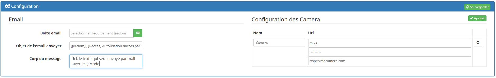
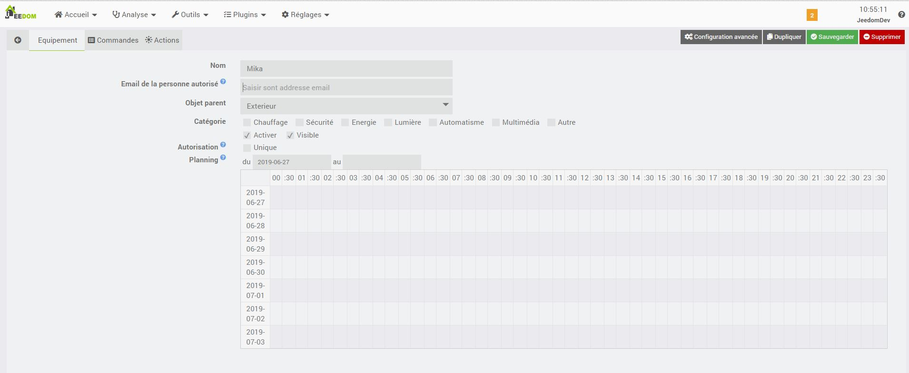
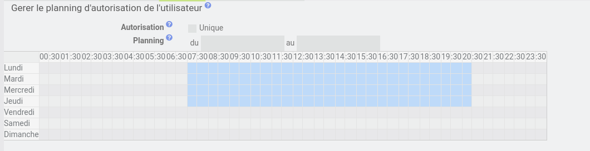
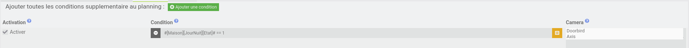
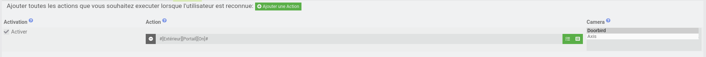

# Description

Ce plugin permet de déclencher l'exécution d'actions lorsqu'un QR code est reconnu par une caméra.

Les QR codes sont envoyés par email aux utilisateurs déclarés.

# Installation

L'installation du plugin est tout à fait standard. 

Vous devez installer les dépendances. Notez que cette étape nécessite l'installation de librairies qui peuvent prendre du temps à compiler et induire un message d'erreur de Jeedom expliquant que le temps imparti a été dépassé. Vous devez ignorer ce message et attendre la fin de l'installation des dépendances.

# Workflow

Voici les étapes nécessaires au bon fonctionnement du plugin :

* On configure un équipement de type `mail` pour que l'envoi des QR codes puisse s'effectuer correctement
* On enregistre des caméras qui serviront à la détection de QR codes
* On ajoute des autorisations utilisateurs pour déterminer qui, quand, et comment les actions peuvent s'exécuter

Vous trouverez ci-après le détail de ces étapes

# Configuration

Un fois l'installation et l'activation du plugin réalisé, nous allons le configurer.

## Email

Le plugin transmet à l'utilisateur autorisé le QR code uniquement par mail.
Pour cela il utilise le plugin "Mail" qui devra être configuré sur sa partie équipements.
Il n'est pas nécessaire de créer une commande mail par utilisateur, le plugin gère seul cette partie.

Dans la partie 'Email':
* Boite email : Objet Jeedom du plugin mail
* Objet de l'email envoyé : Saisir le texte de l'objet de l'email
* Corps du message: Il est possible d'ajouter un texte qui sera joint dans le mail

L'utilisateur reçoit l'email lorsque la commande "Activer" a été exécutée (cf Création d'autorisations)

## Caméras

Il est possible d'ajouter autant de cameras que l'on souhaite, cependant plus y a de cameras, plus votre système sera ralenti.
Dans la partie 'Configuration des Caméras' cliquez sur 'Ajouter'

* Nom : On donne un nom à notre caméra.
* Activation : Permet de choisir si une caméra configurée est utilisée ou non.
* Nombre de thread: Permet de déterminer combien d'analyses simultanées peut faire le plugin. (Plus il y a de threads, plus le plugin est capable d'analyser d'images mais plus la charge est importante)
* Nombre d'image: Permet de déterminer un compteur d'image valide afin de validé la conformité de la detection
* Port de connexion: Saisir un port de votre jeedom libre afin que le plugin puisse communiquer avec le démon de votre caméra
* Authentification : on saisit les identifiants de connexion si besoin.
* URL de connexion (rtsp://, http://) : On saisit l'URL du flux de la caméra. Etant donné le nombre de caméras différentes qui existent sur le marché, il est difficile de vous aider sur cette configuration. Je vous conseille de tester vos URLs avec un lecteur de flux comme `vlc` par exemple.

## Gestion des snapshots

Il est possible que le plugin enregistre un snapshot à chaque détection.
* Prendre un snapshot lors d'une détection : Autorise le plugin à sauvegarder la prise de vue
* Prendre une video lors d'une détection : Autorise le plugin à sauvegarder une video de la detection
* Emplacement du dossier Snapshot : Spécifie le dossier où enregistrer les snapshots
* Surveiller la taille du dossier Snapshot de chaque caméra : Autorise la surveillance et la suppression des snapshots les plus vieux
* Taille du dossier Snapshot de chaque camera (Mo) : Taille maximale que peut contenir le dossier

# Création d'une autorisation utilisateur

Rendez-vous dans Plugins => Sécurité => Accès par QR code
Cliquer sur "Ajouter" pour créer une nouvelle autorisation

## Utilisateur

Ici, on retrouve les paramètres courants de Jeedom
* Nom : Nom de l'équipement
* Email de la personne autorisée : Adresse email de destination du QR code
* Objet parent : Objet Jeedom si on veut l'afficher sur le Dashboard
* Activer / Visible : Permet de d'activer ou de désactiver totalement l'accès

## Gérer un planning d'autorisation

Pour limiter l'usage de la reconnaissance, il est possible de créer des créneaux horaires d'autorisation

* Autorisation (Unique) : Permet que l'autorisation ne soit donnée qu'une seule fois
* Planning : Permet de choisir les créneaux horaires dans la semaine ou sur une période choisie

## Conditionner les actions

Il est également possible de renforcer l'autorisation d'un utilisateur grâce à des conditions

Veillez à bien activer les conditions en cochant la checkbox sur la gauche et à sélectionner la bonne caméra.

## Exécuter les actions

Lorsque le QRcode sera reconnu, si l’utilisateur est activé, s'il est autorisé sur le planning, et que toutes les conditions sont vérifiées, alors le plugin permet d’exécuter des actions.

> Les actions permetant d'envoyer un fichier (Mail, Slack, Télégrame, ...) receveront automatiquement le snapshot qui a ete pris lors de la détéction

> Ouverture du portail, alerte, ...

Veillez à bien activer les actions en cochant la checkbox sur la gauche et à sélectionner la bonne caméra.

# FAQ

## L'utilisateur n'a pas reçu de mail

* La commande Mail utilisée doit être fonctionnelle, vérifiez la avec un mail de test.
* Exécutez la commande "Activer" liée à l'autorisation pour que le mail soit émis.
* Vérifiez que l'autorisation est armée (Cadenas sur le Dashboard).

## La détection s'est elle bien déroulée ?

Lorsque l'utilisateur présente le QR code à une caméra, le plugin peut enregistrer un snapshot si vous l'y avez autorisé.

Dans ce cas, si le QR code a été reconnu, il est entouré d'un cadre bleu. 

Un simple point bleu n'est pas suffisant.

