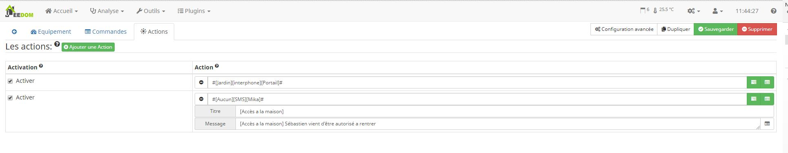

Description
==========
Ce plugin permet de gerer une acces par QRcode.
Un Qr code est envoyé par mail a l'utilisateur autorisé

Configuration
=============

Un fois l'installation et l'activation du plugin réalisé, nous allons le configurer.

Ajout de camera
---------------

Il est possible d'ajouter autant de camera que l'on souhaite, cependant plus y a de camera plus votre systeme sera ralentis
Dans la partie 'Configuration des Camera' cliquer sur 'Ajouter' et saisir les informations de connexion de votre camera.

Envoie d'un mail
----------------
Le plugin transmet a l'utilisateur autorisé le QRcode uniquement par mail.
Pour cela il utilise le plugin "Mail" qui devra etre configurer sur ca partie equipement.
Il n'est pas necessaire de cree une commande mail par utilisateur, le plugin gere seul cette partie.

Dans la partie 'Email':
* Boite email : Objet jeedom du plugin mail
* Objet de l'email envoyer : Saisir le text de l'objet de l'email
* Corp du message: Il est possible d'ajouté un texte qui sera joint dans le mail

Creation d'une autorisation utilisateur
=======================================

Rendez vous dans Plugins => Sécurité => Acces par QRcode
Cliquer sur "Ajouter" pour cree une nouvelle autorisation

Utilisateur
-----------

Ici, on retrouve les parametres courant de jeedom
* Nom : Nom de la commande d'autorisation
* Email de la personne autorisé : Adresse mail pour l'envoie du QRcode
* Objet parent : Objet jeedom si on veux l'afficher sur le dashbord
* Activer / Visible : Permet de desactivé totalement l'acces
* Autorisation (Unique) : Permet que le QRcode ne soit utilisé qu'une seul fois
* Planning : permet de choisir les crenaux horaire dans la semaine ou sur une periode choisis

Actions
-------

Lorsque le QRcode sera vue par une camera et reconnue par jeedom, et qu'il est autorisé dans le crenaux horaire alors les actions seront executé.
Le plugin permet de creer un liste d'action executer dans l'odre de saisi

FAQ
===

L'utilisateur n'a pas recu de mail
----------------------------------

* Vérifier le compte mail sur Jeeedom
* Verifier que l'autorisation est armée (Cadenas sur le dashbord)

