Description
===
Ce plugin a pour objectif de gérer facilement et automatiquement vos volets.
Celui-ci est basé sur le plugin Héliotrope qui est un prérequis pour son utilisation.

> Avant l'utilisation de ce plugin bien vérifier le fonctionnement du plugin Héliotrope.

> Pour le bon fonctionnement du plugin, toutes les gestions pour un volet doivent être activées sur la même zone.
Il est recommandé, mais pas obligatoire, d'utiliser une zone par volet afin de faciliter la configuration et la gestion.

* le plugin gèrera automatiquement l'ouverture et la fermeture de vos volets au lever du soleil et à la tombée de la nuit.
* le plugin gèrera automatiquement l'ouverture et la fermeture de vos volets en fonction de la position du soleil.
    * en mode été, il fermera les volets lorsque le soleil sera dans la fenêtre afin de préserver une température idéale dans la maison.
    * en mode hiver, il ouvrira les volets pour permettre au soleil de chauffer la pièce et faire des économies d'énergie.
* le plugin gèrera automatiquement l'ouverture et la fermeture de vos volets en fonction de vos évènements.
* le plugin gèrera automatiquement l'ouverture et la fermeture de vos volets en fonction de conditions.

Configuration générale
===

Dans la configuration générale il est possible d'ajouter une clef API Bing.
Cette clef est optionnelle, uniquement utile si vous souhaitez avoir des cartes plus récentes ou satellite.
Cela peut être utile si votre maison est récente et pas encore dessinée sur la carte OpenLayer.

Obtenir une clef API BING
----

Pour obtenir une clef API bing, aller sur le site [bingmapsportal](https://www.bingmapsportal.com/Application#)
puis créer une nouvelle application.

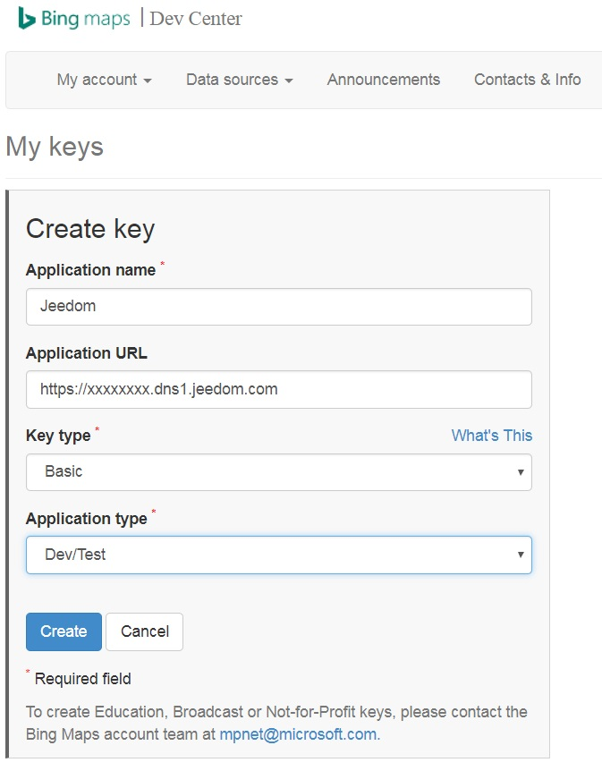

Commandes et widgets
===
Pour chaque équipement, le plugin va créer des commandes.

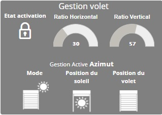

* `Activer` / `Désactiver` => `Etat activation` : Permet de gérer l'armement du plugin par une voie externe (scénario, plugin, ...)
* `Etat du volet`: Etat déterminant la position actuelle du volet
* `Position du soleil` : Détermine si le soleil est dans la fenêtre ou non
* `Ratio Horizontal` : Estimation par le plugin du ratio d'ouverture horizontal
* `Ratio Vertical` : Estimation par le plugin du ratio d'ouverture vertical
* `Mode` : Détermine dans quel Mode (Saison) fonctionne le plugin 
* `Etat mode` : Représentation du mode actif
* `Gestion Active` : Indicateur de gestion en cours d'utilisation

Gestion Active
---
Cette commande permet de déterminer quelle gestion est en cours actuellement.

* `Manuel` : Le plugin est en mode manuel et n'intervient plus
* `Jour` : il fait jour, on active toutes les autres gestions. On vérifie les autres gestions avant d'exécuter les actions.
* `Nuit` : il fait nuit, toutes les autres gestions sont désactivées.
* `Azimut` : si le soleil est dans la fenêtre, on ferme les volets. La gestion par azimut autorise toutes autres gestions.  
* `Evènement` : Le plugin vas écouter les évènements de vos commandes et décider de fermer selon vos paramètres. La gestion Evènement interdit toutes autres gestions hormis la gestion `Nuit`.
* `Conditionnel` : Le plugin vérifie toute les minutes les conditions, si elles sont vérifiées, alors, il fermera le volet. La gestion Conditionnel interdit toutes autres gestions hormis la gestion `Nuit`.

La position du volet
---

L'état du volet est important pour le plugin car il donne les autorisations d'exécution ou non.
L'état peut être réel, si vous configurer les champs `Objet état réel` ou simulé par le plugin si le champ est vide

Pour un état réel il faut bien s'assurer que l'état du plugin suive l'état réel lors de manipulation manuel
Pour un état simulé il peut y avoir des décalages lors de manipulation manuel de votre volet (Le mode manuel n'est donc pas possible)

Lors de l'utilisation de commande non proportionnelle, le plugin met par défaut 0 ou 100%, si votre module (par exemple les FIBARO) n’est pas sur cette plage il faut personnaliser le minimum et maximum de la commande `Etat du volet`

Le mode et son état
---

Ces 2 commandes vont permettre de basculer le plugin en mode "été" ou "hiver".
C'est à vous de déterminer à quel moment il faut gérer ce changement.

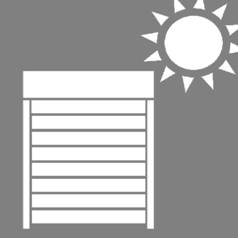

L'icône ci-dessus montre le mode "été", le volet est fermé lorsque le soleil est dans la fenêtre.
Le volet se fermera pour garder la fraicheur.

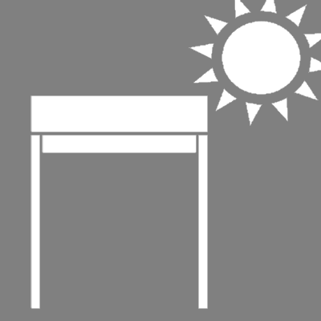

L'icône ci-dessus montre le mode "hiver", le volet est ouvert lorsque le soleil est dans la fenêtre.
Le volet s'ouvrira pour accumuler la chaleur

La position du soleil
---
Cette commande nous informe si le soleil est dans la fenêtre ou pas.

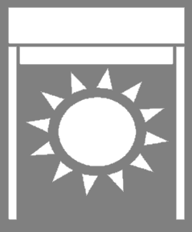

Dans la fenêtre.

Hors fenêtre.

Paramétrage
===
Comme pour tous les plugins, nous allons commencer par créer un groupe de zone avec le bouton `Ajouter`.
Après avoir nommé ce groupe, nous allons pouvoir commencer à mettre en place nos zones.

Configuration générale Jeedom
---

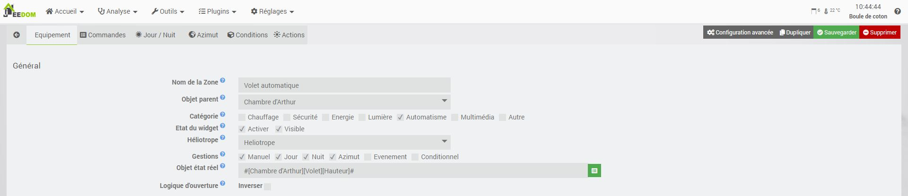

### Paramètres Généraux

* `Nom` : le nom a déjà été paramétré mais vous avez la possibilité de le changer
* `Objet parent` : ce paramètre permet d'ajouter l'équipement dans un objet Jeedom
* `Catégorie` : déclare l'équipement dans une catégorie
* `Activer` : permet d'activer l'équipement
* `Visible` : permet de rendre l'équipement visible dans le Dashboard
* `Héliotrope` : choisir l'équipement Héliotrope à prendre en compte pour ce groupe de zone

### Choix des gestions actives

* `Manuel` : activation de la gestion manuelle, autorise les changements manuels de volet
* `Jour` : activation de la gestion en jour 
* `Nuit` : activation de la gestion en nuit
* `Azimut` : activation de la gestion en fonction de la position du soleil (dépend de l'équipement Héliotrope)
* `Evènement` : activation de la gestion Evènement
* `Conditionnel` : active la gestion Conditionnel. 

### Gestion de l'état réel

* `Objet état réel` : Commande Jeedom permettant de définir l'état réel du volet
* `Inverser Ratio` : Permet d'inversion le sens de calcul du ratio

Gestion du lever et coucher du soleil
---
Cette gestion permet d'ouvrir ou de fermer le volet en fonction du lever et du coucher du soleil.
Il faut activer la gestion pour faire apparaitre les champs de configuration spécifique.

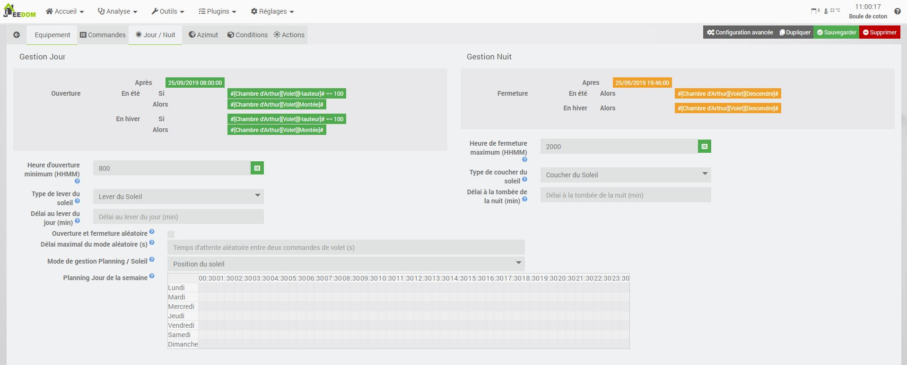

### Général

* `Ouverture et fermeture aléatoire` : Si vous avez plusieurs volets sur la zone et que vous souhaitez un ouverture aléatoire (Attention il est impératif que les actions de mouvement soit renseignées dans les actions)
* `Délai maximal du mode aléatoire (s)` : Délais maximal qui sera appliqué entre chaque exécution de mouvement aléatoire

### Gestion du jour

* `Heure d'ouverture minimum` : Permet d'imposer au plugin une heure minimum à partir de laquelle le plugin ne tiendra plus compte de l'heure du lever du soleil 
* `Type de lever du soleil` : permet de choisir quel type d'horaire vous voulez pour le lever du jour
* `Délai au lever du jour (min)` : délai avant (-) ou après (+) l'heure du lever du jour

### Gestion de la nuit

* `Heure de fermeture maximum` :  Permet d'imposer au plugin une heure maximum à partir de laquelle le plugin ne tiendra plus compte de l'heure du coucher du soleil 
* `Type de coucher du soleil` : permet de choisir quel type d'horaire vous voulez pour la tombée de la nuit
* `Délai à la tombée de la nuit (min)` : délai avant (-) ou après (+) l'heure de la tombée de la nuit

Il est important que ces 2 gestions fonctionnent ensemble.
Si la gestion de Jour n'est pas activée le plugin restera en gestion de Nuit.

Pour compléter cette gestion, il est possible d'ajouter des conditions.
Par exemple, dans les chambres, je ne veux pas que les volets s'ouvrent avant 8h.
J'ajouterai donc une condition de ce type

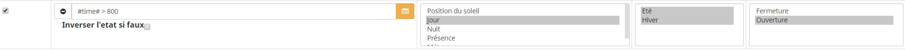

Gestion Manuel
---

La gestion manuel est détectée si votre état réel du volet change et qui n'est pas autorisé par le plugin.
Elle va vous permettre de pouvoir autoriser des changements manuels en désarmant le plugin.

Ce sera donc à vous de gérer le réarmement pour retrouver un fonctionnement automatique de vos volets

Gestion par Azimut
---

Ce mode de fonctionnement permet de fermer les volets lorsque le soleil est entre les angles d'exposition au soleil de la fenêtre.
Pour utiliser cette gestion il est impératif de bien définir l'angle d'exposition au soleil en positionnant correctement les curseurs.

Pour améliorer l'expérience de la gestion Azimut, le plugin calcule des ratios d'ouverture du volet par rapport à l'exposition du soleil

- Ratio Vertical :  ce ratio reflète la hauteur d'ouverture du volet en fonction de l'altitude du soleil (Entre 0 et 100% par défaut)
- Ratio Horizontal :  ce ratio reflète la pénétration du soleil dans la fenêtre en fonction de l'azimut du soleil (Entre 0 et 100% par défaut)

Nous pouvons limiter le ratio Vertical avec les paramètres d'altitude d'obstruction Minimum et Max.
Si le soleil est au-dessous du minimum ou au-dessus du maximum alors le ratio sera à 100% ouvert

Nous pouvons limiter le ratio Horizontal avec la définition de l'angle d'exposition au soleil.

Pour appliquer ces ratios aller lire ce paragraphe [ici](https://mika-nt28.github.io/Jeedom-Volets/fr_FR/#tocAnchor-1-7-8)

### Définition de l'angle d'exposition au soleil 

Cette étape est importante pour le fonctionnement de la gestion en fonction de la position du soleil.

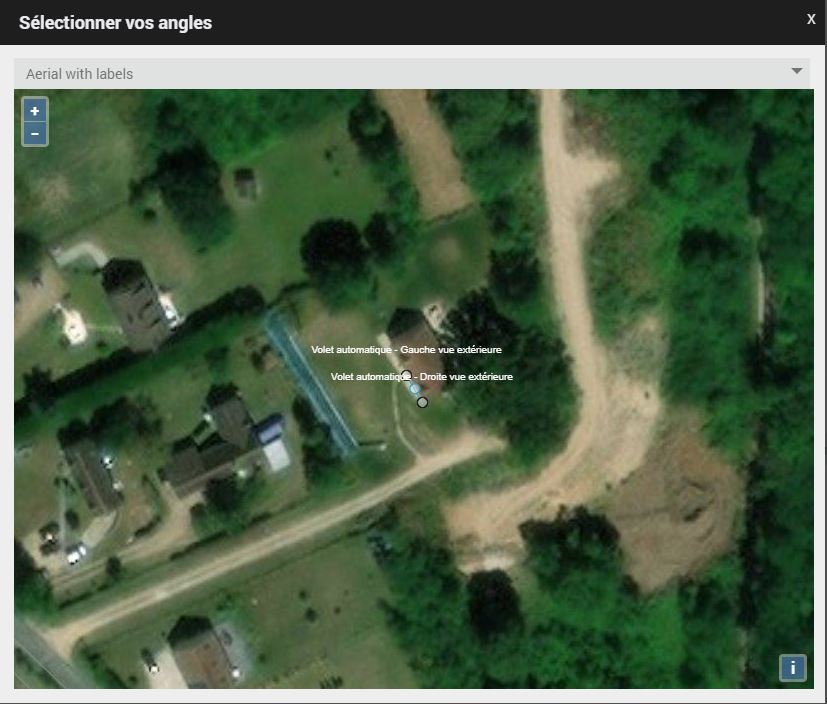

Sur votre fenêtre doit apparaitre 3 curseurs. 
Ces 3 curseurs vont donc former notre angle.
Le point central doit être obligatoirement placé au-dessus de notre fenêtre. 
Les 2 autres vont former l'angle et peuvent être placés n'importe où à l'extérieur de la maison. 
Attention toutefois à bien respecter la droite et la gauche de votre fenêtre vue de l'extérieur (indiqué sur les points de la carte).

### Conditionner

Pour compléter les gestions, il est possible d'ajouter des conditions.
Les conditions vont venir autoriser ou non l'exécution des actions de cette gestion
Par exemple, je veux que les volets ne se ferment que si j'ai une température ambiante en été supérieure à 23.
J'ajouterai donc une condition de ce type.

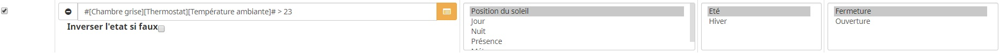

Gestion Evènement
-----------------

Cette gestion est prioritaire sur la gestion Azimut

La gestion Evènement permet de cree une gestion personalisée sur une évènement exterieur
Il faut activer la gestion pour faire apparaitre les champs de configuration spécifiques.

Pour cree une nouvelle gestion évènementiel cliquer sur **Ajouter un groupe**
Desormais cette gestion est diponnible dans la configuration des actions et des conditions particuliere

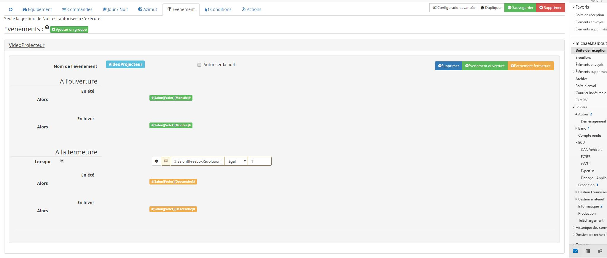

Deplier le groupe de gestion en cliquan sur son nom

Vous pouvez ajouter un évènement, aussi bien pour une action d'ouverture ou de fermeture.
Pour cela, il vous suffit de cliquer **Evenement ouverture**ou**Evenement fermeture** et de compléter la ligne créée.
* `Objet` : Sélectionner une commande Jeedom à écouter
* `Operateur`: Choisir l'opération à effectuer pour valider la fermeture
* `Valeur` : Saisir la valeur à comparer à l'objet

En dessous, le plugin affichera le resumé des conditions et actions pour chaque phase.

Par defaut, la gestion est autorisé en mode jours, il est cepandant possible de l'autoriser la nuit avec la case **Autoriser la nuit** elle sera donc prioritaire sur toutes les gestions
En cas de multiple gestion évènementiel la premiere gestion executer sera prioritaire.

Gestion Conditionnel
--------------------

Cette gestion est prioritaire sur la gestion Azimut

La gestion Conditionnel permet de cree une gestion personalisée ou les condition sont vérifie toutes les minutes.
Si toutes les conditions que vous avez complétées sont valides, alors l'ordre de fermeture sera donné et toutes les autres gestions hormis la gestion de la nuit sont inactives.
Il faut activer la gestion pour faire apparaitre les champs de configuration spécifiques.

Pour cree une nouvelle gestion évènementiel cliquer sur **Ajouter un groupe**
Desormais cette gestion est diponnible dans la configuration des actions et des conditions particuliere

Deplier le groupe de gestion en cliquant sur son nom pour afficher le resumé des conditions et actions pour chaque phase.

Conditions d'exécution et de réarmement
---

Afin d'affiner tous les cas d'utilisation de gestion de nos volets, nous pouvons ajouter des conditions.

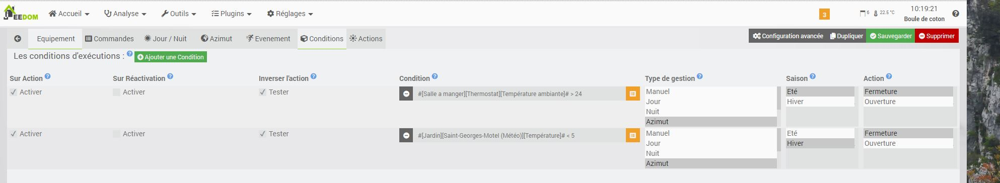

Paramètres complémentaires :
* `Sur Action` : Permet d'identifier les conditions à tester pour exécuter une action   
* `Sur Réactivation` :  Permet d'identifier les conditions à tester pour réarmer le plugin automatiquement
* `Inverser l'action` : Permet de relancer une évaluation des conditions avec une position inverse du volet     
* `Condition` : Saisir votre condition. L'ensemble des conditions forme un ET logique
* `Type de gestion` : sélectionner toutes les gestions où la condition doit être vérifiée (avec la touche `Ctrl`)
* `Mode` : sélectionner tous les modes où la condition doit être vérifiée (avec la touche `Ctrl`)
* `Action` : sélectionner toutes les actions où la condition doit être vérifiée (avec la touche `Ctrl`)

Pour vous aider à la configuration des conditions, un éditeur est ajouté.

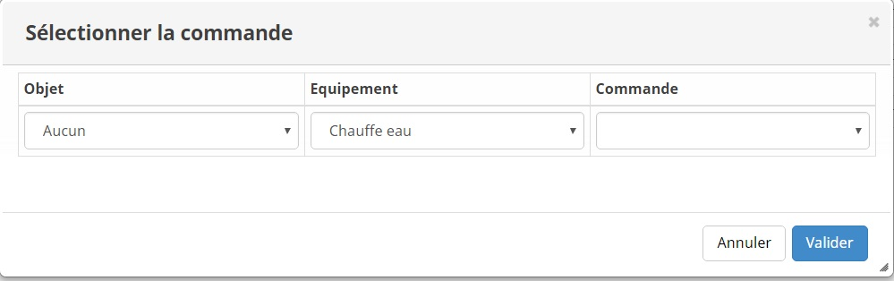

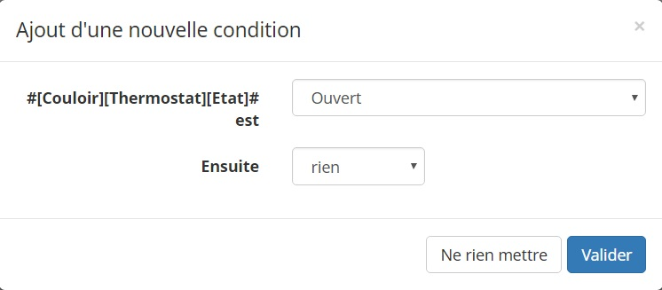

Pour que chaque condition soit validée et les actions exécutées, ces paramètres doivent être validés.

Actions d'ouverture et de fermeture
---

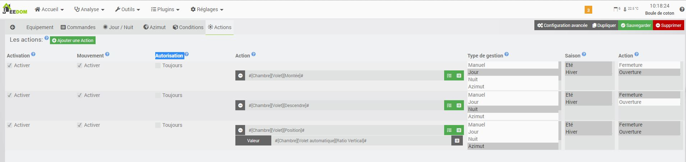

Tout à droite, il est possible d'activer ou non la commande.
Choisissez les actions à mener sans oublier de configurer leurs valeurs.

Paramètres complémentaires :

* `Activation` : Permet d'activer ou non l'action
* `Mouvement` : Permet de déterminer si l'action est une action de mouvement et donnera un retour d'état.
* `Type de gestion` : sélectionner toutes les gestions où l'action doit être exécutée (avec la touche `Ctrl`).
* `Action` : Saisir / choisir votre commande. Il est possible de saisir des opérations arithmétiques dans les options.
* `Mode` : sélectionner tous les modes où l'action doit être exécutée (avec la touche `Ctrl`).
* `Action` : Sélectionner toutes les actions où l'action doit être exécutée (avec la touche `Ctrl`).

### Utilisation des commandes Ratio

Avec la gestion azimut, le plugin calcule et met à jour des commandes radiométriques (Horizontale et Verticale) afin que le rayonnement du soleil soit masqué.
Si vous souhaitez utiliser les commandes radiométriques, il est juste nécessaire de sélectionner la commande ratio en valeur de la commande proportionnelle de votre volet.

FAQ
===

Je veux que mon volet s'ouvre ou se ferme si ma condition est fausse
---
> Lorsque l'on saisit une condition, il est possible d'activer l'option *Inverser l'action*.
Cette option va donc inverser la demande de mouvement et relancer l'évaluation des conditions.

Mon volet ne remonte pas à la sortie du soleil de la fenêtre
---
> Si vous n'avez pas de remontée de volet en gestion Azimut lors de la sortie du soleil, c'est que très probablement l'état du volet sur le plugin est déjà ouvert.

Le plugin reste en gestion Nuit
---
> Vérifier que la gestion jour est activée

Le plugin reste en mode manuel
---
> Pour sortir du mode manuel il faut réarmer **Manuellement ou par scénario** le plugin.

Je ne veux pas que mes volets s'ouvrent le matin avant 10h
---
> Pour cela il faut ajouter une condition sur la gestion jour

Mes Volets ne bougent plus
---
> Vérifier que l'armement de la zone est bien actif (Cadenas fermé sur le widget) et que la gestion active ne soit pas "Manuel"

Le cadenas est ouvert, mais le plugin continue à analyser les informations d'héliotrope
---
> Le plugin est désarmé, il n'y aura pas d'action mais le plugin continue sa surveillance

Mon cadenas s'ouvre à chaque commande du plugin
---
> D'une manière générale, le plugin passe en mode manuel car il reçoit consécutivement plusieurs retours d'état qu'il a acquittés.
Ce problème est lié à la gestion de *répétition de votre commande d'état*.
Pour le corriger, rendez-vous sur la page de configuration du plugin de contrôle de votre module volet et double-cliquez sur la commande de retour d'état.
Jeedom va vous ouvrir la page de paramètre avancé
Allez dans l'onglet **Configuration**>>**Autres**et passez le paramètre**Gestion de la répétition des valeurs**sur**Jamais répéter**

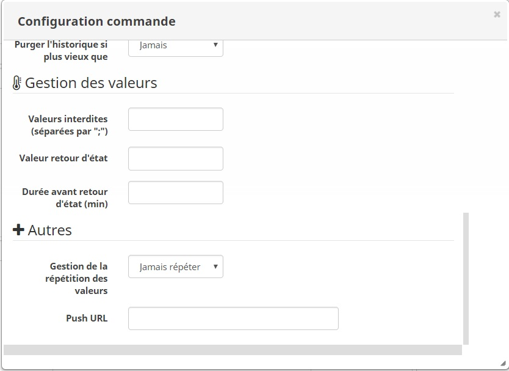

Je suis passé en mode manuel dans la journée, comment réarmer automatiquement le plugin
---
> Pour le réarmement automatique il est nécessaire d'ajouter une condition de réarmement sur la gestion et le mouvement produit.
Par exemple pour le réarmement en gestion de nuit, je vais ajouter une condition du style #time# ++ 2000 en gestion de nuit et sur la fermeture

J'ai configuré ma gestion Azimut avec le ratio mais il fait trop de mouvements
---
> Il est possible de limiter les mouvements avec une formule dans les options.
Dans l'exemple si dessous, on limite l'ouverture du volet de 0 à 100% par pas de 5%
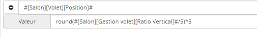

Le plugin ne fonctionne pas avec mon module Fibaro
---
> Les modules fibaro sont gradués proportionnellement de 0 à 99%.
Pour pallier à ce problème il est recommandé de mettre à jour le minimum et maximum des commandes `Etat du volet`,`Ratio Horizontal`, `Ratio Vertical`.
