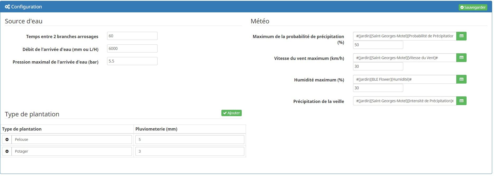
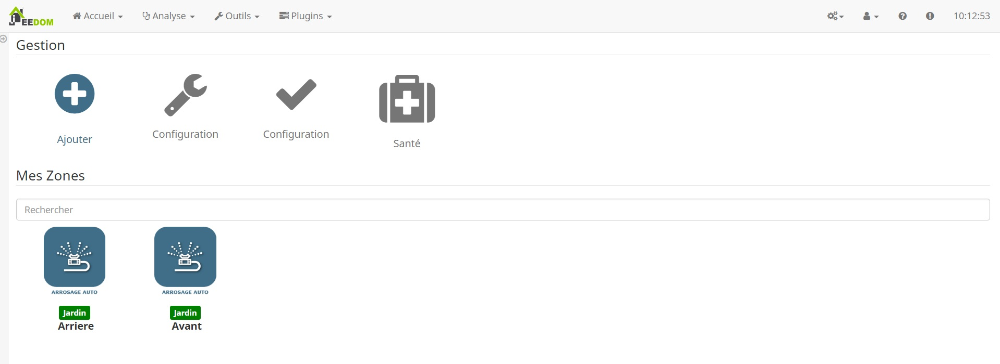
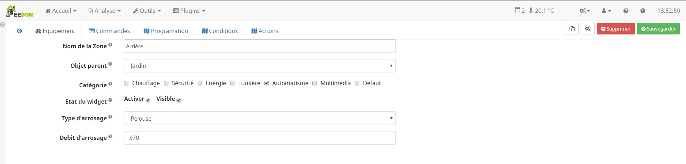
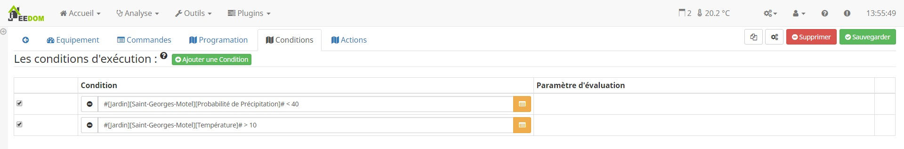
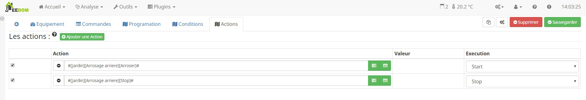
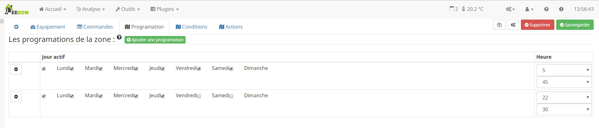
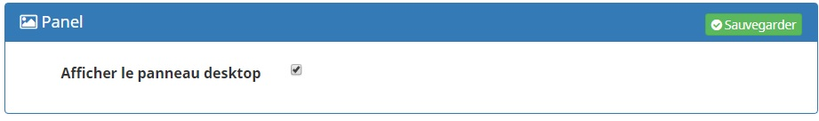
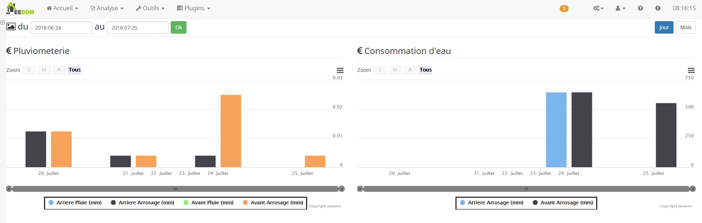

Description
===
Ce plugin a pour objet de gérer facilement et automatiquement votre arrosage automatique.

Une fois configuré :

* le plugin gérera automatiquement l'arrosage selon le type de plantation et le débit de vos turbines ou goutte à goutte.

Configuration
===

Caractérisation de la source d'eau
---

* Temps entre 2 branches d'arrosage : délai en minutes entre 2 arrosages d'une même programmation
* Débit de l'arrivée d'eau (mm ou L/h) : débit de votre source
* Pression maximal de l'arrivée d'eau (Bar) : pression de votre source

Conditions météorologiques
---
Le plugin est capable de prendre en compte la météo.
Pour chaque paramètre, il faut sélectionner une commande et saisir son seuil.

* Maximum de la probabilité de précipitation (%) : seuil au-dessus duquel l'arrosage ne se fait pas
* Vitesse du vent maximum (km/h): seuil au-dessus duquel l'arrosage ne se fait pas
* Humidité maximum (%): seuil au-dessus duquel l'arrosage ne se fait pas
* Précipitation de la veille : Le plugin prend en compte les précipitations de la veille

Pluviométrie par type de plantation
---

Le plugin va distinguer le type de plantation, car le besoin en eau n'est pas la même pour chaque plante.
Personnaliser votre liste de types de plantation en y saisissant un nom et la quantité (L/m²) d'eau nécessaire à l'arrosage.

Le débit de la pompe n'est pas encore utilisé, il permettra de déterminer le nombre de zones possibles à l'arrosage.

Commandes et widgets
===

Pour chaque zone d'arrosage créée, le plugin va créer les commandes suivantes :

* Activer : pour armer l'arrosage dynamiquement
* Désactiver : pour désarmer l'arrosage dynamiquement
* État activation : pour connaître l'état d'armement du plugin
* Réglage coefficient : Commande permettant d'intervenir manuellement sur le temps d'arrosage (de 0% à 100% on réduit le temps au-delà on l'augmente)
* Coefficient : pour connaître la valeur du coefficient

Création d'une branche / zone d'arrosage
===

Comme pour tous les plugins, nous allons commencer par créer une zone avec le bouton Ajouter. 
Maintenant nous pouvons configurer notre zone d'arrosage.

Configuration générale Jeedom
---

* Nom : le nom a déjà été paramétré mais vous avez la possibilité de le changer,
* Objet parent : ce paramètre permet d'ajouter l'équipement dans un objet Jeedom,
* Catégorie : déclare l'équipement dans une catégorie,
* Visible : permet de rendre l'équipement visible dans le dashboard,
* Activer : permet d'activer l'équipement,
* Type d'arrosage : sélectionner le type de plantation à arroser,
* Débit d'arrosage : saisir le débit des turbines ou goutte à goutte.
* Superficie : saisir la superficie de la zone

Calcul du débit pour un goutte à goutte :

Débit (mm/h) = (10 000 x débit du goutteur (L/h))/(Espacement latéral (cm) x Espacement des goutteurs (cm))

Conditions
---

Pour chaque zone, nous pouvons choisir des conditions.
Toutes les conditions doivent être respectées pour que les actions soient exécutées.
Pour vous aider à la configuration des conditions, un éditeur est ajouté.

Actions
---

Choisissez les actions à mener sans oublier de configurer leur valeurs et l'étape à laquelle on veut qu'elles s'exécutent.

Programmation des arrosages
===

La programmation est générale, c'est a dire que l'on détermine à quelle heure on doit arroser pour chaque zone et le plugin se charge du reste.
Si vous décider d'arroser plusieurs zone dans le même créneau, mais que la source d'eau n'a pas les ressources (débit / pression) nécessaires alors l'arrosage se décalera du temps d'arrosage des premiers créneaux avec le temps entre 2 arrosages.

Pour programmer un nouvelle arrosage, il suffit faut se rendre sur la page de configuration des arroseurs puis d'ouvrir la programmation.

Pour ajouter à la liste un nouveaux créneaux d'arrosage, il suffit de cliquer sur *Ajouter une programmation*.
* Sélectionner les jours de la programmation
* Sélectionner l'heure de la programmation
* Sélectionner les zones à arroser pour cette programmation
			
Affichage des statistiques d'arrosage
===

Le plugin a un panel qui vous donne des statistiques sur l'arrosage réalisé.
Jeedom n'autorise pas par défaut l'affichage d'un panel, il vous sera donc nécessaire de l'activé dans un premier temps.

Ensuite rendez vous dans Accueil > Arrosage automatique et vous verrez l'affichage des statistiques de vos arrosages comme ceci 

ChangeLog
=========

Stable
--------

### 15/02/2020

* Correction du defaut a la création des commandes avec le version 4.xxx

Beta
----

### 07/03/2020

* Correction verification meteo

### 06/03/2020

* Ajout de la verification de la meteo avant le demmarage de l'arrosage

### 03/03/2020

* Passage de l'arrosage a la seconde.
* BugFix reprogrammation lorsque la condition est fausse.

