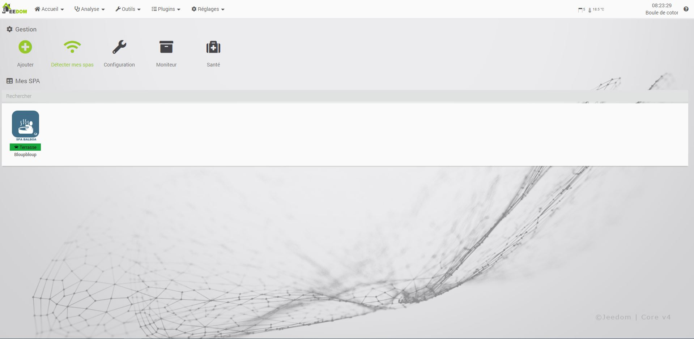
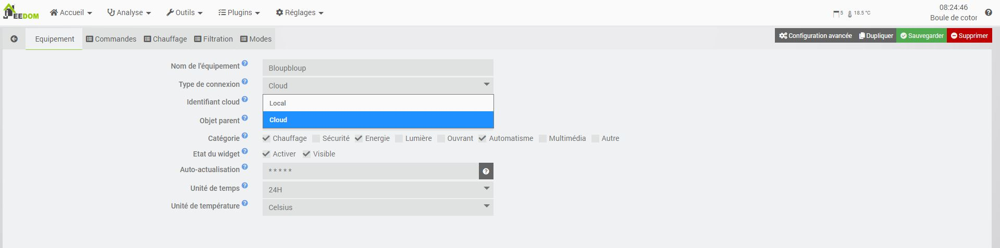
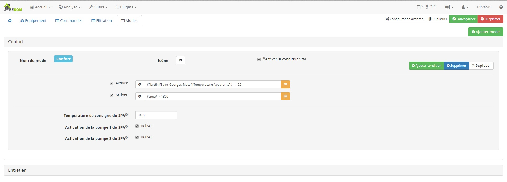
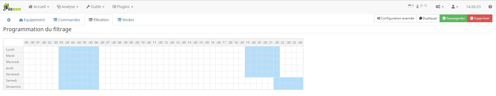

# Description

Ce plugin a pour objet de connecter Jeedom à vos SPA __balboa__.

# Configuration

## Ajout d'un SPA

Rendez-vous sur la pages de configuration du plugin Plugins => Confort => SPA Balboa

Il existe 2 solution pour ajouter un SPA a jeedom
Comme partout dans jeedom vous avez le bouton "Ajouter" qui vas vous crée votre équipement, au la decouverte automatique qui vas crée automatiquement tous les spa qui reponde.

Si-dessous, les champs de configuration qui sont a presonaliser dans les 2 cas de creation

* Nom de l'équipement : Nom saisi lors de la création de l'equipement, mais peut être encore modifié
* Type de connexion : Sélectionner la méthode de connexion locale / cloud / ControlMySPA
* Adresse IP de l'equipement : Adresse IP du module wifi de votre SPA (automatiquement renseigné par la détéction automatique
* Identifiant cloud / ControlMySPA : Saisir vos identifiants de connexion BWA / ControlMySPA
* Objet parent : Objet Jeedom associé à votre SPA
* Catégorie : choisissez la catégorie dans laquelle vous souhaiter regrouper votre SPA
* Etat du widget : Paramètre de visibilité et d'activation de votre equipement
* Unité de temps : Ce paramètre permet de configurer votre SPA Balboa et synchronise l'heure de jeedom et du SPA
* Unité de température : Ce paramètre permet de configurer votre SPA Balboa

>  Unité de temps et Unité de température, ne fonctionne pas en mode CLOUD/ ControlMySPA

## Création de mode de fonctionnement

Pour automatiser plus facilement notre SPA, le plugin propose la création de mode.
Il est possible d'ajouter autant de mode que l'on souhaite.

Les modes peuvent etre automatiquement déclanché par des conditions évalué toute les minutes.
Pour que le mode soit autrisé automatiquement toute les conditions doivent etre remplis

Pour chaque mode une deuxieme serie de condition évalué uniquement lors d'une demande de changement de mode 
Pour que le mode soit autrisé  toute les conditions doivent etre remplis

Lorsque le mode est autorisé toutes les actions de changement de mode sont executé.
Apres un changement de mode et lorsque la température est a 1°c de la température de consigne alors les actions "Pret" sont executé

## Programmation hebdomadaire des filtrations

La gestion de votre SPA est capable en toute autonomie de gère automatiquement les filtrations quotidien.
Dans cette partie je vous propose de programmer la filtration hebdomadaire.

Pour ajouter un créneaux, vous cliquer et glisser vers la fin du créneaux
> seul 2 créneaux sont autoriser

> Pour supprimer un créneaux, utiliser le clic droit

> Ne fonctionne pas en mode CLOUD

# Commandes

Voici toute les commandes qui sont automatiquement crée lors de l'ajout d'un SPA, il est possible d'en créer des supplémentaires. 

* Température : Température actuel de l'eau de votre SPA
* Consigne / Etat Consigne : Consigne de chauffage actuel de votre SPA
* Range / Etat Range : Limite de consigne de température de votre SPA
* Etat chauffage : Etat du réchauffeur d'eau
* Temps de chauffage : Temps estimé pour une chauffe complète
* Mode de chauffage / Etat Mode de chauffage : type de chauffage
* Eclairage / Etat éclairage : Activation et état de l'éclairage de votre SPA
* Blower / Etat Blower : Activation et état du blower de votre SPA
* Pompe 1 / Etat Pompe 1 : Activation et état de la pompe 1 de votre SPA
* Pompe 2 / Etat Pompe 2 : Activation et état de la pompe 2 de votre SPA
* Etat Pompe de circulation : Activation et état de la pompe de circulation de votre SPA
* Mode actif / Mode du SPA : Activation et état des mode de votre SPA
* Priming: Flag d'amorçage de la pompe

# FAQ

