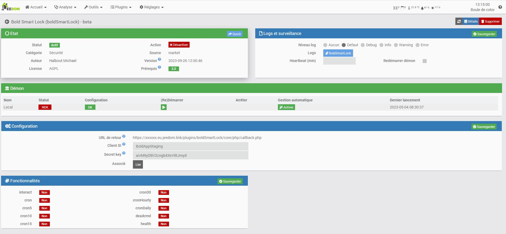
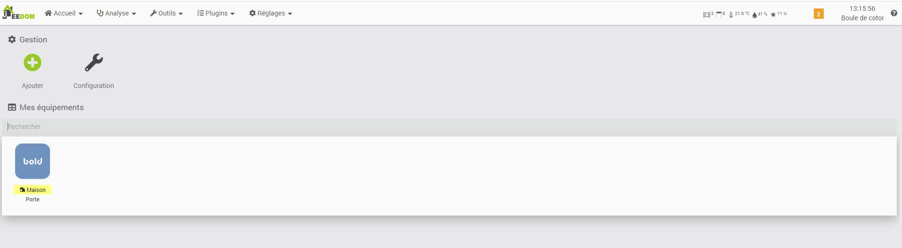

# Description

Plugin permettant de piloter les serrures Bold Smart Lock.
Pour fonctionner, il vous faut une Bold connect ainsi qu'un cylindre

# Configuration du plugin

Le plugin n'a pas besoin de dépendance, il communique avec les serveurs Bold au travers de leur API
Pour fonctionner le plugin a besoin d'information 
* Client ID : a determiné si besoin spécifique,  par défaut **BoldAppStaging**
* Secret key  : a determiné si besoin spécifique,  par défaut **aivM9yDBV2cngb4XeV8tJmyd**
* Login : votre login de connexion a bold
* Mots de pass : votre mots de passe de connexion a bold

# Configuration Equipements

## Autodetection
A venir une auto detection et creation des equipements (en attente des premier retour de connexion)

## Parametres

Paramtrage standard a jeedom, attention que le numero de serie de la serrure soit spécifié

## Commandes

Pour cette premiere version seul les commande
* Etat
* Ouvrir
* Fermer
