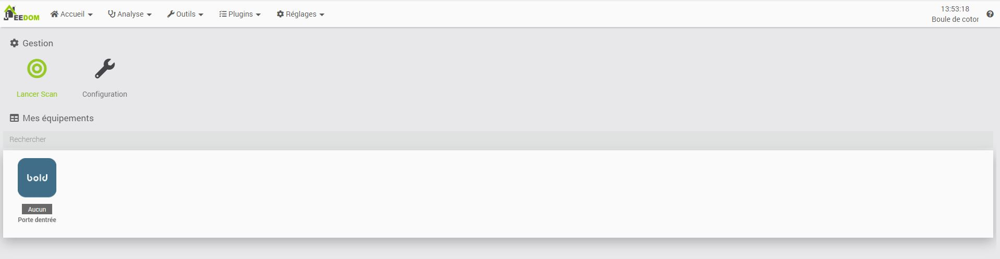

# Description

Plugin permettant de piloter les serrures Bold Smart Lock.
Pour fonctionner, il vous faut une Bold connect ainsi qu'un cylindre

# Configuration du plugin

Le plugin n'a pas besoin de dépendance, il communique avec les serveurs Jeedom et Bold au travers de leur API
Pour que les services jeedom puisse communiqué avec votre serrure il faut lier Jeedom a Bold par le lien

# Configuration Equipements

## Autodetection
Apres l'association, vous pouver lancer une recherche de vos équipements qui seront automatiquement remonté par Bold

## Commandes

Pour cette premiere version seul les commande
* Etat : 
* Activer : Permet d'activer la serrure pour ouvrir
* Fermer : Permet de desactiver la serrure pour empecher l'ouverture
