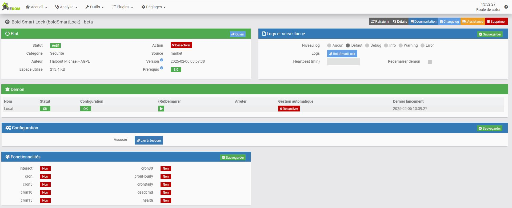

# Description

Plugin permettant de piloter les serrures Bold Smart Lock.
Pour fonctionner, il vous faut une Bold connect ainsi qu'un cylindre

# Configuration du plugin

Le plugin n'a pas besoin de dépendance, il communique avec les serveurs Bold au travers de leur API
Pour fonctionner le plugin a besoin d'information 
* Client ID : a demander a Bold
* Secret key  : a demander a Bold

Pensez a sauvgarder les paramatres avant de l'association de votre jeedom a votre compte Bolde

# Configuration Equipements

## Autodetection
Apres l'association a votre box, le demon demmarrera et créra toutes les serrures liée au compte

## Commandes

Pour cette premiere version seul les commande
* Etat : 
* Activer : Permet d'activer la serrure pour ouvrir
* Fermer : Permet de desactiver la serrure pour empecher l'ouverture
