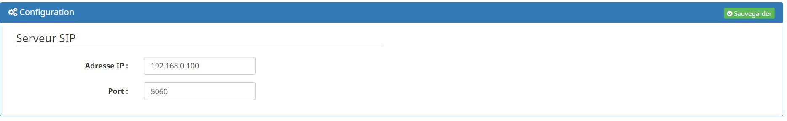
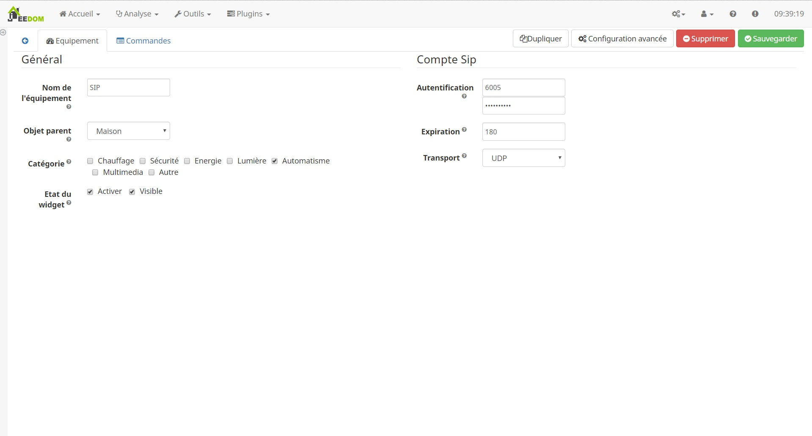

# Description

Ce plugin a pour but de connecter jeedom a notre réseau SIP de manière a ce que des interaction entre jeedom et son appellent soit possible.
Jeedom repondera automatiquement a chaque appel, un message sera diffusé filtré par le numero de l'appelan

# Installation et configuration

## Installation

Le plugin embarque l'installation de dépendance pour faire du TexToSpeach (pas encore actif sur la plugin)
Pour poursuivre la configuration, il est important d'avoir installé ses dépendances

## Configuration

Pour utiliser se plugin, il est impératif d'avoir configurer un serveur SIP et d'y saisir les informations de connexions

	

# Ajouter un client SIP

Avant de commencer le paramétrage du client sur jeedom, il est impératif de l'avoir créé sur votre serveur 

	

# Configuration général

Cette onglet est un standard de jeedom

* Nom de l'équipement : Permet de nommer sur jeedom sur votre réseau SIP le client virtuel crée
* Objet parent : Permet d'associer le widget sur votre Jeedom
* Catégorie : Permet d'associer un catégorie
* Activer : Permet d'activer le client sur jeedom et sur le réseau SIP
* Visible : Permet de rendre visible ou non le widget sur Jeedom

## Configuration du client SIP

Afin de pouvoir établir une connexion il est impératif d'avoir créé un numéro et un authentification sur votre serveur SIP.
Reporter ici les information

* Saisir les informations d'authentification sur le serveur : Identifiant précédemment créer
* Saisir le temps d'expiration : Temps d'expiration de votre numéro précédemment configurer sur votre serveur: non utilisé sur cette version
* Choisir le type de transport : Type de transport choisie (seul l'udp a été validé): non utilisé sur cette version

Un fois sauvegarder jeedom communiquera avec votre réseau SIP

## Text To Speach

Le plugin communique avec son interlocuteur à l'aide de message que vous avez cree pour chaque numero et le stream par un text to speach au format PCMU/PCMA.(G711)
Des message générique diffusé a tous le appel peuvent etre réalisé en ne remplissant pas le numero d'appelant

## DTMF

Le plugin est capable de reconnaitre et de remonté la saisi de DTMF.
Des actions DTMF peuvent etre creé en associant des numero DTMF a chaque action.
Le message de chaque action sera diffusé par Text to Speach

Actuelement 1 seul digit est reconue

# Commandes jeedom

La liste si dessous décrit chaque commande disponible sous jeedom

* Etat connexion: Cette commande reflète l'état du client sur le réseau SIP
  * INACTIVE: Pas enregistrer
  * REGISTERING: Téléphone en cours d'enregistrement
  * REGISTERED: Téléphone enregistré
  * DEREGISTERING: Téléphone arreté
  * FAILED
This PhoneStatus is used when VoIPPhone.start() has been called, but failed to start due to an error.
* Etat appel: cette commande détermine l'état de la ligne
  * DIALING: Lorsque l'appel est en cours
  * RINGING: Lors de la recepetion d'un appel pas encore décroché.
  * ANSWRED: Communication active
  * ENDED: Fin de communication 
* Appel: Cette commande permet de saisir un numéro d'appel
* Message: non utilisé sur cette version
