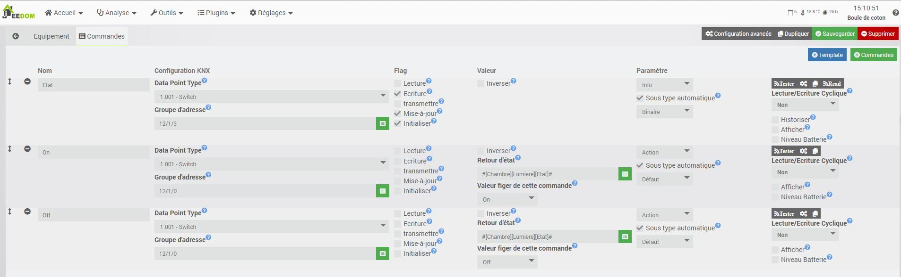
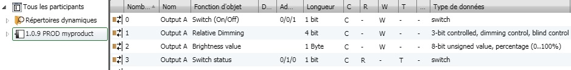
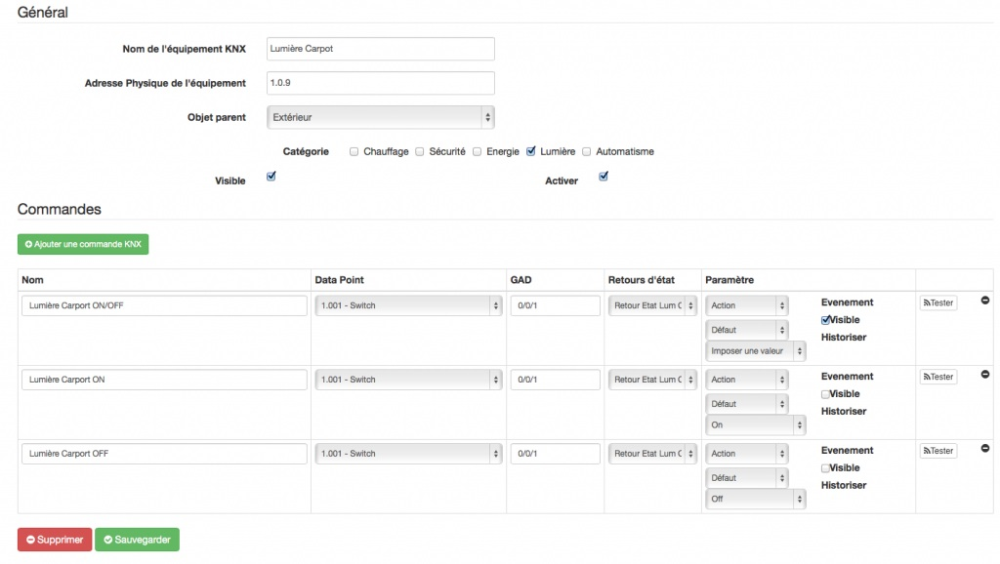
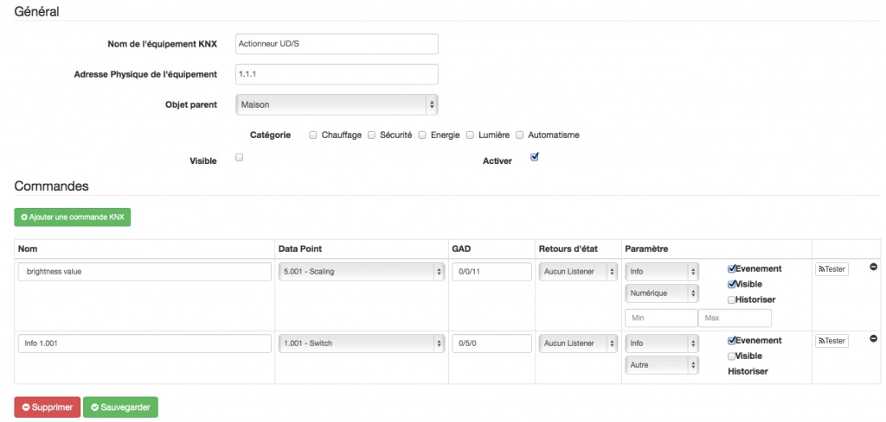
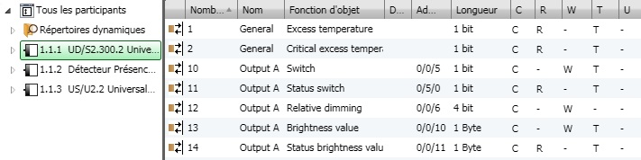
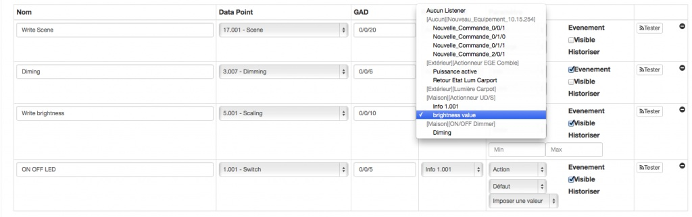

Exemple de configuration :
==========================

L'horloge KNX
--------------

Une horloge knx cout relativement cher et nous pouvons facilement nous en passé grace a jeedom
L'integration est hyper simple, soit en creant les commande comme ceci

Ou tous simplement en utilisant le template NTP
Le mise a jours de l'heure peut etre demandé par un actionneur, dans ce cas il faut activé le flag "Lecture"
La mise a jours cyclique est recommandé 

Téléinfo (DPT : 235.000)
-----------------------------------------------------

Ce DPT permet l'emission ou réception des informations "Choix de tarif" et "Energie réactive". Il est utiliser pour récupérer l'index du compteur ainsi que les états HP/HC ...

Les valeurs renvoyé dans le tarif sont les suivantes :

## Composition du DPT 235.001

Il est sur 6 octets découpé comme suit :

* Entier signé 32 bits Active energy measured in the tariff indicated in the field Tariff (13.010) (Wh)  
* Entier non signé 8 bits Tariff associated to the energy indicated in the field ActiveElectricalEnergy   
* Binaire 8 bits b0 =0 si Tarif valide b1=0 si Active energy valide le reste est réservé.

## Confiugration des commandes

Créer un équipement (Lien vers doc)

Cliquer sur "Ajouter un commande knx" et completer la commande comme ci dessous.

Actionneur ON/OFF :
-------------------
## Créer un équipement correspondant à votre actionneur KNX :

L'Adresse KNX ( elle doit être identique à votre actionneur )
Notre retour d'état : La Groupe Adresse choisie dans l'exemple : 0/1/0 ( A adapter à votre configuration).

Exemple de config ETS de l'actionneur :
Objet status ( Retour d'Etat ) doit avoir au minimum les flags C R et T, comme ci-dessous.

## Créer un équipement qui se comportera comme un intérrupteur KNX :

son Adresse KNX ( elle peut être identique à un vrai intérrupteur KNX qui remplira les même fonctions)

Dans l'exemple ci-dessous : l'actionneur devra réagir sur l'adresse de groupe 0/0/1 ( A adapter à votre configuration)

Lumière ON/OFF est notre action qui fera la bascule (visible coché : sera affiché sur le dashboard)

(Optionel) Lumière ON est une commande qui impose ON (visible décoché : utilisé uniquement via un scénario)

(Optionel) Lumière OFF est une commande qui impose OFF (visible décoché : sert uniquement via un scénario)

Important : Ne pas oublier de choisir dans le champs Retour d'Etat la commande crée précédemment.

Actionneur Dimmer :
----------------------------------
## Créer un équipement correspondant à votre dimmer KNX :

L'Adresse KNX ( elle doit être identique à votre actionneur dimmer )

Etablir un retour Etat 0/0/11 ( A adapter à votre configuration)

Attention au paramètre type "Numérique".

Exemple de config ETS de l'actionneur dimmer :

Objet 0/0/11 Status Brightness value ( Retour d'Etat ) doit avoir au minimum les flags C R et T, comme ci-dessous ( de longeur 1 byte).

## Créer la commande pour dimmer votre lumière :

La commande Write brightness 5.001 0/0/10 doit avoir le paramètre "Slider" et comme retour état la commande créée précédemment "brightness value"

La commande Diming 3.007 est uniquement là pour que jeedom reconnaissance des variations faites depuis des interrupteurs poussoir KNX.

