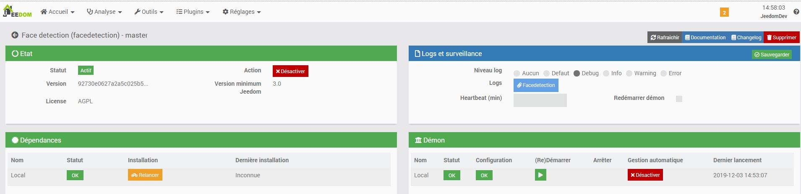
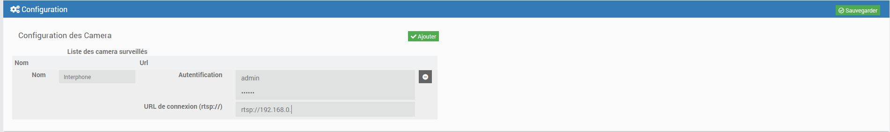
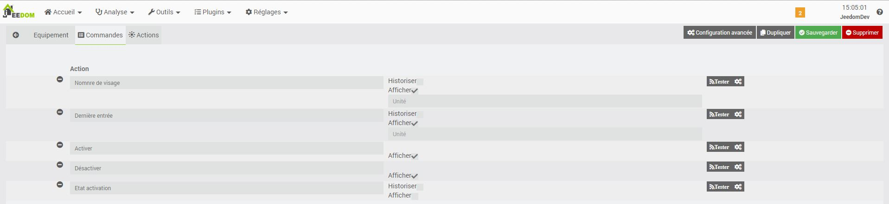

Description
==========
Ce plugin utilise OpenCv pour détecter les visages sur vos camera.

Installation et Configuration
=============================

Pour fonctionner le plugin a besion de certain logiciel comme OpenCv, il est imperatif de lancer l'instalaltion des dependance

Pendant l'installation des dependances, qui peuvent etre long, nous pouvons continuer en configurant nos camera a scruter

Il est assez simple d'ajouter une camera avec un simple bouton et on y saisi les information de connexion

* Nom : On donne un nom a notre camera
* Autentification : on saisi ses identifiant de connexion si besoin
* URL de connexion (rtsp://) : On saisis son url

Ajout d'un groupe actions
=========================

Lorsqu'un camera detecte au moins un visage les groupes seront mise a jours, il est imperatif d'en cree 1
Pour le moment seul 1 groupe est utile, a faire evolué

Voici le commandes qui seront automatiquement cree par le plugin

A chaque detection de visage dans un groupe il sera possible d'effectuer des actions
