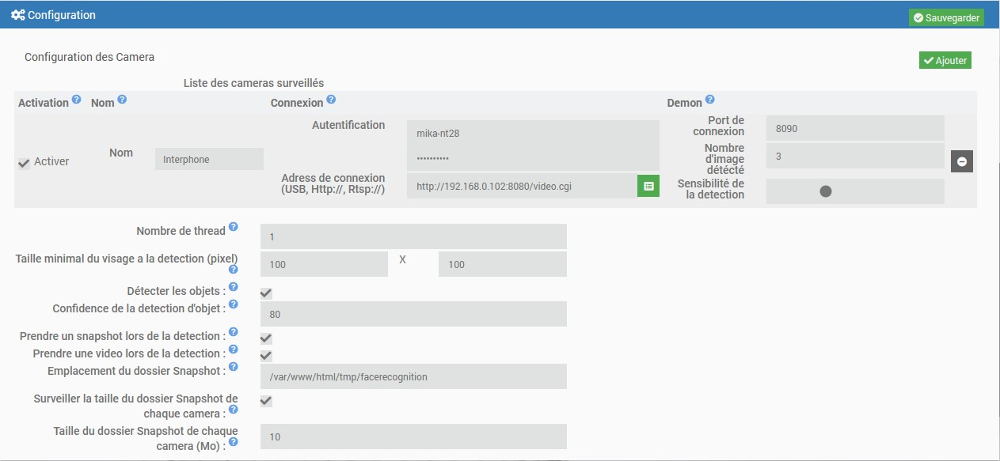
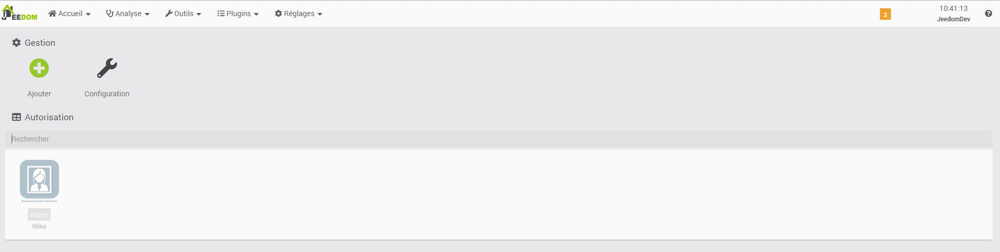
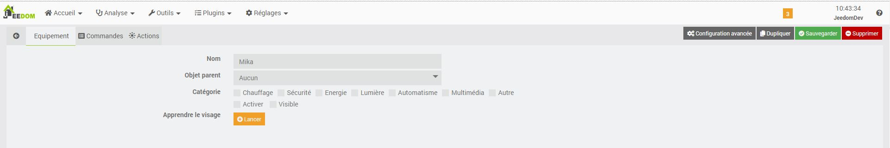
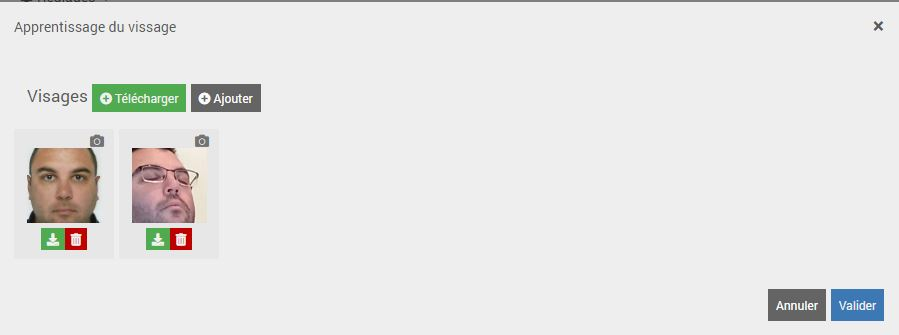
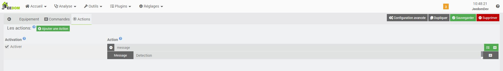
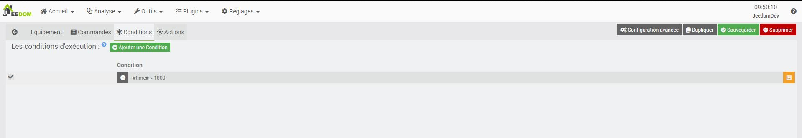

---
Description
==========
Ce plugin utilise OpenCv pour détecter et reconnaitre votre visage. Attention, toute de même aux permissions que vous accordez au plugin car on peut le tromper avec des photos … ou son jumeau

Ce plugin est compatible avec toute camera disposant d'un flux rstp http ou une camera USB

> Le plugin est encore jeune et peut encore comporter quelques bugs mais il évolue régulièrement : n’hésitez pas à me contacter sur le site de Jeedom Community avec toutes vos remarques et suggestions.

Installation et Configuration
=============================

Pour fonctionner le plugin a besoin de certains logiciels comme [OpenCv](https://github.com/opencv/opencv/wiki) ou il est impératif de lancer l’installation des dépendances.

L’installation des dépendances peut prendre beaucoup de temps (plus de 4h lors de mes derniers tests) et par conséquent je vous invite a être patient et a poursivre la configuration

Configuration des cameras
------------------------
Vous pouvez configurer vos cameras (une après l’autre) simplement en cliquant sur le bouton « ajouter » et en saisissant les informations de connexion.

* Nom : On donne un nom à notre camera.
* Activation du démon: Permet de choisir si une camera configuré est utilisée ou non.
* Port du démon: Il est impératif de saisir un port libre différent pour chaque caméra, celui çi interagit avec le démon dynamiquement (mise à jours des visage reconnus, prise de snapshots etc…)
* FrameRate: Permet de determiner combient d'image par seconde le plugin va analysé (plus le framerate est elevé plus il consomme du CPU). Le Frame rate ne doit pas etre superieur au framerate de la camera
* Autentification : on saisi les identifiants de connexion si besoin.
* URL de connexion (rtsp://) : On saisis son url (attention de ne pas se tromper ici, je ne peux pas vous aider à cause du nombre immense de caméra qui existent)

Configuration de prise de vue
-----------------------------

Il est possible que le plugin enregistre un snapshot a chaque detection.
Pour cela il faut l'autoriser dans la configuration du plugin.
Apres l'activation, le plugin vous demande ou enregister les snap, il vous est libre de le choisir.

Pour ne pas remplir les disques avec des snapshot, il est possible de limiter la taille de chaque dossier camera

Creation d'un utilisateur
=========================

Rendez vous sur la page de configuration du plugin

Comme sur tous les plugins Jeedom, il vous suffit de cliquer sur « Ajouter » pour créer un nouvelle utilisateur.

Configurer l'utilisateur
-----------------------

* Nom : Nommer l’utilisateur.
* Objet parent: Choisir un objet parent.
* Catégorie : Sélectionner une catégorie.
* Activer : Activer si vous autorisez l’utilisateur.
* Visible : Afficher sur le dashboard.
* Apprendre le visage : Outils d’apprentissage de votre visage.

Apprentissage de votre visage
-----------------------------

Avant de pouvoir utiliser la reconnaissance faciale, nous devons d’abord recueillir une librairie d’images du visage que nous voulons reconnaître. L’apprentissage peut être effectuer sur plusieurs jours ou semaines pour recueillir des exemples de leur visage dans:

*  conditions d’éclairage
* Heures de la journée
* Humeurs et états émotionnels
* Angle de prise de vue
* Pour faciliter l’apprentissage le plugin propose un outil de capture. Il est également possible d’importer des images.

Vous pouvez choisir ici la caméra avec laquelle vous allez détecter le visage. Vous visualiserez aussi les snapshots, ainsi que l’image de la caméra.

> La création de la reconnaissance peut être long car elle vas réapprendre tous les visages configurer.

Gerer un planning d'autorisation
---------------------------------

Pour limiter l'usage de la reconnaissance il est possible de créer des crenaux horaire d'autorisation

* Autorisation (Unique) : Permet que le QRcode ne soit utilisé qu'une seul fois
* Planning : permet de choisir les crenaux horaire dans la semaine ou sur une periode choisis

Executer les actions
--------------------

Lorsque le visage sera reconnu et que l’utilisateur est activé, le plugin permet d’exécuter des actions.

Conditionner les actions
------------------------

Il est possible de conditionner l’exécution des actions avec l’onglet Condition

