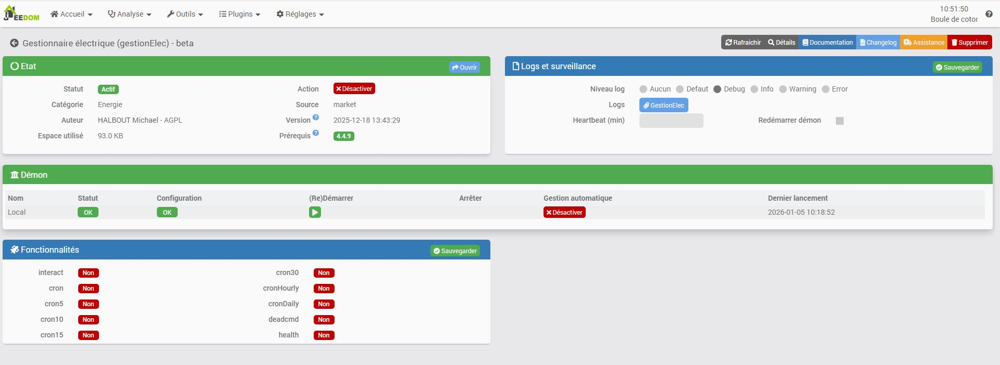
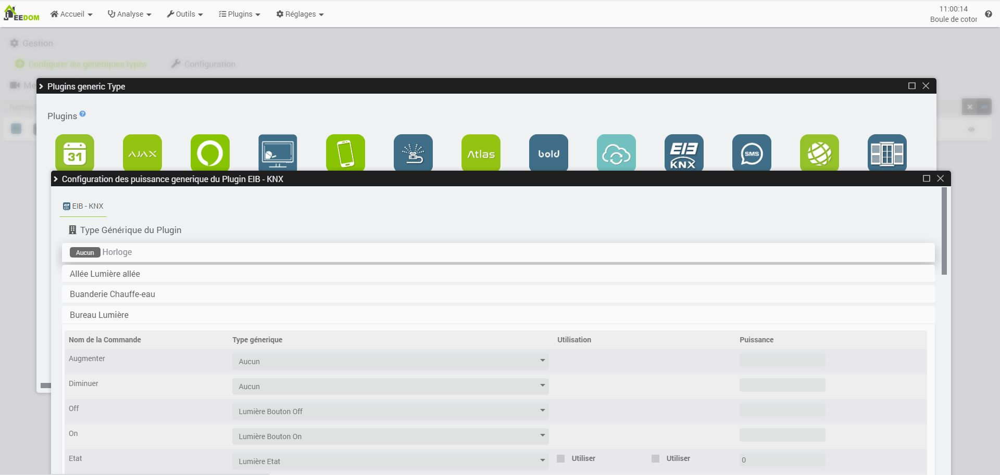
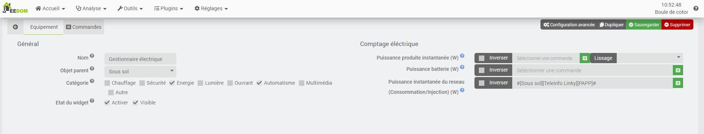
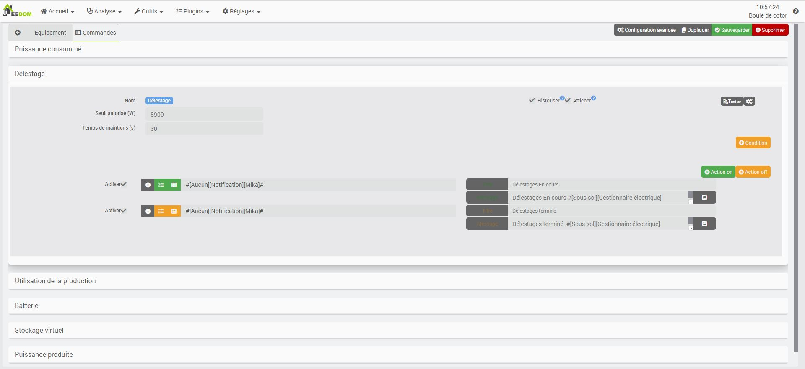

Description
===
Ce plugin a pour but de permettre de gérer les objets connéctés de votre domotique vis-à-vis de votre consomation / production

Paramétrage du plugin
=====================

Le plugin n'a besoin d'aucune configuration particuliere.
Vous avez juste dans cette partie les options habituel de Jeedom

Paramétrage des équipements par leurs generiques type
======================================================

Le plugin permet de simplifié la gestion des équipements en utilisent leur generique type
Dans l'onglet "Configurer les generiques type" vous retrouverez les états de tous les équipements compatible avec le plugin.
Si l'équipement n'est pas présent, il faudra alors aller le configurer.

Lors que vous souhaitez utiliser un équipement pour la gestion, le plugin a besoin que l'on paremetre les inforamtions suivante
* Puissance : Saisir la puissance maximal de l'etat
* Utiliser Delestage : Cocher si vous souhaitez l'utiliser autoamatique par le plugin
* Utiliser Production : Cocher si vous souhaitez l'utiliser autoamatique par le plugin

Paramétrage d'un gestionnaire
================================
Le plugin vas automatiquement creer un gestionnaire, mais vous pouvez personnaliser les parametre suvant

* Nom : Le nom du gestionnaire
* Objet parent : Ce paramétre permet d'ajouter l'équipement dans un objet Jeedom
* Catégorie : Déclarer l'équipement dans une catégorie
* Visible : Permet de rendre l'équipement visible dans le Dashboard
* Activer : Permet d'activer l'équipement

## Configuration du suivis des puissance de consommation et production

Pour que le plugin fonctionne il est necessaire de luis configurer 
* Puissance produite instantanée (W)  : Commande de puissance instantané de la production. Cette commande doit etre positive, sinon le plugin propose l'inversion de sense a cocher. La puissance configurer peut etre lissé (voir chapitre spécifique) (Commande pas obligatoire)
* Puissance batterie (W) : Commande de puissance instantané de la batterie. Cette commande doit etre positive, sinon le plugin propose l'inversion de sense a cocher.(Commande pas obligatoire)
* Puissance instantanée du reseau (Consommation/Injection) (W) : Commande de puissance instantané du reseau. Cette commande doit etre positive, sinon le plugin propose l'inversion de sense a cocher. (Commande obligatoire)

## Gestion de la production

Lorsque vous produisez de l'energie vous souhaitez pouvoir utiliser cette prodution sur les équipements connecté.
* Délai avant desactivation en mins : Temps de maintien du plugin, de l'activation des équipements lorsque la production lissé n'est plus suffisante
* Seuil production minimal en Watts : Seuil de la puissance de prodution pour l'activation / desactivation de la gestion

## Gestion du delestage

Lorsque vous consommé trop d'energie vous souhaitez pouvoir reduir et desactivé ses équipements connecté qui peuvent consommé plus tard.
* Délai avant réactivation  en mins : Temps de maintien du plugin, du délestage des équipements lorsque la consomation est trop importante
* Seuil maximal de délestage en Watts : Seuil de la puissance consommé pour l'activation / desactivation de la gestion

Le plugin vas commencer le delestage par les generiques type de thermostat.
Pour les generiques type de thermostat, le plugin vas delesté en priorité les thermostats avec le plus petit delta de température.

 
## Gestion avec stockage viruel
Le principe de cette gestion est d'autoriser une consomation sur le reseau uniquement ce qui a été injecté.
Dans cette premiere version on ne distigue pas une eventuel difference de cout entre l'achat et la revente. Ce sera implémenté dans une version future en fonction des retour d'experience.

Commandes
=========

Le plugin genere autotmatiquement ses commandes
* Batterie : 
* Puissance consommé : Reflet de la consommation vue par le plugin
* Puissance produite : Reflet de la production vue par le plugin (avec lissage)
* Stockage virtuel : Compteur d'energie injecter dans le reseau / utilisé par le plugin
* Délestage : indicateur de l'etat de la gestion de delestage. Passe a 1 lorsque le delestage est en cours
* Utilisation de la production : indicateur de l'etat de la gestion de prodution. Passe a 1 lorsque la gestion est en cours

