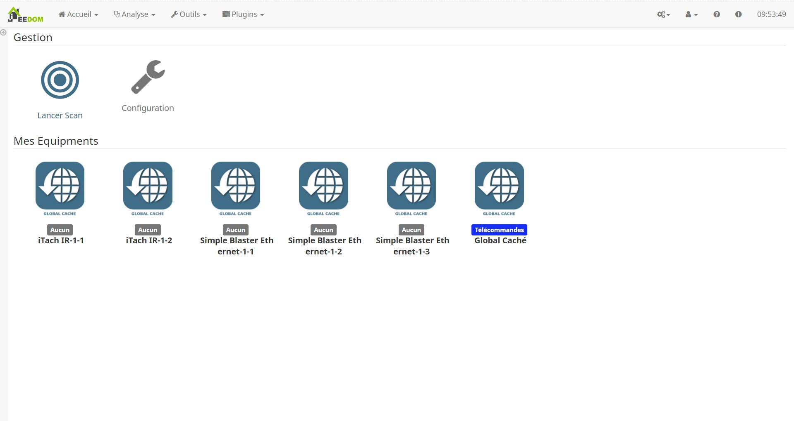
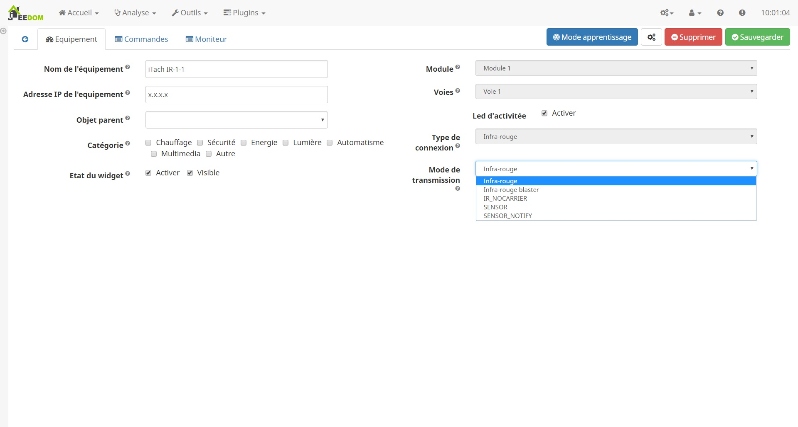
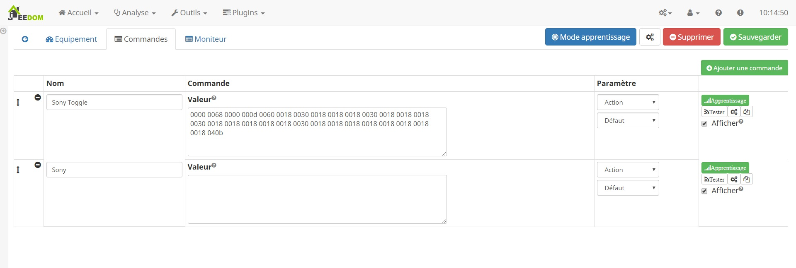
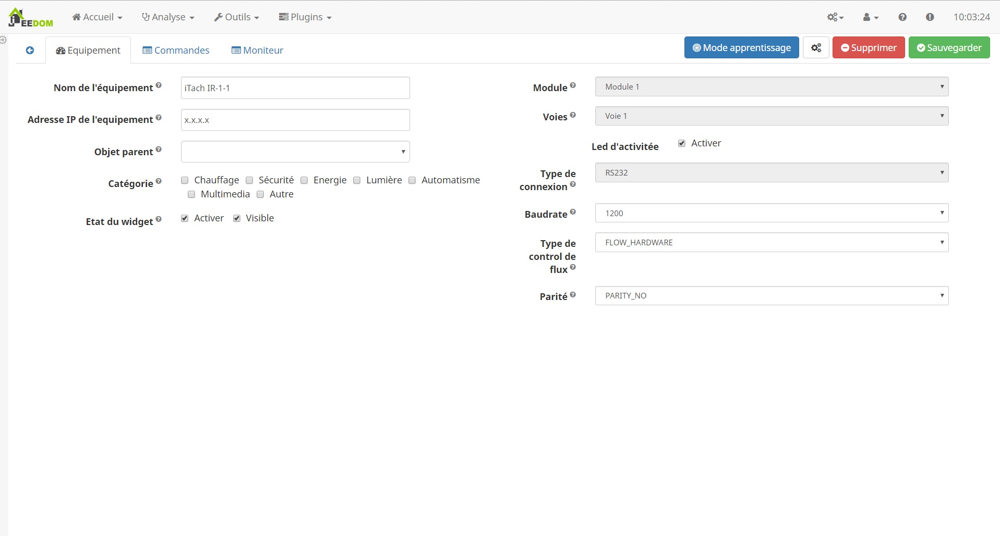
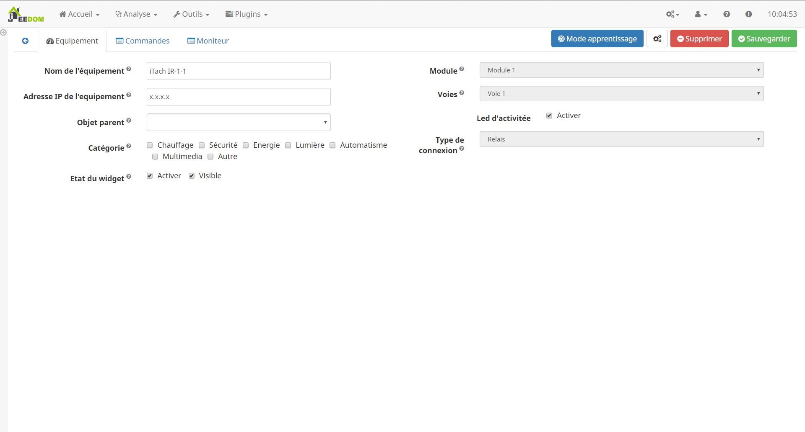

Description
====
Ce plugin a pour but de connecter jeedom à vos équipements __global cache__.

Installation et configuration
====
Il n'y a besoin d'aucune installation ou configuration particulière pour utiliser ce plugin

Recheche des équipements
====

Le plugin est doté d'une découverte de global cache sur votre réseau avec une auto-configuration
Vous avez juste a cliquer sur le bouton "Lancer Scan"

Si vous avez plusieur global cache sur votre reséau, il vous faudra répéter l'operation

Paramettrage spécifique
====
En fonction du model dont vous disposez, vous serez ammené à configurer les differents modules.
Le module, la voie ainsi que le type est parametrer par le plugin, il n'est donc pas possible de le modifier

Infra-Rouge
----

Il faudra choisir le protocole d'échange de votre equipement a piloter
* Infra-rouge
* Infra-rouge blaster
* IR_NOCARRIER
* SENSOR
* SENSOR_NOTIFY

Maintenant, que notre voie est configuré, on va sauvgarder ses parametres qui seront envoyé à votre global cache.
Nous sommes pret a crée une commande.

Pour les iTach, il existe une procédure d'apperentissage (Non testé sur les GC100)

### Mode Manuel

Pour pouvoir configurer une commande en mode manuel il faut avoir la valeur HEXA a envoyer a l'appareil.
Une database global cache est disponible https://irdb.globalcache.com/Home/Database

Le plugin fait le reste

### Mode apprentisstage

Dans un permier temps, il faut passer en mode apprentissage (Bouton en haut de la page)
Une fois le mode apprentissage validé par le globle cache, on peux cliquer sur le bouton "Apprentissage" de notre commande.
Il est possible de répeter cette dernière manipulation autant de fois que l'on a de commandes
Ne pas oublier de sauvegarder et de quitter le mode apprentissage

RS232
----

Pour le mode RS232, il est imperatif d'avoir la documentation de votre appareil relier a votre Global Cache.
On pourra alors a l'aide de celui ci configurer notre liaison serie
* Baudrate
* Type de Flux
* Parité

Maintenant, que notre voie est configuré, on va sauvegarder ses parametres qui seront envoyé a votre global cache.
Nous somme pret à créé une commande.

Pour chaque commande, il sera important de définir le type de codage et sa valeur.
Ses informations sont également à retrouver dans la spécification de votre équipement.
Sans oublier de definir s'il faut envoyer un retour de chariot et une nouvelle ligne

Relais
----

Le relais ne nécéssite pas de configuration particulière, les commandes seront automatiquement créés
