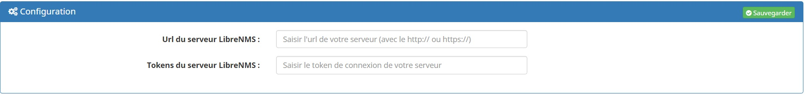
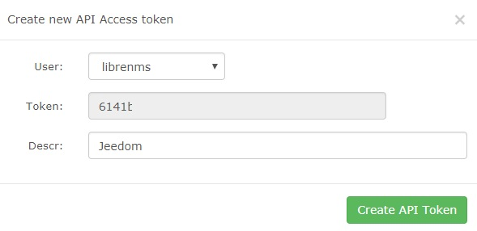
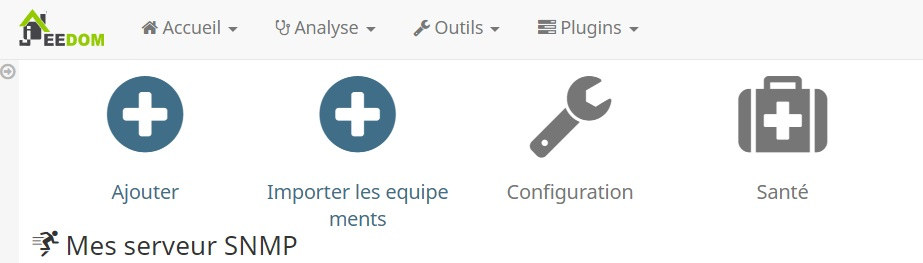

Description 
===========
LibreNMS est une AutoDiscovery PHP/MySQL/SNMP réseau de surveillance qui comprend la prise en charge d'une large gamme de matériel réseau et les systèmes d'exploitation, y compris Cisco, Linux, FreeBSD, Juniper, Brocade, Foundry, HP et beaucoup plus.

Installation 
===========

Pour pourvoir utiliser se plugin il est important d'avoir au préalable installer et configurer votre server LibreNMS
https://docs.librenms.org/

Une fois installer, il est necessaire de configurer les acces au server

* Url du serveur LibreNMS : Saisir le chemin d'acces au serveur (sans oublier le http)
* Tokens du serveur LibreNMS : Saisir le token qu'il faut aller recupere sur votre server

Récupération du token
---------------------
Pour recupérer votre token, connectez vous sur l'interface de votre serveur LMS puis ici

Il vous suffit de cliquer sur "Create API access token" et de donner une description a ce token

N'oubliez pas de reporter ce token dans la configuration du plugin

Vos equipements
===============

Les Importer
------------
Pour cela rien de plus simple, le plugin est doté d'un import des equipements, il vous suffit de cliquer sur importer et le plugin fait le reste

Les creer
---------
C'est egalement tres simple, comme toujours sur Jeedom il suffit de cliquer sur Ajouter et de complété manuelement les informations

Les Informations remonté
========================
Pour chaque equipement il vous est possible de choisir quel type de donné seront remonté
