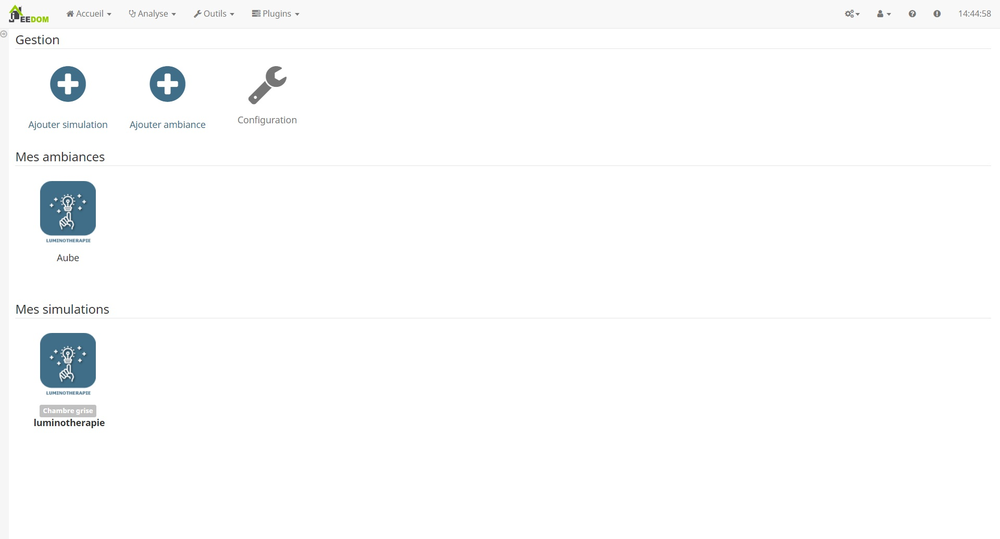
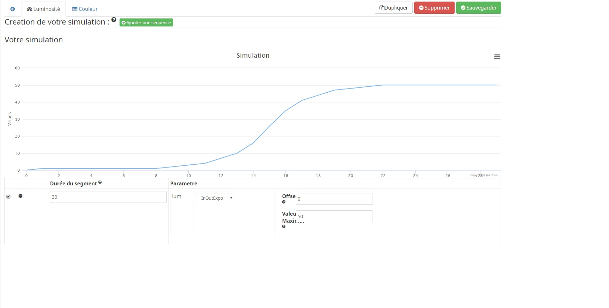
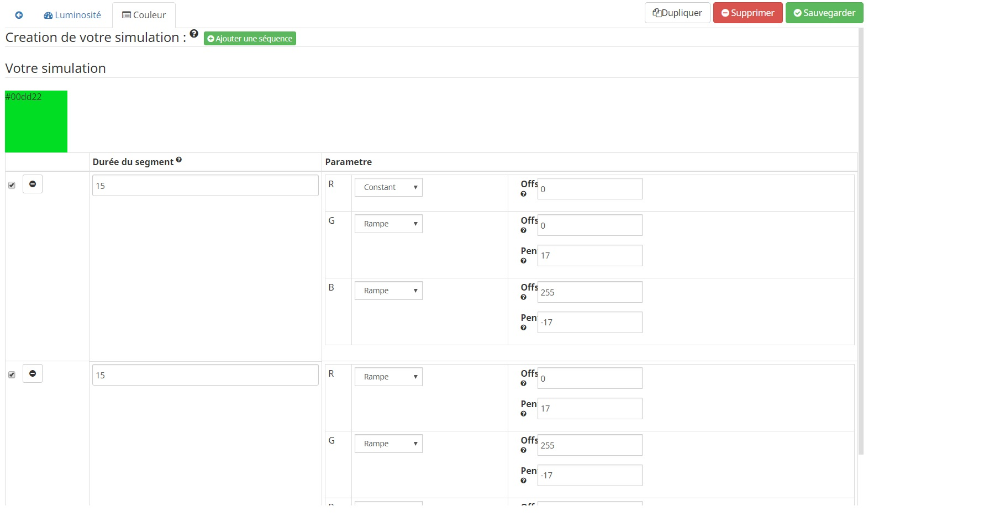
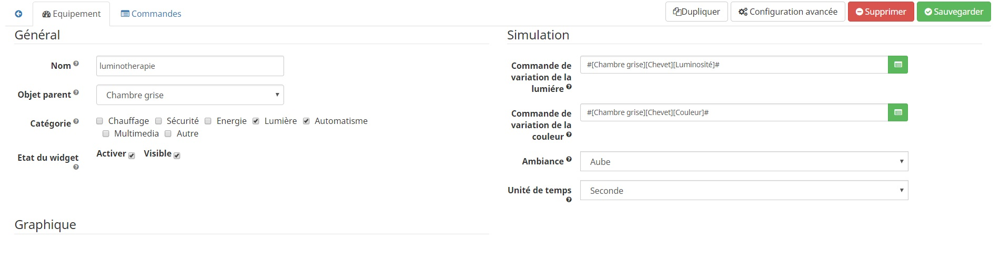

====

Ce plugin permet de créer des ambiances lumineuse

Configuration
====

* Temps d'attente : Ce temps, exprimé en seconde, est un temps de pause chaque verification d'un lancement d'une simulation. Ce temps est important pour libérer de la charge materiel

Crée une ambiance lumineuse
====

Par defaut, le plugin propose des ambiances pré-configurer, il est deconseiller de les modifier car elles seront mise a jours en meme temps que le plugin.

Pour créer sa premiere ambiance, rien de plus simple, il suffie de cliquez sur le bouton "Ajouter ambiance" de la page principal puis de nommer l'ambiance.
On vas retrouver sur cette page 2 onglets pour le paramettrage de le luminosité et de la couleur.

Crée une séquence de varaition de la luminosité
----

En cliquant sur le bouton "Ajouter une séquence" nous allons pouvoir imbriquer plusieurs formes élémentaires afin de fabriquer notre signal
			

On remarquera une représentation graphique de notre simulation pour facilité la creation

Pour chaque sequence, il faut determiner un delais dont sont unité sera definie dans la configuration d'une sequence.

Crée une séquence de varaition de la couleur
-----

C'est le meme principe que pour la variation lumineuse, on vas imbriquer plusieurs forme élémentaire afin de fabriquer notre couleur et pour chaque couleur elementaire

On remarquera une représentation graphique de notre simulation pour facilité la creation

Le forme d'onde
-----

Pour chaque forme d'onde, il faudra parametrer, 
* Constant : Permet de maintenir a une valeur defini
* Rampe : Permet de cree une montée ou descente linéaire
* Sinusoide : Permet de faire varier sous forme de sinusoid
* Carré : Permet de faire clignoté
* InQuad :forme d'onde particuliere généralement utilisé en luminotherapie
* InOutQuad :forme d'onde particuliere généralement utilisé en luminotherapie
* InOutExpo :forme d'onde particuliere généralement utilisé en luminotherapie
* OutInExpo :forme d'onde particuliere généralement utilisé en luminotherapie
* InExpo :forme d'onde particuliere généralement utilisé en luminotherapie
* OutExpo :forme d'onde particuliere généralement utilisé en luminotherapie
* Polynome : Permet de cree un signal par un polynome

Configuration d'une simulation
====

Nous pouvons maintenant cree notre simulation 
		

* Nom  : le nom a déjà été paramétré, mais vous avez la possibilité de le changer.		
* Objet parent : ce paramètre permet d'ajouter l'équipement dans un objet Jeedom.		
* Catégorie : déclare l'équipement dans une catégorie.		
* Visible : permet de rendre l'équipement visible dans le Dashboard.		
* Activer : permet d'activer l'équipement.		

Configurer les parametres de votre simulation
* Commande de variation de la lumiére : Objet jeedom pour la variation de l'intensité lumineuse
* Commande de variation de la couleur : Objet jeedom pour la variation de la couleur
* Ambiance : Choisir l'ambiance que l'on veux
* Unité de temps : Choisir la base de temps que l'on veux pour notre simulation
