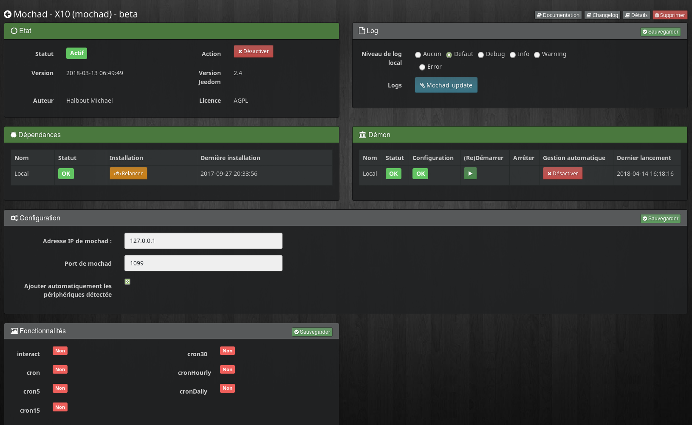
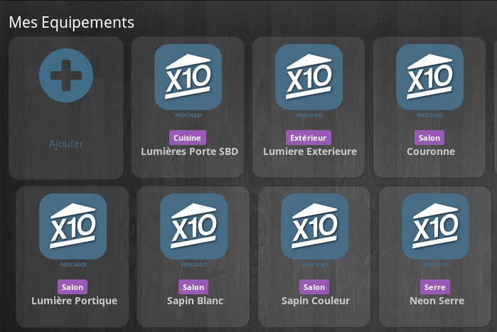
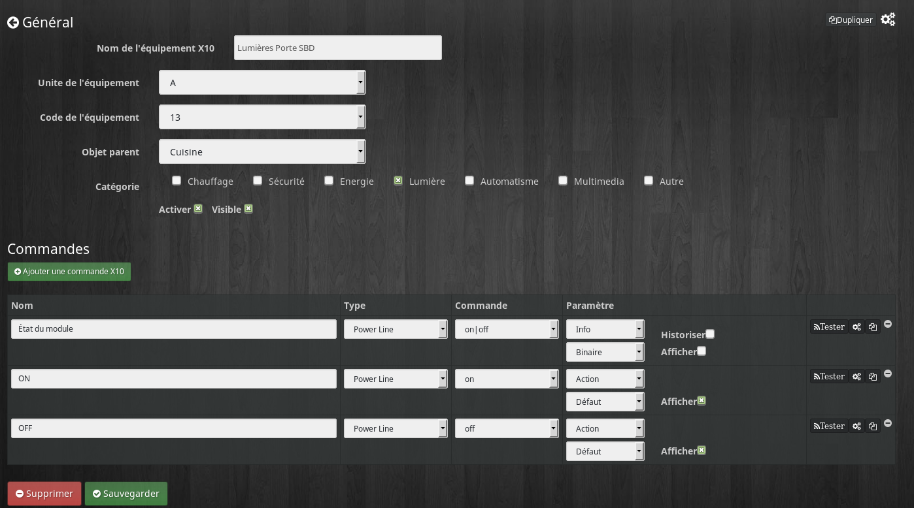

Description
===
Ce plugin permet de gerer vos equipements x10 grace a votre CM15 pi CM19

Installation et configuration
===

Le plugin est basé sur le logiciel mochad, il est donc impératif d'installer ses dépendances
Il est possible d'utilisé un mochad sur venant d'un autre machine

* Adresse IP de Mochad  : Ip ou est installé Mochad, par defaut sur la machine local 127.0.0.1
* Port de mochad  : Port sur lequel Mochad transmet, par defaut 1099
* Ajouté automatiquement les devices : Mochad peut detecter les equipement qui transmette sur le bus 

Configuration d'un équpement
====

Comme partout sur jeedom pour cree une nouvelle equipement il faut cliquer sur le petit +
Par la suite il faut le configurer
* Nom  : le nom a déjà été paramétré, mais vous avez la possibilité de le changer.  
* Unité  : L'unité pour lequel le module appartien. 
* Code  : le code our lequel le module appartien.   
* Objet parent : ce paramètre permet d'ajouter l'équipement dans un objet Jeedom.       
* Catégorie : déclare l'équipement dans une catégorie.      
* Visible : permet de rendre l'équipement visible dans le Dashboard.        
* Activer : permet d'activer l'équipement.      

Configuration des commandes
====

Ajouter autant de commande que necessaire en luis indiquant a chaque fois 

* Nom : Le nome de la commande
* Type : Le type de transmision X10
* Commande : La commande X10 qui doit etre execute
* Parametre : Spécifier le type et sous type de la commande jeedom
