Description
=========
Motion est un logiciel de détection vidéo et qui permet de diffuser un flux vidéo via internet par le protocole HTTP. C’est une solution simple pour diffuser le flux de sa webcam en ligne ou pour détecter des mouvements dans le champ d’une caméra par exemple.

Dans ce plugin motion sera utilisé pour ces capacité de détection de mouvement

Installation des dépendances
================================
Pour faciliter la mise en place des dépendances, Jeedom va gérer seul l'installation de motion.

Dans la cadre réservée aux dépendances, vous allez avoir le statut de l'installation.
Nous avons aussi la possibilité de consulter le log d'installation en temps réel.

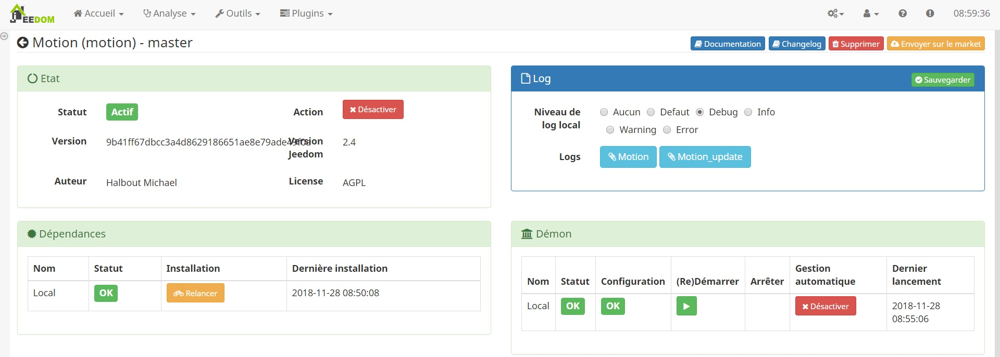

Configuration du plugin et de ses dépendances
---------------------------------------------

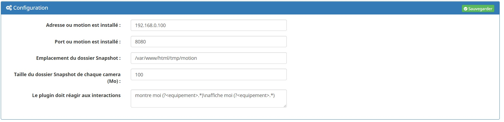

Les paramètres de configuration générale sont

* Debug : Met le niveau de log de motion sur 1 lorsqu'il est desactivé et sur 9. Ce parametre donne plus ou moins d'information sur ce qui se passe dans le demon motion
* Adresse ou motion est installé : Ce champs est complété automatiquement
* Port de contrôle de motion : C'est le port sur lequel on va se connecter pour mettre à jour la configuration de motion
* Emplacement du dossier Snapshot: Permet de choisir ou stocker les snapshot (on peut imaginer monté un disque réseau nas)
* Taille du dossier Snapshot de chaque camera (Mo) :Taille du dossier des snapshots, pour chaque camera, pris depuis motion
* Le plugin doit réagir aux interactions : Interaction programmer (Beta)

Il est possible que le démon ne passe pas au vert, pour que motion puisse démarrer correctement, nous avons besoin de configurer une caméra.
Rendez-vous au paragraphe suivant

Configuration d'une camera
==========================
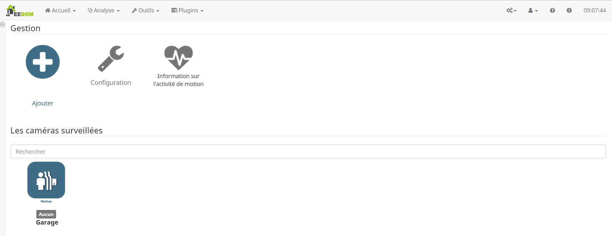

> Attention: Ne pas configurer 2 fois la même caméra, cela peut entrainer un plantage du logiciel motion.

Équipement
-----------------

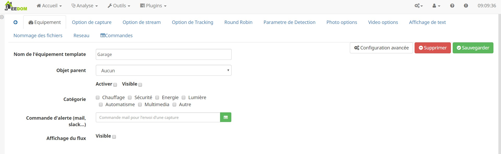

Dans cet onglet, nous allons retrouver les champs standard à ce que l'on retrouve sur Jeedom.
Il est possible de configurer une commande d'alerte compatible (mail, slack...).

 Option de capture
----------------

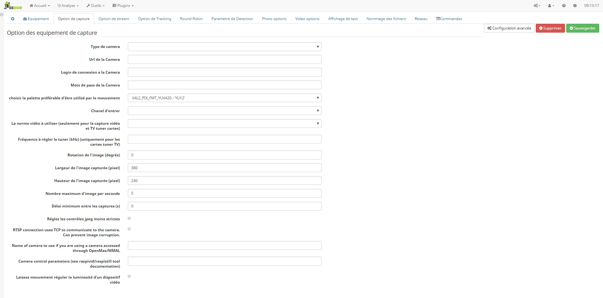

Cet onglet est le plus important car nous allons configure notre camera

#Type de camera

Si votre camera est du type IP alors il vous faudra compléter ses champs

* Url de la Camera : URL du flux vidéo (rtsp://, http://, ..)
* Login de connexion à la Camera : Saisir le login d'accès
* Mots de passe de la Camera : Saisir le Mots de pas d'accès

Si elle est du type USB alors il vous faudra choisir le port USB
* Camera : Toutes les cameras USB sont retourné sur ce champs

Nombre maximum d'image par seconde
5
Délai minimum entre les captures (s)
0

RTSP connection uses TCP to communicate to the camera. Can prevent image corruption.
Name of camera to use if you are using a camera accessed through OpenMax/MMAL
Camera control parameters (see raspivid/raspistill tool documentation)
Laissez mouvement réguler la luminosité d'un dispositif vidéo

* Choisir la palette préférable d'être utilisé par le mouvement : V4l2_palette permet de choisir la palette préférable d’être utilisé par le mouvement
* Chanel d'entrer :
* La norme vidéo à utiliser : seulement pour la capture vidéo et TV tuner cartes
* Fréquence à régler le tuner (kHz) : uniquement pour les cartes tuner TV
* Rotation de l'image : Faire pivoter l’image de ce nombre de degrés. La rotation affecte toutes les images enregistrées comme
* Largeur de l’image (pixels).
* Hauteur de l’image (pixels).
* Nombre maximum d'image par seconde : Le nombre maximum d’images à être capturées par seconde.(Plage valide: 2-100.)
* Délai minimum entre les captures : Délai minimum en secondes entre la capture des cadres de la caméra. Default: 0 = désactivé - le taux de capture est donné par le framerate de la caméra. Cette option est utilisée lorsque vous souhaitez capturer des images à un taux inférieur à 2 par seconde.
* Réglez les contrôles jpeg moins strictes : Définir contrôles jpeg moins stricts pour les caméras réseau avec un firmware buggé pauvres.

Streaming
----------
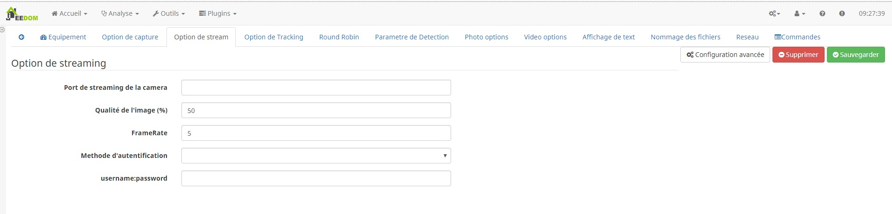

Cette option de Motion permet de streamer le flux vidéo.
Cette option est très utile lorsque l'on a une caméra USB et que l'on veut visualiser le flux mais est aussi conseillé sur un camera IP pour alléger le flux et qu'il soit plus facilement affichable sur une page web.
Le flux sera donc accessible a http://IP_Jeedom:PortConfigurer/stream

Pour le configurer:

* Port de streaming de la camera : un port de votre machine doit être saisi. Il doit être libre et non utilisé (Exemple : 8081 => 8090)
* Qualité de l'image (%) : Qualité de diffusion
* FrameRate : Rafraichissement de diffusion
* Méthode d'authentification : Choisir si vous voulez une identification sur ce flux
* username:password : saisir les paramètres d'authentification

Tracking
----------
Pas tester, mais permet de configurer les axes de rotation  (non compatible PTZ)

Round Robin
----------
Round-robin (RR) est un algorithme d'ordonnancement courant dans les systèmes d'exploitation et est adapté aux systèmes travaillant en temps partagés.

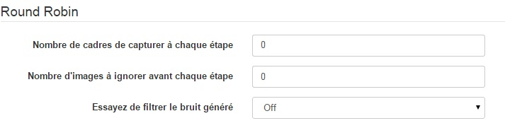

* Nombre de cadres de capturer à chaque étape de roundrobin
* Nombre d’images à ignorer avant chaque étape de roundrobin
* Essayez de filtrer le bruit généré par roundrobin

Détection:
------------
Ses paramètres de configuration sont complexe a maitrisé et dépende de votre camera et de son environnement

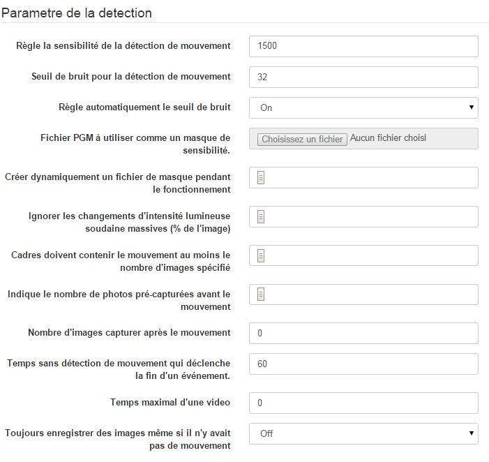

* Règle la sensibilité de la détection de mouvement : Seuil de nombre de pixels modifiés dans une image Déclenche la détection de mouvement
* Régler automatiquement le seuil bas si possible
* Seuil de bruit pour la détection de mouvement
* Automatiquement ajuster le seuil de bruit Image en mouvement Despeckle utilisant (e) Rode ou (d) ilate ou (l) abel (par défaut: non défini) Valeur recommandée est EedDl. Toute combinaison (et nombre) de E, E, D et D est valide. (L) Abeling ne doit être utilisé une fois et le «l» doit être la dernière lettre. Commentez désactiver despeckle_filter EedDl
* Fichier PGM à utiliser comme un masque de sensibilité. Nom complet de chemin d’accès.
* Créer dynamiquement un fichier de masque pendant le fonctionnement
* Ajustez la vitesse des changements de masque de 0 (désactivé) à 10 (rapide)
* Ignorer les changements massifs soudaine de l’intensité lumineuse donnée en pourcentage de l’image Zone qui a changé l’intensité. Plage valide: 0 - 100, défaut: 0 = désactivé
* Cadres d’image doivent contenir le mouvement au moins le nombre d’images spécifié Dans une rangée avant qu’ils soient détecté comme un véritable mouvement. Au défaut de 1, tous les Mouvement est détecté. Plage valide: 1 à des milliers, recommandé 1-5
* Indique le nombre de photos (mémoire tampon) pré-capturées à partir avant le mouvement A été détecté qui sera sortie à détection de mouvement. Plage recommandée: 0 à 5 (par défaut: 0) Ne pas utiliser de grandes valeurs! De grandes valeurs vont provoquer de mouvement pour sauter des images vidéo et Provoquent des films saccadés. Pour lisser les films utilisent de plus grandes valeurs de post_capture place.
* Nombre de cadres pour capturer après le mouvement est plus détecté
* Gap événement est les secondes sans détection de mouvement qui déclenche la fin d’un événement. Un événement est défini comme une série d’images en mouvement prises dans un délai court. Valeur recommandée est de 60 secondes (par défaut). La valeur -1 est autorisée et handicapés événements causant tout mouvement à écrire dans un fichier de film unique et aucun pre_capture. Si la valeur 0, le mouvement est exécuté en mode sans intervalle. Films n'ont plus de lacunes. Une Événement se termine juste après pas plus de mouvement est détecté et post_capture est terminée.
* Longueur maximale en quelques secondes d’un film Quand la valeur est dépassée un nouveau fichier vidéo est créé.
* Toujours enregistrer les images, même s'il n’y avait pas de mouvement

Snapshot
--------

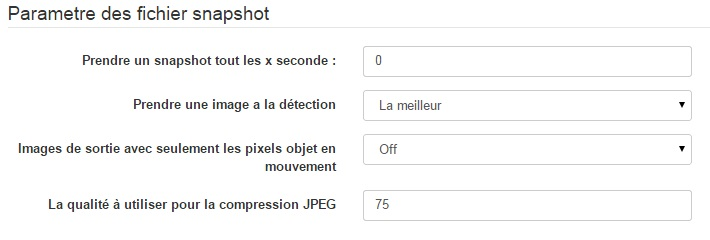

* Prendre une image a la détection : Sortie images «normales» lorsqu’un mouvement est détecté (par défaut: activé) Les valeurs valides: on, off, d’abord, le meilleur, centre Lorsque réglé sur «première», seule la première image d’un événement est enregistré. Image avec la plupart mouvement d’un événement est enregistré lorsqu’il est réglé sur «le meilleur». Image avec le mouvement centre le plus proche de l’image est enregistrée lorsque la valeur 'centre'. Peut être utilisé comme aperçu tir pour le film correspondant.
* Type d'image : Choisir le format de compression d'image
* Photos de sortie avec seulement les pixels objet en mouvement (images fantômes)
* La qualité (en %) pour être utilisé par la compression jpeg

Vidéo
--------

* Utilisez ffmpeg pour encoder des vidéos en temps réel
* Créer un vidéo avec juste les pixels en mouvement
* Timelapse Valeur par défaut 0 = off - autre chose qu'encadrer chaque seconde Nième
* Mode de timelapse : Le mode de la vidéo timelapse fichier de substitution Les valeurs valides: toutes les heures, tous les jours (par défaut), hebdomadaire dimanche, lundi hebdomadaire, mensuelle, manuel
* Bitrate : Bitrate pour être utilisé par le codeur de ffmpeg Cette option est ignorée si ffmpeg_variable_bitrate est pas 0 (désactivé)
* Active et définit un débit variable pour l’encodeur ffmpeg. Ffmpeg_bps est ignorée si le bitrate variable est activée. Les valeurs valides: 0 (par défaut) = débit fixe défini par ffmpeg_bps, Ou la gamme de 2 à 31 où 2 signifie meilleure qualité et 31 est pire.
* Format des vidéos enregistrées : Codec à utiliser par ffmpeg pour la compression vidéo. (Conseiller *.mp4 pour être visualisé sous Jeedom)

Paramètre dynamique
-------------

Voici la description de tous les paramètres pouvant composer dynamiquement un texte
* %Y = année
* %m = mois
* %d = jour
* %H = heure
* %M = minute
* %S = seconde
* %T = HH: MM: SS
* %V = événement
* %q = numéro de trame
* %t = fil (caméra) nombre
* %D = changé pixels
* %N = niveau de bruit, \ n = nouvelle ligne
* %I et % J = largeur et la hauteur de la zone de mouvement
* %K et %L = coordonnées X et Y du centre de mouvement
* %C = valeur définie par text_event - ne pas utiliser avec text_event! Vous pouvez mettre des guillemets autour du texte pour permettre grands espaces

Affichage de texte
-------------
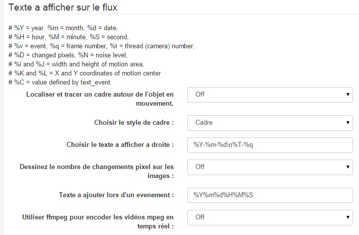

* Localiser et tracer un cadre autour de l'objet en mouvement permet de définir si on veut un cadre sur nos images
* Choisir le style de cadre : Type de cadre
* Choisir le texte à afficher à droite : Texte affiché sur l'image
* Dessinez le nombre de changements pixel sur les images :
* Texte a ajouté lors d'un évènement : Défini le nom affiché de l'évènement

Nom des fichiers
---------------

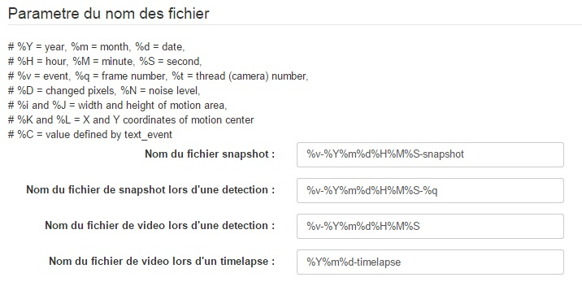

* Nom du fichier snapshot : Défini le nom que portera un snapshot que vous demandé
* Nom du fichier de snapshot lors d'une détection : Défini le nom d'un snapshot de détection
* Nom du fichier de vidéo lors d'une détection :Défini le nom d'une vidéo de détection
* Nom du fichier de vidéo lors d'un timelapse :Défini le nom d'une vidéo timelapse

Configuration des Zone area
===========================

Motion permet de limiter la détection dans certaine zone Pour cela, elle divise le flux en 9 zones. Avec le plugin, un outil de sélection a été ajouté

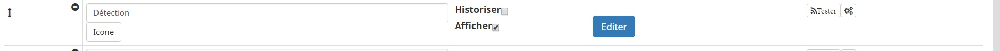

En cliquant sur le bouton "Éditer" de cette commande vous allez faire apparaitre l'éditeur

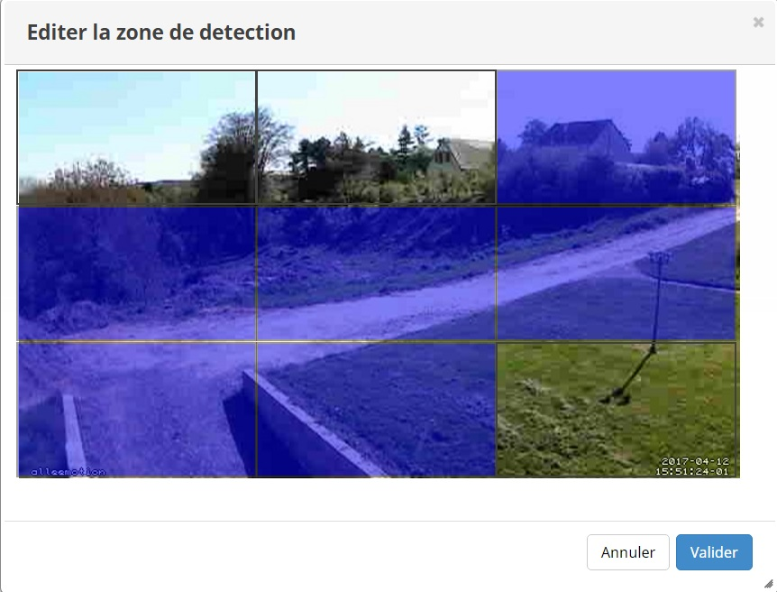

Il vous suffit donc de sélectionner ou désélection les zone que vous souhaitez pour la détection

FAQ
==========

> Comment configurer une caméra USB ?

Lorsque l'on veut configurer une caméra USB il faut:
Dons l'onglet Option de capture ** Plugin source camera = Motion ** Type de camera = USB ** Camera = Choisir le port USB de votre webcam ** Chanel d'entrée = -1
Dans l'onglet Option de streaming ** Streaming = On ** Port de streaming de la camera choisir un port libre de votre Jeedom --
