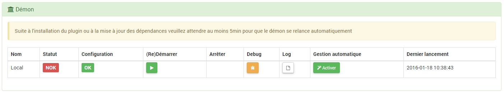

Description
===========
Plugin permanent de faire de la reconnaissance de plaque d’immatriculation avec nos camera

> Attention avec l'usage de ce plugin
Seules les autorités publiques (les mairies notamment) peuvent
Filmer la voie publique.
Les particuliers ne peuvent filmer que l’intérieur de leur propriété.
Ils ne peuvent pas filmer la voie publique, y compris pour
Assurer la sécurité de leur véhicule garé devant leur domicile.

Installation et configuration
=============================

Installation des dépendances
----------------------------

Pour faciliter la mise en place des dépendance, Jeedom vas gérer seul l’installation et la compilation du logiciel OpenALPR.

Dans le cadre réservé aux dépendances, vous allez avoir le statut de l’installation. Nous avons aussi la possibilité de consulté le log d’installation en temps réel.

Configuration du plugin et de ses dépendances
----------------------------------------------

Les paramètre de configuration général sont:

* Création automatique de plaque inconnue: Permet à Jeedom de créer une commande pour les plaques non reconnue
* Activer le Snapshot: Permet de déterminer si on veut des snapshot des détectons
* Choisir l'emplacement par défaut des snapshot
* Choisir les commandes d'alerte (mail, slack...) séparer par des &&
* Choisir le nombre d'images envoyé
* Personnalisé les paramètre par défaut de OpenAlpr

*  state_id_img_size_percent
*  ocr_img_size_percent
*  Calibrage de votre camera améliore la précision de la détection dans les cas où des plaques d'immatriculation sont capturés à un angle raide (Utilisez l'utilitaire openalpr-utils-calibration pour calibrer votre camera fixe pour ajuster un angle )
*  La détection ignorera plaques qui sont trop grands. Ceci est une bonne technique de l'efficacité à utiliser si les plaques vont être à une distance fixe de la caméra (par exemple, vous ne verrez jamais plaques qui remplissent la totalité de l'image
*  Augmentation détection d'itération est le pourcentage que le cadre de LBP augmente chaque itération. Il doit être supérieur à 1,0. Une valeur de 1,01 signifie augmentation de 1%, 1,10 augmentation de 10% de chaque fois. Ainsi, une augmentation de 1% serait ~ 10x plus lent que 10% à traiter, mais il a une plus grande chance de l'atterrissage directement sur la plaque et d'obtenir une détection forte
*  La force minimale de détection détermine comment assurer l'algorithme de détection doit être avant de signaler qu'une région de la plaque existe. Techniquement, cela correspond à LBP voisins les plus proches (par exemple, combien de détectives sont regroupés autour de la même zone). Par exemple, 2 = très indulgent, 9 = très stricte
*  La détection n'a pas nécessairement besoin d'une image de très haute résolution pour détecter les plaques. En utilisant une image d'entrée plus petit doit encore trouver les plaques et le fera plus rapidement. Peaufiner les valeurs de max_detection_input va redimensionner l'image d'entrée si elle est plus grande que ces tailles (exprimées en pixels
*  Technique utilisée pour trouver des régions de plaque d'immatriculation d'une image. La valeur peut être réglée sur les résultats doivent correspondre un textpattern de post-traitement si un modèle est disponible.
*  Contourne la détection de la plaque. Si elle est positionnée à 1, la bibliothèque suppose que chaque zone prévue est une zone de la plaque susceptible.
*  OpenALPR peut balayer la même image plusieurs fois avec randomisation différent. Mettre ce paramètre à une valeur plus grande que 1 peut augmenter la précision, mais augmentera le temps de traitement linéaire
*  OpenALPR détecte les cultures de plaque à contraste élevé et utilise une technique de détection de bord alternatif. Mettre cette option à 0.0 classerait toutes les images comme contraste élevé, la mise à 1.0 classerait pas d'images comme contraste élevé.
*  max_plate_angle_degrees
*  ocr_min_font_point
*  Minimum de confiance OCR à considérer(%)
*  Tout caractère OCR inférieur à ce paramètre sera ignorée.
*  Mode Débug
* Ajouter une caméra : Permet d’ajouter une camera
* Réseau Jeedom: Permet de déterminer sur quel Jeedom l’analyse va se faire
* Plugin source camera: détermine la manière de configurer une camera
* Url de la Camera: adresse du flux de votre camera
* Login de connexion à la Camera
* Mots de passe de la Camera

Nous pouvons voir le statu de configuration et d’activation d’OpenALPR dans le cadre "Démon"
La configuration des paramètres peut être défini avec l'utilitaire openalpr-utils-calibrate.exe sur windows avec une image de la camera.

Si tous les voyant sont au vert, nous pouvons passée à la suite

Paramétrage de mes groupes et de mes plaques
=============================================

Vérification d'une image
-----------------

Il est possible de lancer une détection manuelle, ou par scénario de cette en passant en message l'url de votre image

Groupe de plaques
------------------

Dans un premier temps, il faut créer un nouveau groupe et le nommer.
Comme dans tous les plugins Jeedom vous avez un bouton ajouter un équipement sur la gauche de votre fenêtre.

Ce nouveau groupe a besoin d'être paramétré.

* Nom du groupe : Le nom a déjà été paramétrée mais vous avez la possibilité de la changer
* Objet parent : Ce paramétré permet d'ajouter l'équipement dans un objet Jeedom
* Catégorie : Déclare l'équipement dans une catégorie
* Visible : Permet de rendre l'équipement visible dans le Dashboard
* Activer : Permet d'activer l'équipement
* Mode de mise a jours : permet de déterminé si les états des commandes représenteront la visibilité sur l'image ou un changement à chaque passage (cette deuxième option peut poser des problèmes si on reste devant la caméra)
* Camera autoriser : ce champ permet de spécifier quel camera à le droit de mettre à jours se groupe

Le groupe "Plaques détectées inconnu" se créer automatiquement dès qu’une plaque a été détecté et qu’elle n’existe pas sous Jeedom.

Plaques d'immatriculation
--------------------------

A la création du groupe certaine commande ont été ajouté automatiquement, il ne faut pas les supprimer.
* Dernier déclencheur : Indique la dernière plaque qui a été vue sur la camera
* Détection manuel : permet de spécifier une url d'une image a analysé
* État du groupe : informe l'état de détection du groupe

Pour compléter votre groupe vous devez ajouter autant de commandes que vous avez de plaque à détecter

* Nom : Donner un nom à votre plaque de manière à la retrouve facilement dans Jeedom
* Numéro de la plaque: Numéro de la plaque (sans les tirets) (il est possible de remplacer des caractères par de ** en cas de flotte avec de plaque qui se suive

>AX**
AX123**
AX**WW
123
**123WW
**WW

* Historiser: Très utiles si vous voulez visualiser sur le panel les entée
* Afficher: si vous voulez que la plaque apparaisse sur le Dashboard
* Déplacer: ce bouton permet de déplacer une plaque d’un groupe a un autre
* Enfin pensez sauvegarder.

Il est possible également de d'initialisé l'état de base (si vous avez choisi un changement à chaque passage) avec les boutons "Absent" et "Présent".

Condition et Action
-------------------
A chaque détection du plugin il est possible d'exécuter des actions.
Ses actions sont autorisées par des conditions
