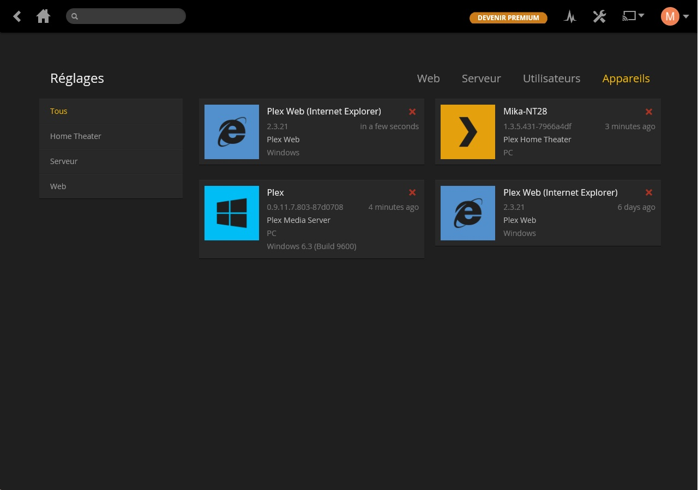
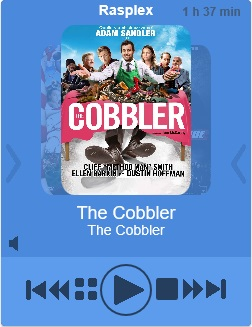
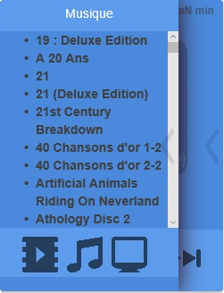
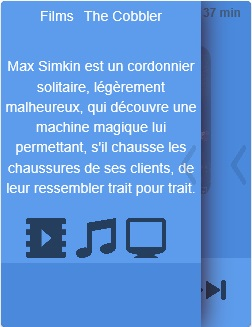

Contrôler vos clients plex grâce a votre domotique.
Créer des réveil, musical grâce a l'association de plex et de jeedom.

Qu'est ce que PLEX?
===================

Plex organise vidéo, musique et photos à partir de bibliothèques de médias personnels et les cours d'eau pour les téléviseurs intelligents, des boîtes en streaming et les appareils mobiles. Il est un système de lecteur multimédia et suite logicielle composée de plusieurs applications de lecture pour les interfaces utilisateur.       

Configuration 
=============

Configuration des serveur Plex
------------------------------
La première chose à réaliser est de connecter Jeedom aux serveurs Plex.
Il est possible de disposer de plusieurs serveur

 

Cliquez sur "Ajouter" et complétez les 3 champs d'informations pour la connexion a chaque serveur

* Adresse ip du serveur
* Le port de connexion
* Son nom, attention de bien respecter la casse de ce paramètre

Configuration d'un compte Plex
------------------------------
Il est recommandé de se connecteur avec un compte plex pour securisé les connexions.
Pour liee se compte a jeedom il faut saisir vos identifiants

Pour connaître les informations liées à votre installation Plex, je vous conseille d'ouvrir la page de configuration de votre serveur Plex.
   

Nota:

Des indicateurs de démon sont également présents sur cette page de configuration.
Le démon permet de scruter l'état de medias en cours et détermine si une pause est établie sur le player.

Configuration des clients Plex
==============================

Configuration de l'equipement 
-----------------------------
Nous allons nous rendre sur la page de paramétrage des clients Plex Plugins > Multimedia > Plex.
Arrivé sur cette page, nous allons pouvoir accéder à nos clients déja configurés, ou en ajouter un.

 

Vous l'aurez deviné, pour ajouter un client, il suffit de cliquer sur le bouton "Ajouter" et de nommer l'équipement dans la fenêtre qui va apparaître.

 

Commencez par personnaliser les paramètres généraux (activer, visible, parent)

Parametre du client
-------------------.

Pour liée Jeedom a un client plex, il faudra selectionner un client.
Pour qu'un client soit visible dans le plugin il faut que celui ci soit ouvert et connecter au serveur/
Certain client ne sont disponible que dans leur retour d'etat, dans ce cas il faut qu'un media soit en cours de lecture pour qu'il soit visible

Activer l'option "Heartbeat" pour que le démon surveille votre client et mette a jours ses etat de lecture.

Si votre client est sur la meme machine que votre serveur alors le serveur remontra un ip localhost.
Si jeedom n'est pas sur cette meme machine alors il faut luis spécifié l'adresse ip du client sur le reseau

Ajoutez un incrément pour le volume.

Utilisation du widget
=====================

   

L'écran principal du widget permet les fonctions de base :

* Saut arrière
* Saut avant
* Reculer
* Avancer
* Affichage du menu
* Lecture / Pause 
* Stop

Mais aussi de choisir le medias en cliquant sur les affiches arrières.
Il permet également d'accéder aux différents menus.

    

A droite, la télécommande qui permet de naviguer directement sur votre écran.

   

Le menu de gauche permet des sélectioner une librairie et leur media associé.

  

Mais aussi le détail du media.

