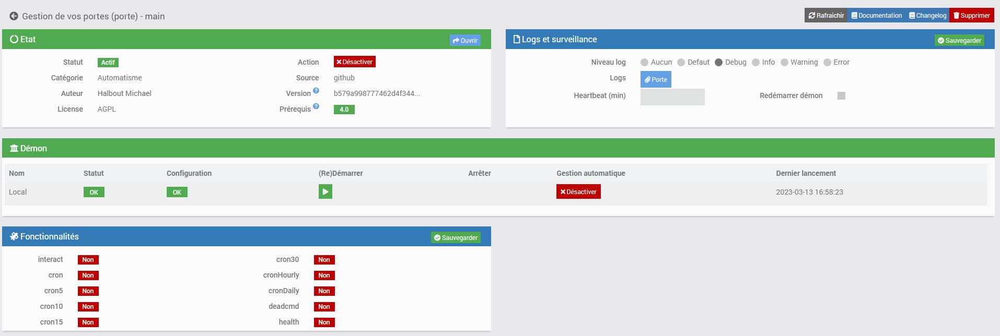
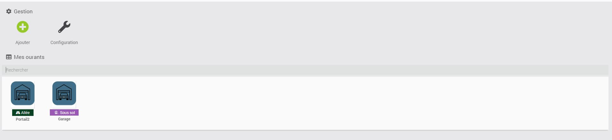
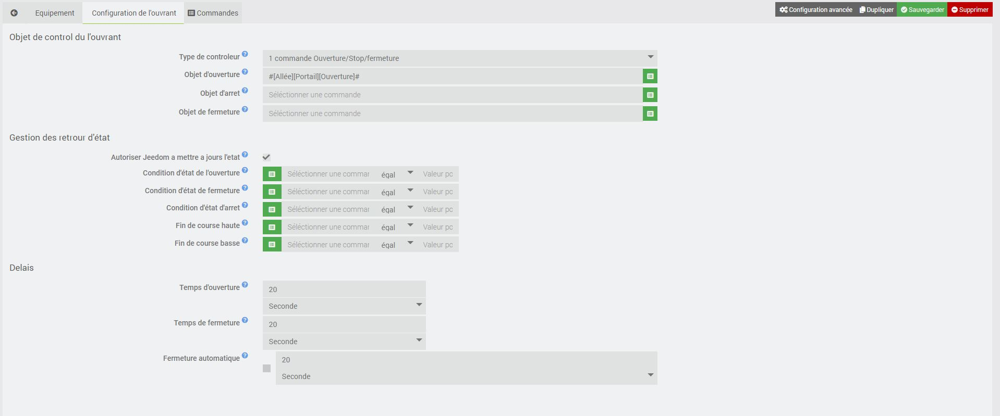

Description
===
Ce plugin a pour but de permettre de gérer ses ouvrant 

Paramétrage du plugin
===

Le plugin n'a besoin d'aucune configuration.
Vous avez juste dans cette partie les options habituel de Jeedom

Paramétrage d'un ourvrant
===

La page de configuration est assez simple.

Général
---

* Nom : Le nom a déjà été paramétrée mais vous avez la possibilité de la changer
* Objet parent : Ce paramétré permet d'ajouter l'équipement dans un objet Jeedom
* Catégorie : Déclare l'équipement dans une catégorie
* Visible : Permet de rendre l'équipement visible dans le Dashboard
* Activer : Permet d'activer l'équipement

Objet de controle
---

* Objet d'ouverture : Commande Jeedom permettant de contrôler l'ouverture (Action -> Défaut) **Obligatoire**
* Objet de stop  : Commande Jeedom permettant de contrôler le stop (Action -> Défaut) **Option**
* Objet de fermeture : Commande Jeedom permettant de contrôler la descente (Action -> Défaut)**Option**

> La commande stop n'est pas obligatoire.
Lorsque le champs de l'objet Stop n'est pas remplis, le plugin utilisera la même commande de mouvement pour s'arrêter 

Objet d'état
---

Les états de mouvement sont définis comme une condition, c'est à dire qu'il faut définir un objet ainsi qu'un opérande et une valeur.
* Utiliser les états sur :
* Les mouvement Jeedom : Permet, si cochée de mettre à jours la hauteur par le retour d'état, ou sinon de forcer la valeur demander
* Condition d'état de l'ouverture : Cette état indique au plugin une ouverture **Option**
* Condition d'état d'une fermeture  : Cette état indique au plugin une fermeture **Option**
* Condition d'état arrêt : Cette état indique au plugin un arrêt de mouvement **Option**
* Condition Fin de course :  Commandes Jeedom représentant les fins de course (info -> Binaire :1 = fermée/ouvert) **Option**

> Tout les état ne sont pas obligatoires. 
Elle doivent corresponde à ce qui est disponible sur votre actionneur. 

Délais
---

* Temps d'ouverture : Temps que met l'ouvrant pour s'ouvrir
* Temps de fermeture : Temps  que met l'ouvrant pour se fermer
* Temps de fermeture automatique : Temps de fermuture automatique (par le plugin si option coché)

