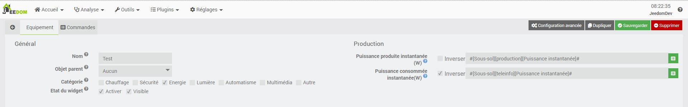
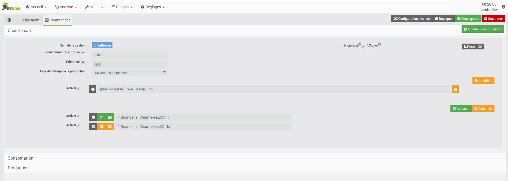

Description
===========

L’autoconsommation est le but dans la production d’énergie. Ce plugin est là pour vous y aidé en contrôlant les activations.

Suivis de la production
=======================

Pour chaque producteur d'énergie vous pouvez crée une gestion

Pour que le plugin fonctionne il est necessaire de luis configurer 
* Puissance produite instantanée (W)  : Commande de puissance instantané de la production. Cette commande doit etre positive, sinon le plugin propose l'inversion de sense a cocher. La puissance configurer peut etre lissé (voir chapitre spécifique) (Commande pas obligatoire)
* Puissance batterie (W) : Commande de puissance instantané de la batterie. Cette commande doit etre positive, sinon le plugin propose l'inversion de sense a cocher.(Commande pas obligatoire)
* Puissance instantanée du reseau (Consommation/Injection) (W) : Commande de puissance instantané du reseau. Cette commande doit etre positive, sinon le plugin propose l'inversion de sense a cocher. (Commande obligatoire)

## Lissage de la production

Le principe du lissage est simple, il vas réaliser la moyenne des valeurs mesuré dans l'intervalle de temps configurer.

Commande particulière
=====================

Le plugin a des commandes qui ne sont pas des gestions.
Ces commandes sont des informations issues des calcul du plugin
* Puissance consommé : Puissance instantané consommé (sans negative d'injection reseau)
* Puissance produite : Puissance produite lissé
* Batterie : Puissance instanntané de la batterie 
* Stockage virtuel : Bilan de consommation injecté / consommation (autorisé)

Gestions des autorisations
==========================

Chaque gestion d'autorisation est une commande booléen de Jeedom et donc exploitable partout sur Jeedom.
Les autorisations sont hiérarchiques, c'est à dire que la puissance produite doit être supérieur ou égale à la somme de toutes les gestions précédentes autorisé.

Pour configurer une gestion il faudra saisir
* Consommation autorisé (W): La puissance nominal de l'équipements a activé
* Type de filtrage de la production: Nous l'avons vue au paragraphe précedent la production est obilgatoirement lissé. Pour chaque gestion
* Tolérance (W): La puissance de consommation du réseau autorisé
* Type de filtrage de la production: pour éviter les coupures liée a la production, le plugin embarque un lissage de la production sur une heure ou un temps de maintiens
* Le temps de maintiens: ce paramètre permet de stabiliser la production, on autorise un temps (s) sur lequel on maintien l'activation
## Utilisation du réseau (Beta a amélioré avec retour d'experiance)
Pour chaque commande d'autorisation, il est possible d'autoriser un consommation sur le reseau (par exemple pour les consommateurs ou on sera a un moment donné obliger de les utiliser (exemple: chauffe-eau)
Pour l'activer
* Utilisation du reseau : cocher la case pour autorise
* Tolérance (W): Saisir la puissance de consommation du réseau autorisé
  
## Gestion avec batterie (Beta a amélioré avec retour d'experiance)
Pour chaque commande d'autorisation, il est possible d'autoriser un consommation sur la batteri (par exemple pour les consommateurs ou on sera a un moment donné obliger de les utiliser tel que le chauffe-eau)
Pour l'activer
* Utilisation de la batterie : cocher la case pour autorise
* Tolérance (W): Saisir la puissance de consommation sur la batterie
  
## Gestion avec stockag viruel (Beta a amélioré avec retour d'experiance)
Le principe de cette gestion est d'autoriser une consomation sur le reseau uniquement ce qui a été injecté.
Dans cette premiere version on ne distigue pas une eventuel difference de cout entre l'achat et la revente. Ce sera implémenté dans une version future en fonction des retour d'experience.
Pour l'activer
* Utilisation du stockage virtuel : cocher la case pour autorise
* Tolérance (W): Saisir la consommation du réseau autorisé si stocké)

## Condition
Afin de pouvoir filtrer les allumages inutiles de votre équipement nous avons la possibilité de lui ajouter des conditions d'exécution.

Cliquer sur "Ajouter une condition" et configurer votre condition
Chaque condition de la liste formera un ET

Dans mon exemple si dessous, on voit que j'autorise l'utilisation de la production uniquement si mon eau est inferieur a 35°C

## Actions
Les actions sont exécutées dans l'ordre d'apparition en fonction de leur déclencheurs (on ou off).
Vous pouvez aussi bien notifier que de piloté l'équipements
