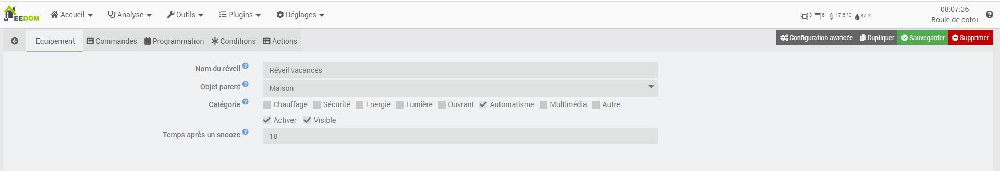
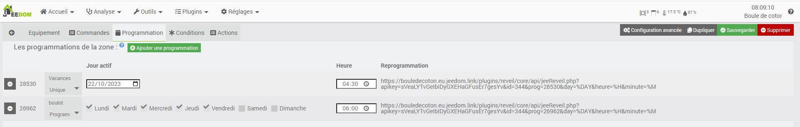
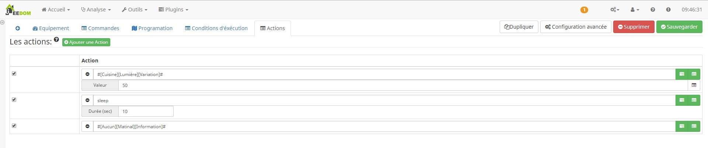

Description
==========
Ce plugin permet de créer des réveils.

Création d'un réveil
==========  

Paramètre général
---

   

* Nom : le nom a déjà été paramétré, mais vous avez la possibilité de le changer.
* Objet parent : ce paramètre permet d'ajouter l'équipement dans un objet Jeedom.
* Catégorie : défini la catégorie de l'équipement.
* Visible : permet de rendre l'équipement visible dans le Dashboard.
* Activer : permet d'activer l'équipement.

Programmation
---
Nous avons la possibilité de créer plusieurs programmations de réveil.
Pour chaque programmation, une url de reconfiguration est disponible pour le lier avec d'autre équipement.

  

L'url de reprogrammation se présente sous la forme suivante :
URL_Jeedom/plugins/reveil/core/api/jeeReveil.php?apikey=APIKEY&id=ID&prog=IDcmd&day=%DAY&heure=%H&minute=%M
Les champs, "URL_Jeedom, APIKEY, ID, IDcmd", sont automatiquement complétés pour chaque URL.
Il sera impératif de personnaliser cette url et de remplacer les paramètres par les informations à compléter :

- %DAY : Les jours de déclanchements (0 = Dimanche, 1 = Lundi, ...)
- %H : L'heure de déclanchement du réveil
- %M : La minute de déclanchement du réveil

Condition
---
Afin de pouvoir filtrer les déclanchements du réveil nous avons la possibilité de lui ajouter des conditions d'exécution

Cliquer sur "Ajouter une condition" et configurer votre condition
Chaque condition de la liste formera un ET

Action
---
Vous pouvez configurer le séquencement de votre réveil.
Pour chaque action il est possible de mettre un delais (positif si on veux le decaler dans le future et negatif dans le passée)
Chaque action configurée sera berifiée et/ou exécutée dans l'ordre choisi.

ChangeLog
=========

2019-11-24 08:09:34
-------------------
* Suppression des widgets de maniere a laisser cette tache au core
* BugFix lorsqu'il n'y a aucun delais
