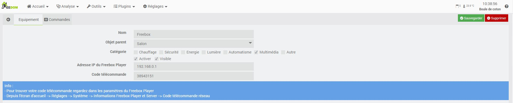
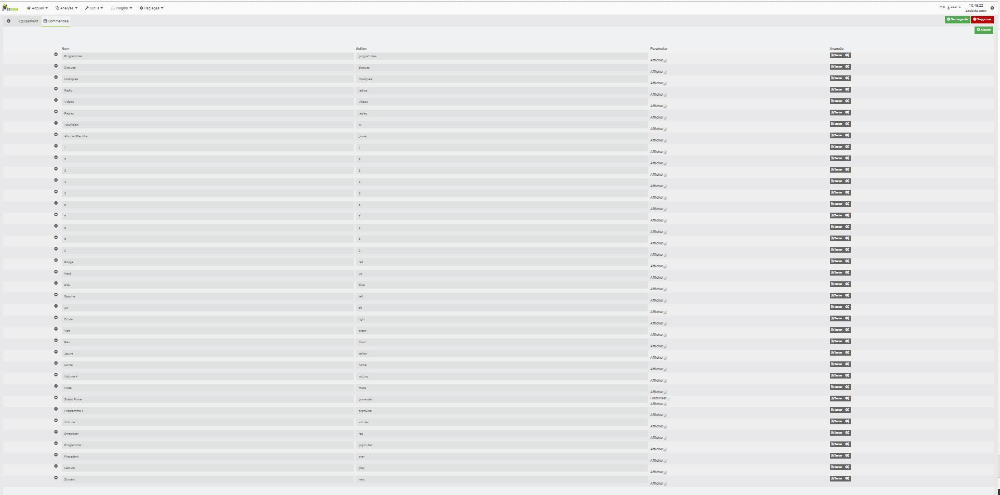
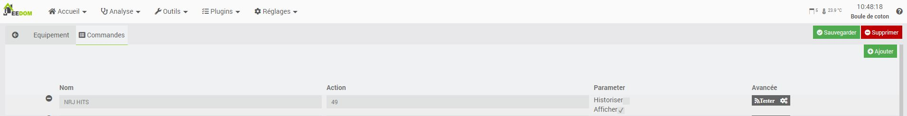

Description
==========

Plugin pour commander le Freebox Player de la Freebox Révolution

Installation et Configuration
=============================
Le plugin Télécommande Freebox permet de piloter le Freebox Player (Freebox Révolution) 

Une fois installé à partir du Market, puis une fois activé, on accède à la page du plugin Telecommande Freebox dans le menu Plugin->Multimédia.

Ajout d'une télecommande
========================

Pour créer une nouvelle télécommande, il suffit de cliquer sur "Ajouter un équipement" dans le menu de gauche. Il est possible de créer plusieurs télécommandes.

   

Configurer votre player avec les information si dessous
* Adresse IP du Freebox Player: L'adresse de connexion de la freebox
* Code télécommande: le code télécommande

> Pour trouver votre code télécommande regardez dans les paramètres du Freebox Player
Depuis l'écran d'accueil --> Réglages --> Système --> Informations Freebox Player et Server --> Code télécommande réseau

Commandes
=========

   

Par defaut, le plugin ajoute toutes les commandes de base ainsi que ses principaux racourcis.
Il est néanmoins possible d'ajouter des chaines personnalisé avce le bouton "Ajouter"

 

Nommer la chaine et saisir en action le numero de chaine freebox voulue

FAQ
===
Je ne connais pas mon code télécommande
------------------------------------------

Vous pouvez le trouver dans les paramètres du Freebox Player : Depuis l'écran d'accueil --> Réglages --> Système --> Informations Freebox Player et Server --> Code télécommande réseau

Aucune commande ne fonctionne
------------------------------
Dans un premier temps s'assurer que votre modèle de Freebox est bien le V6 (Révolution) avec le firmware à jour
_Vérifiez que l'adresse IP du player est correcte
_Vérifiez que le code télécommande est correct
_Vérifiez dans l'interface de votre Freebox que votre "Box" Jeedom fait bien partie des périphériques détectés sur le réseau
_Si même après avoir essayé les points ci-dessus cela ne fonctionne toujours pas, essayez directement d'entrer les commandes suivantes dans votre navigateur internet
http://hd1.freebox.fr/pub/remote_control?code=CODEDEVOTRETELECOMMANDE&key=power
http://hd2.freebox.fr/pub/remote_control?code=CODEDEVOTRETELECOMMANDE&key=power
Si aucune ne fonctionne c'est un problème de réseau et non du plugin
