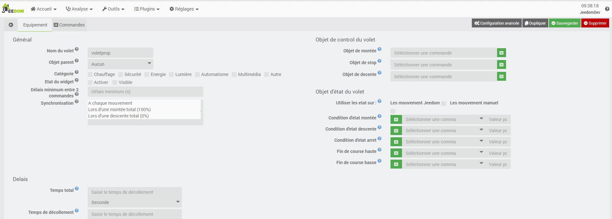

Description
===
Ce plugin a pour but de permetre de gerer ses volets de maniere proportionnel

Paramétrage d'un volet proportionnel
===

La page de configuration est assez simple.

Géneral
---

* Nom du volet : Le nom a déjà été paramétrée mais vous avez la possibilité de la changer
* Objet parent : Ce paramétré permet d'ajouter l'équipement dans un objet Jeedom
* Catégorie : Déclare l'équipement dans une catégorie
* Visible : Permet de rendre l'équipement visible dans le Dashboard
* Activer : Permet d'activer l'équipement
* Délais minimal : Permet de determiner le delais entre 2 commande (Attention plus le delais est grand et plus le petite montée seront impossible).
* Synchro : Sélectioner les types de synchro que vous souhaité.

Objet de control du volet
---

* Objet de montée : Commande jeedom permétant de controler la montée (Action -> Defaut)
* Objet de stop  : Commande jeedom permétant de controler le stop (Action -> Defaut)
* Objet de decente : Commande jeedom permétant de controler la déscente (Action -> Defaut)

Objet d'état du volet
---

Les états de mouvement sont defini comme une condition, c'est a dire qu'il faut definir une objet (de votre equipement connecter au volet) ainsi qu'un opérende et une valeur.
* Utiliser les etat sur : 
 * Les mouvement Jeedom : Permet de mettre a jours la hauteur par les retour d'etat sur ordre de jeedom  
 * Les mouvement manuel : Permet de mettre a jours la hauteur par les retour d'etat sur ordre de manuel (interrupteur telecommande)  

* Condition d'etat montée : Cette etat indique au plugin une montée
* Condition d'etat descente  : Cette etat indique au plugin une descente
* Condition d'etat arret  : Cette etat indique au plugin un arret de mouvement

* Fin de course  :  Commande jeedom representant la fin de course(info -> Binaire :1 = Volet commpletement fermée)

Délais
---

* Temps total : Temps total que met le volet pour une fermeture ou un ouverture
* Temps de décollement : Temps avant lequel le volet se decolle du sol

ChangeLog
=========

Beta
----

Stable
------

### 06/12/2019

* Interdiction du timeout lors de l'utilisation de Up et Down direct
