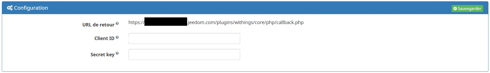
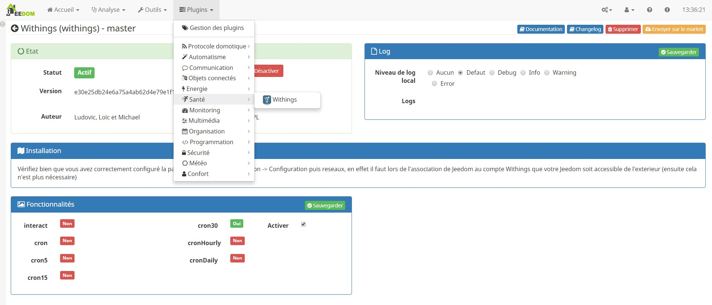
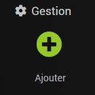
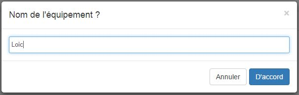
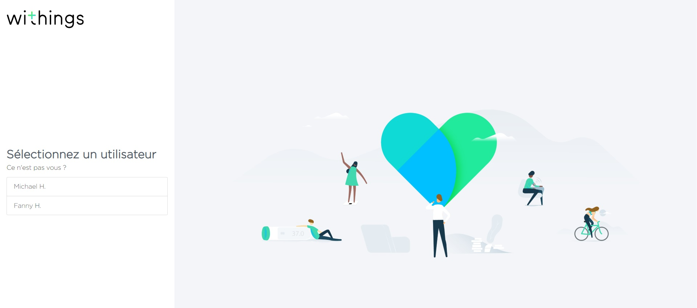
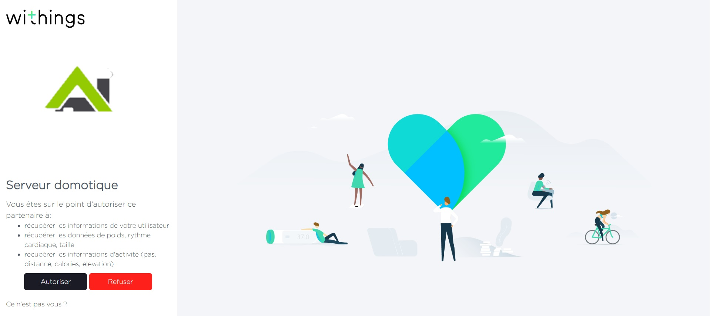
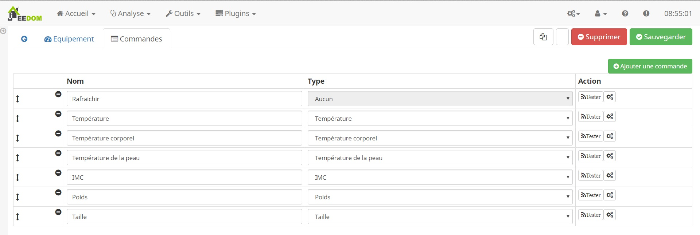
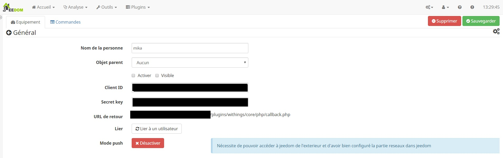
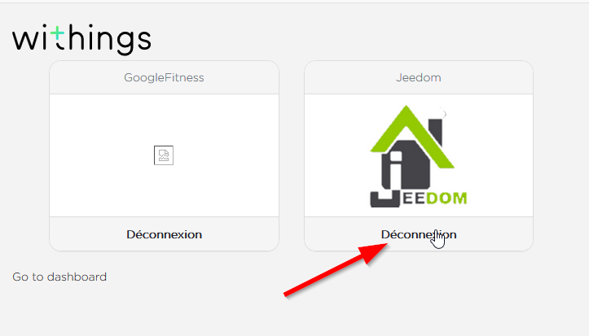

Description 
===========
Plugin pour appareils Withings / Nokia, il permet de récupérer les informations des balances withings (poids, masse graisseuse mais pas le CO2) et des bracelets (distance, nombre de pas, heures de sommeil profond, heures de sommeil léger...)

Association avec le compte Withings / Nokia
============================================
Connectez vous le formulaire Withings pour associer votre compte [ici](https://account.withings.com/partner/dashboard_oauth2)

Compléter le formulaire 

* Nom de l'application :	Nom de l'application sur le service withings / Nokia (par exemple: Jeedom)
* Description :	Description de l'application sur le service withings / Nokia (par exemple: Connexion au serveur Jeedom)
* Site web de l'application:	Url de votre connexion Jeedom
* Société :	-
* URL de callback :	Reporter ici "URL de retour"
* Accès par défaut :	Lecture seule
* Logo: choisir de image pour l'identification sur le service withings / Nokia

Je vous propose un logo de Jeedom au bon format

Un fois complété valider.

Installation et configuration
===========

Une fois le plugin Wihtings installé et activé, il faut saisir l'indentification de votre compte dont les parametre on ete configurer précédement[ici](#tocAnchor-1-2)

> La premiere chose à verifier est "URL de retour". Celle-ci doit être validée et accessible de l'extérieure sinon vous ne pourrez pas associer Jeedom a votre compte Withings. 
Si ce n'est pas le cas, mettez à jour vos paramètres de configuration réseau dans Général -> Administration -> Configuration puis partie "réseaux", voir [ici](https://jeedom.github.io/core/fr_FR/administration#tocAnchor-1-7)

* Client ID : Reporter ici, l'API Key de votre compte Withings / Nokia précédement configurer
* Secret key :Reporter ici, l'API Secret de votre compte Withings / Nokia précédement configurer 

Création d'un utilisateur
------------
Rendez vous dans la gestion du plugin pour ajouté des utilisateurs

Cliquez sur ajouter une personne pour ajouter quelqu'un : 

> Comme à beaucoup d'endroit sur Jeedom, mettre la souris tout à gauche permet de faire apparaître un menu d'accès rapide (vous pouvez à partir de votre profils le laisser toujours visible)

Donnez un nom à cette personne (cet équipement) et validez : 

Configuration
---------

Voici les détails de la configuration du plugin : 

* Nom de la personne : nom de l'équipement Withings
* Objet parent : nom de l'objet auquel ratacher l'équipement
* Activer/Visible : permet d'activer l'équipement (ne pas oublier de le faire sinon vous n'aurez aucune donnée) et de le rendre visible sur le dashboard
* Mode push : une fois activé, il permet à Jeedom de recevoir en temps réel les informations de Wihtings (par défaut il peut y avoir jusqu'à 30 min de délai). Attention activer ce mode nécessite d'avoir bien configuré la partie réseau (et de manière durable !!!)

Pensez a sauvegarder votre equipement avant de poursuivre

Lier à un utilisateur
---------

Cliquez sur "Lier à un utilisateur" pour lier un utilisateur Withings avec Jeedom
Vous aller arrivé sur cette ecran qui vous permet de choisir l'utilisateur du compte Withings / Nokia

Une fois choisi, il faut autorisé l'application jeedom a acceder a cette utilisateur

> Si vous obtenez une page blanche ou une erreur, c'est que votre configuration réseaux n'est pas bonne, sinon vous devez retomber sur cette page (vous remarquerez que cette fois, il y a un bouton "Activer" en face de "Mode push") : 

Commandes
---------

Il vous appartien de choisir les informations que vous souhaitez faire remonter en ajoutant une commande conigurer ainsi

* Nom : permet de personnalisé le nom de la commande
* Type : choisir l'inforamtion que l'on souhaite
* Historiser : permet d'historiser la commande
* Afficher : permet de la rendre visible ou non sur le dashboard
* Avancée (petites roues crantées) : permet d'afficher la configuration avancée de la commande
* Tester : permet de tester la commande pour voir sa valeur

Mode de mise a jours des commandes
----------------------------------

Toute les 30 minutes, le plugin vas chercher la derniere valeur enregistrer sur votre compte

Pour plus de rapidité, il est possible d'activé le mode push qui notifira jeedom d'une nouvelle valeur pour qu'il la synchronise

FAQ
===

Réassocier un utilisateur avec le plugin ne fonctionne pas…
---------------------------------------------------------

il faut aller sur l’API Withing
https://account.withings.com/partner/user_select?selecteduser=USERID

cliquer sur l’utilisateur qui déconne et le déconnecter de l’application Jeedom

Depuis la mise a jours du 04/10/2018, le plugin ne fonctionne plus
------------------------------------------------------------------

A cette date, le plugin est passé a l'Auth2.0 car Withings / Nokia redirige automatiquement toute nouvelle demande d'application vers cette nouvelle authentification.
Entre ses version, les identifiants de connexion de compte ne sont pas identique et il faut donc les recreer [ici](#tocAnchor-1-2-2)

Je n'arrive pas a creer un application sur le site de Withings
--------------------------------------------------------------

Withings et l'OAuth 2 on de grosse limite avec l'url de callback.
Les adresse IP sont interdite
Seul les port 80 et 443 sont autorisé.

Je n'arrive pas a synchroniser un utilisateur a Jeedom
------------------------------------------------------

La synchronisation doit etre obligatoirement faite a partir de l'url externe.
Withings a une securité sur le callback qui doit etre identique au callback renseginé lors de la création de l'application, celui envoyer par le plugin lors de la demande et que la racine de l'url demandeur soit la meme que le callback.

Je n'ai plus de synchonisation apres un arret long du serveur ou une restauration
---------------------------------------------------------------------------------

La synchronisation fait une demande de tocken avec une duree de validité (Généralement 30min)
Si cette validité a ete dépassé, il n'est plus possible de regenere un nouveau token et il faut donc refaire une synchro d'utilsateur