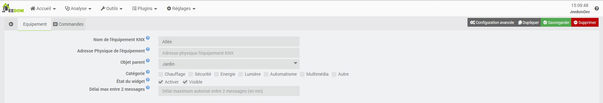
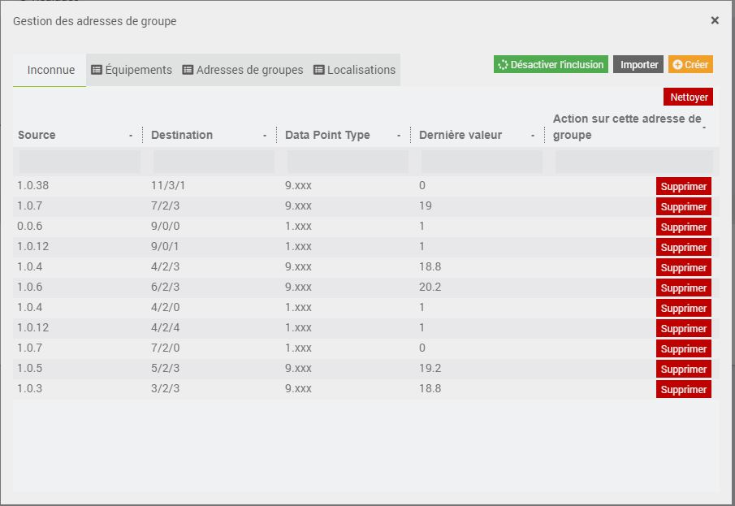

# Description

Ce plugin permet de communiquer entre Jeedom et votre installation KNX.
Jeedom deviendra donc un équipement de votre installation.
Des fonctions d'auto-configuration (auto-include, parser ETS) ont été implémentées pour permettre une mise en place rapide.

# Installation et configuration général

## Configuration du plugin et de ses dépendances

* `Adresse de la passerelle` : Indiquez l'adresse IP de la passerelle
* `Port de la passerelle` : Indiquez le port de la passerelle
* `Niveau d'adresse de groupe (GAD)` : Sélectionnez le niveau de GAD choisi lors de la programmation des équipements

> Pensez à sauvegarder.

## Installation des dépendances

Pour faciliter la mise en place des dépendances, Jeedom va gérer seul l'installation .

Si tous les voyants sont au vert, nous pouvons passer à la suite...

# Configuration des équipements

Sur cette page nous retrouvons tous nos equipement ainsi que quelques raccourcis important
* `Ajouter` : Permet de crée un equipement manuellement
* `Template` : Permet de crée par un Template un equipement
*` Configuration` : Permet d'afficher la configuration général
* `Moniteur de bus` : Permet d'afficher les trame sur vue par le bus monitor
* `Adresses de groupe` : Permet de gérer ses Adresse de groupe (soit par découvert du bus monitor ou par import ETS)
* `Log du démon` : Permet de voir ce qu'il se passe sur le démon
* `Santé` : Permet d'avoir une idée synectique de l'état de ses équipements

# Équipement

Dans un premier temps, il faut créer un nouvelle équipement et le nommer.
Comme dans tous les plugins Jeedom, vous avez un bouton "Ajouter" sur la gauche de votre fenêtre.

Ce nouvel équipement a besoin d'être paramétré.

* Nom de l'équipement KNX : Le nom a déjà été paramétré mais vous avez la possibilité de la changer
* Adresse Physique de l'équipement : cette élément n'est pas très important et peut être laissé vide
* Objet parent : Ce paramétré permet d'ajouter l'équipement dans un objet Jeedom
* Catégorie : Déclare l'équipement dans une catégorie
* Visible : Permet de rendre l'équipement visible dans le Dashboard
* Activer : Permet d'activer l'équipement
* Délai max entre 2 messages: ce champ est utile pour les équipements qui fonctionnent sur batterie, il indique a Jeedom le délai qu'il doit laisser entre 2 messages avant de vous informer d'un risque de panne.

# Commande

Maintenant que votre équipement est créé et configuré, vous allez pouvoir y ajouter des commandes.
Pour une bonne intégration, il est recommandé d’utiliser les Templates qui créeront automatiquement toutes les commandes nécessaires préconfigurées avec leurs Flags

Exemple de configuration

Nommer votre commande de manière à la retrouver facilement dans Jeedom

## Configuration KNX

Ces champs de configuration sont importants pour la communication
* Data Point Type (DPT) : ce champ est important et indispensable pour l'encodage et décodage de la valeur.
* Groupe d’adresse : ce champs identifie la commande sur le bus et sur Jeedom

## Valeur

* Retour d'état : Ce paramètre est visible pour une commande de type action, elle permet à Jeedom de lier une info à une action
* Valeur : Imposer une valeur à votre commande (lorsque l'on est en type action)
* Inverser : Cette commande permet d'inverser la valeur

## Paramètre

* Type : Sélectionnez le type de commande
* Sous type automatique : Laissez le plugin choisir le sous-type le plus adapté à votre DPT
* Sous Type : Choisissez le sous type le plus adaptée à la valeur transmise ou à transmettre
* Visible : Permet de rendre visible votre commande sur le Dashboard
* Historiser : Permet d'enregistrer la valeur

Enfin, pensez à sauvegarder.

# Utilisation des Templates

Il existe dans le plugin plusieurs Templates.
Ceux-ci vous permettent de configurer rapidement un équipement.

## Création d'un équipement par Template

Sur la page principale, un bouton "Template" permet d'ajouter un équipement .
Il vous suffit de sélectionner le Template et de saisir les GAD, ou d’aller chercher les GAD importés par ETS ou dans l'onglet "Inconnue".
Certain Template, comme celui présenté on des options, pour ajouter une option il suffit de le coché et de complété ses groupes supplémentaire

# Flags

## Flag  Lecture / Read

* Actif : Si Jeedom voit sur le bus un télégramme de type "Lecture / Read" qui correspond à cet objet (= l'objet est lié à l'adresse de groupe de destination du télégramme) alors le participant va répondre en envoyant sur le bus la valeur actuelle de l'objet.
* Inactif : Le participant ne réagira à aucun télégramme de type "Lecture / Read" qui correspond à cet objet.

Pour chaque adresse de groupe, au maximum UN seul objet doit avoir son flag "Lecture/Read" actif, tous les autre objet de cette même adresse de groupe doivent être inactifs, sinon une interrogation de la valeur donnerait plus d'une réponse qui pourraient être discordantes.

En général, la valeur stockée ou utilisée par les objets faisant partie d'une même adresse de groupe représente une information correspondant à quelque chose de réel / physique / mesurable dans votre maison.
Pour déterminer lequel de tous les objets faisant partie de la même adresse de groupe doit être celui qui aura son flag "Lecture/Read" actif, il faut vous demander lequel de tous ces objets à le plus de chance d'être en phase avec la réalité.
Cas simple : 3 boutons poussoir et un relais qui allume ou éteint une lampe, c'est la valeur de l'objet du relais qui représentera réellement l'état (allumé ou éteint) de la lampe, surtout après une panne de courant ou un problème sur le bus...

## Flag  Écriture / Write

* Actif : La valeur de la commande jeedom associé au GAD sera modifiée si un participant envoie sur le bus un télégramme de type "Écriture/Write" qui
correspond à cet objet (= l'objet est lié à l'adresse de groupe de destination du télégramme).
* Inactif : La valeur de cet objet NE sera PAS modifiée, même si un participant envoie sur le bus un télégramme de type "Écriture/Write" qui correspond à cet objet.

Pour une valeur d'adresse de groupe, plusieurs objets peuvent avoir leur flag "Écriture/Write" actif.
N'importe quel objet dont la valeur doit pouvoir être modifiée par un autre doit avoir son flag "Écriture/Write" actif.

Exemples d'objets pour lesquels le flag "Écriture/Write" est généralement actif :
* En général, tous les commande de type info.

Exemples d'objets pour lesquels le flag "Écriture/Write" est généralement INACTIF :
* En général, tous les commande de type action.

## Flag  Transmission / Transmit

* Actif : Si la valeur de commande venait à être modifiée, Jeedom va envoyer sur le bus un télégramme de type "Écriture/Write" contenant la nouvelle valeur, vers la première adresse de groupe liée à cet objet.
* Inactif : Le participant n'envoie aucun télégramme sur le bus quand le retour d'état est modifié.

Exemples d'objets pour lesquels le flag "Transmission/Transmit" est généralement actif.
* Si la commande est de type action
* Si le retour d'état de la commande n'est pas un capteur KNX

Exemples d'objets pour lesquels le flag "Transmission/Transmit" est généralement inactif.
* Si le retour d'état porte la même adresse de groupe.

## Flag  Mise-à-jour/Update

* Actif : Si un autre participant répond à un télégramme de type "Lecture de la valeur" qui correspond à cet objet (= l'objet est lié à l'adresse de groupe de destination du télégramme) en envoyant une valeur différente de celle actuellement stockée dans l'objet, la valeur de l'objet est remplacée par celle lue sur le bus dans le télégramme de réponse. (= Les télégrammes de réponse de valeur sont interprétés comme instruction d'écriture).
* Inactif : Le participant ne modifie pas la valeur de son objet tant qu'il ne reçoit pas un télégramme "Écriture/Write".

En théorie, ce flag ne semble pas très utile, mais en pratique, s'il est actif il permet de "resynchroniser" plus rapidement tous les participants d'un bus quand certains ont été redémarrés ou qu'une coupure est survenue sur le bus (arrêt temporaire d'une liaison entre 2 étages ou 2 bâtiments par exemple), dans ce cas, il suffit de lancer un script qui lit tous les groupes et hop tout est resynchronisé.

Exemples d'objets pour lesquels le flag "Mise-à-jour/Update" est généralement actif :
* Si la commande est de type info
* Si le flag "Écriture/Write" actif.

Exemples d'objets pour lesquels le flag "Mise-à-jour/Update" est généralement inactif :
* Tous les commande qui ont le flag "Lecture/Read" actif.
* Tous les commande qui ont un type action

## Flag  Read-on-Init / Initialisation

* Actif : Au démarrage du Bus Monitor, un télégramme de type "Lecture/Read" pour une info ou "Écriture/Write" pour une action sera envoyé sur le bus qui mettra à jour Jeedom
* Inactif : Pas de mise à jour.

Exemples d'objets pour lesquels le flag "Read-on-Init/Initialisation" est généralement actif :
* Pour les commandes de type info il faut un Flag "Lecture/Read" actif sur le un device KNX (pas sur Jeedom)
* Pour les commandes de type action il faut un retour d'etat venant d'un autre plugin jeedom (associer a un Flag "Transmettre") ou une valeur par défaut

# Utilisation du Bus Monitor

En cliquant sur l'icône ci-dessous, vous allez pouvoir visualiser l'activité qui se passe sur votre bus.
Pour le débogage d'une configuration défaillante, il est aussi possible de filtrer les messages enregistrés en mémoire cache.

Avec le Bus Monitor vous allez pouvoir analyser ce qui se passe sur votre bus et ce que comprend Jeedom au bus.

Le Bus Monitor affiche l'adresse physique de l’équipement, l'adresse de groupe, la data en hexa et sa conversion

# Adresses de groupe

Cette fenêtre est disponible à plusieurs endroits.

* Sur la page principal
* Sur chaque bouton pour la sélection (Template et commande)

En cliquant sur un de ses bouton vous allez obtenir cette fenêtre.

Sur cette écran, il sera possible de
* Activer / désactiver la recherche d'adresse de groupe inconnue
* Importer un projet ETS ou TX100
* Cree des objets ou des commande par rapport à l'arborescence

## Inconnue

Cet onglet permet de remonter les GAD inconnue vue par le Bus Monitor.
En activant l'inclusion, le Bus Monitor va mettre en cache également tous les GAD qu'il voit et qui sont inconnus sur votre installation.
De même, si vous avez configurer les DPT dans votre projet ETS, et l'adresse physique de votre équipement dans votre configuration Jeedom, un filtre sera automatiquement ajouté pour faciliter les recherches

## Équipements

Cet onglet permet de lister tous les équipements avec tous leur Adresse de groupe associé.
Pour que remplir ce tableau, il est impératif d'utiliser le parseur ETS.
Si vous avez ouvert cette fenêtre depuis un bouton de sélection de GAD, alors vous aurez la possibilité de sélectionner le bon GAD (qui se mettra en gras) et de valider pour retourner à la page de configuration.
De même, si vous avez configuré les DPT dans votre projet ETS, et l'adresse physique de votre équipement dans votre configuration Jeedom, un filtre sera automatiquement ajouté pour faciliter les recherches

## Adresse de groupes

Cet onglet permet de récréer l'arborescence des adresse de groupes tel qu'elle est définie dans ETS.
Pour que remplir ce tableau, il est impératif d'utiliser le parseur ETS.

Si vous avez ouvert cette fenêtre depuis un bouton de sélection de GAD, alors vous aurez la possibilité de sélectionner le bon GAD (qui se mettra en gras) et de valider pour retourner à la page de configuration.
De même, si vous avez configuré les DPT dans votre projet ETS, le plugin vous soulignera en bleu lorsque le DPT est identique et en jaune lorsqu'il est compatible

## Localisations

Cet onglet permet de récréer l'arborescence du bâtiment tel qu'elle est définie dans ETS.
Pour que remplir ce tableau, il est impératif d'utiliser le parseur ETS.

Si vous avez ouvert cette fenêtre depuis un bouton de sélection de GAD, alors vous aurez la possibilité de sélectionner le bon GAD (qui se mettra en gras) et de valider pour retourner à la page de configuration.
De même, si vous avez configuré les DPT dans votre projet ETS, le plugin vous soulignera en bleu lorsque le DPT est identique et en jaune lorsqu'il est compatible

# Import de votre projet knx

En téléchargeant votre projet ETS (.KNXproj), ou le zip de votre projet TX100, vous allez permettre à Jeedom de charger, tous les arborescences de votre installation.

Après avoir charger votre fichier, le plugin vous demandera si vous voulez en charger un autre.
Ce mécanisme est très utile pour les personnes ayant une licence démo ou lite d'ETS et qui veulent reconstruire les arborescences sous jeedom.

Après le chargement de tous vos projet le plugin vous propose d'utiliser la création automatique des equipement

# Création automatique des équipements

> La création automatique de vos équipements ne correspondant pas à un Template peut être inutilisable et nécessitera obligatoirement une reprise 1 à 1 de chaque equipement et commande.
Ce fonctionnement n'est donc pas recommandé mais existe

> La création automatique de vos équipements par la recherche de Templates vous oblige à nommage sur ETS dans la vue Groupes ou Bâtiment.
Le nom  Template et ses commandes doit être strictement inclue dans le nom sur ETS.[Voici un exemple]: https://github.com/mika-nt28/Documentations/xknx/raw/master/docs/images/Jeedom_Template.KNXproj.
Pour assouplir cette démarche des synonyme sont ajouté
Se reporté au paragraphe de Template pour y connaitre toute les nome et syntaxe

* Quelle arborescence choisir : Choisi sur quel arborescence se base la création automatique
* Arborescence des groupes : Défini, pour chaque rang de votre arborescence, un type d'information. Cette configuration est obligatoire si vous voulez qu'il crée automatiquement vos objets et équipements
* Créer les objets : crée automatiquement, s'ils n'existent pas, les objets définis dans le rang d'arborescence si plusieurs rang objet sélectionné alors il mettra le précédent en parent
* Créer les équipements  : crée automatiquement, s'il n'existe pas, vos équipements tels que définis dans le rang d'arborescence.
* Uniquement correspondant à un Template : Cette option permet de créer un équipement qui corresponde à un Template.

# Utilisation de la passerelle Jeedom/KNX

Pour être au plus proche du KNX, le plugin peut se comporter comme un participant.
On peut donc configurer le plugin pour qu'il réalise des actions automatiquement.

## Envoyer une valeur sur le bus.

Vous avez sur Jeedom un capteur qui n'est pas KNX, mais vous souhaiteriez le lier directement à votre réseau ?
Pour cela il suffit de configurer votre commande ainsi:

* Créer une commande de type "action"
* Saisir le GAD qui correspond à l'objet KNX que vous souhaitez mettre à jour
* Activer le Flag "Transmettre"
* En retour d'état allez chercher la commande de votre capteur.

## Répondre à une commande "Read" en provenance du bus

Le plugin est capable de répondre à un interrogation du bus.
Pour cela, il suffit de configurer votre commande ainsi:

* Créer une commande de type "info"
* Saisir le GAD qui correspond à l'objet KNX que vous souhaitez surveiller
* Activer le flag "Lecture"

## Mode cyclique

Vous avez besoin de lire un état ou d'envoyer une valeur sur le bus de manière cyclique (comme une horloge ou un état à une vanne thermostatique)
Rien de plus simple, il suffit de choisir une base de temps sur votre commande de type action, le plugin fait le reste.

# Template disponible

Voici la définition de chaque Template.
Désormais un Template peut contenir des options (par exemple pour un point de lumière qui peut être simple, variateur ou couleur).
Pour simplifier la création, un Template rassemble les commandes identiques (On / Off, Ouvrir / Fermer,...)
Pour donner plus de souplesse à l'import ETS, la notion de synonyme est intégrée.

## Thermostat

### Synonyme

Pas pour le moment

### Commandes

* État *[Pas de Synonyme]
* Température ambiante *[Pas de Synonyme]
* Température consigne *[Pas de Synonyme]
* Consigne *[Pas de Synonyme]
* Mode de fonctionnement *[Pas de Synonyme]
* Mode *[Pas de Synonyme]

### Options Verrouillage

* État Verrouillage *[Pas de Synonyme]
* Activer le verrouillage *[Pas de Synonyme]
* Désactiver le verrouillage *[Pas de Synonyme]

## Portail

### Synonyme

* Portillon
* Barrière

### Commandes

 * État *[Pas de Synonyme]
 * Ouvrir *[Pas de Synonyme]
 * Fermer *[Pas de Synonyme]

## Volet

### Synonyme

* BSO

### Commandes

* Position État *[Pas de Synonyme]
* Haut *[Pas de Synonyme]
* Stop *[Pas de Synonyme]
* Bas *[Pas de Synonyme]

### Options BSO

* Lames État *[Pas de Synonyme]
* Lames Montée *[Pas de Synonyme]
* Lames descente *[Pas de Synonyme]

## Citerne eau de pluie

### Synonyme

* Citerne
* Pluie

### Commandes

* valeur *[Pas de Synonyme]

## Détecteur Fumée

### Synonyme

Pas pour le moment

### Commandes

* valeur *[Pas de Synonyme]

## Digicode

### Synonyme

Pas pour le moment

### Commandes

* Ouverture *[Pas de Synonyme]
* Protection *[Pas de Synonyme]

## Lumière

### Synonyme

* Dimmer
* Variateur
* Couleur ambiance
* Ambiance

### Commandes

* État *[Pas de Synonyme]
* On *[Pas de Synonyme]
* Off *[Pas de Synonyme]

### Options variation

* Luminosité *[Pas de Synonyme]
* Augmenter *[Pas de Synonyme]
* Diminuer *[Pas de Synonyme]
* Variation *[Pas de Synonyme]

### Options Couleur RGB

* État Couleur *[Pas de Synonyme]
* Couleur *[Pas de Synonyme]

### Options Couleur RGBW

* État R *[Pas de Synonyme]
* État G *[Pas de Synonyme]
* État B *[Pas de Synonyme]
* État W *[Pas de Synonyme]
* Luminosité  R *[Pas de Synonyme]
* Luminosité  G *[Pas de Synonyme]
* Luminosité  B *[Pas de Synonyme]
* Luminosité  W *[Pas de Synonyme]
* Vitesse de régulation 1 *[Pas de Synonyme]
* Vitesse de régulation 2 *[Pas de Synonyme]
* Variation de couleur" *[Pas de Synonyme]

### Options Couleur Lumento

* Couleur Direct *[Pas de Synonyme]

## Garage

### Synonyme

Pas pour le moment

### Commandes

* État *[Pas de Synonyme]
* Ouvrir *[Pas de Synonyme]
* Fermer *[Pas de Synonyme]

## Impulsion

### Commandes

* Eau de pluie *[Pas de Synonyme]
* Eau de ville *[Pas de Synonyme]
* Gaz *[Pas de Synonyme]

## Serrure

### Synonyme

* Verrou

### Commandes

* État *[Pas de Synonyme]
* Ouvrir *[Pas de Synonyme]
* Fermer *[Pas de Synonyme]

## Luminosité

### Synonyme

Pas pour le moment

### Commandes

* valeur *[Pas de Synonyme]

## Détecteur Mouvement

### Synonyme

Pas pour le moment

### Commandes

* valeur *[Pas de Synonyme]
* Luminosité *[Pas de Synonyme]

## Synchro NTP

### Synonyme

* Horloge

### Commandes

* Date Info *[Pas de Synonyme]
* Heure Info *[Pas de Synonyme]
* Date *[Pas de Synonyme]
* Heure *[Pas de Synonyme]

## Prise

### Synonyme

Pas pour le moment

### Commandes

* État *[Pas de Synonyme]
* On *[Pas de Synonyme]
* Off *[Pas de Synonyme]

## Sirène

### Synonyme

Pas pour le moment

### Commandes

* État *[Pas de Synonyme]
* On *[Pas de Synonyme]
* Off *[Pas de Synonyme]

## Température

### Synonyme

Pas pour le moment

### Commandes

* Valeur *[Pas de Synonyme]

# DPT spécifique
## Utilisation du DPT235.001

Ce DPT remonte 10 Tarif diférents que le plugin vas séparé
Dans un premier temps il vas falloir crée des commande virtuel pour chaque tarif
* Soit par le plugin virtuel 
* Soit directement sur le plugin KNX avec le 13.010 sans GAD ou avec le GAD impossible 255/255/255 

Une derniere commande est a créer avec le DPT 235.001. Sur cette commande l'option "ActiveElectricalEnergy" apparait et il doit etre saisi dans l'ordre  les 10 commande tarif et séparé par '|'

# FAQ

## Le plugin ne trouve pas ma passerelle IP ?
* Verifier que votre passerelle est correctement connecter
* Verifier que votre passerelle est sur le meme reseau que jeedom 

## Je n'arrive pas configurer ma box JEEDOM ATLAS PRO
Le plugin n'est compatible qu'avec les interfaces IP

## Le démon ne démarre pas
* Verifier que les dépendances soit vert
* Verifier l'accecibilité de la passerelle
* Verifier l'alimentation du bus knx

## Je n'ai pas de retour d'etat
* Vérifer que la configuration et le lancement du démon
* Verifier la configuration de vos Equipements sur les Flag Init et Transmetre

## Comment créer une commande pour allumer la lumière alors que physiquement, je n'ai pas d’interrupteur ?

Sous Jeedom, nous pouvons créer des interrupteurs virtuels en configurant une commande de type action.
Les éléments importants pour envoyer des informations sur le bus avec Jeedom sont :

* Adresse de groupe
* Le DPT pour son encodage

